# Animales — Diagramas completos de referencia

[Índice gráfico](../../lang/es/catalog-diagrams.md) · [English](DIAGRAMS.md) · [Español](DIAGRAMS.es.md)

[JSON](animals.catalog.guide.json) · [Estructura completa del JSON](../../lang/es/json-structures.md)

Todos los registros del catálogo están incluidos. Se usan varios diagramas pequeños en este mismo archivo para facilitar la consulta. Las flechas representan vínculos documentados, no rendimiento, presencia garantizada ni evolución deducida. Los IDs actuales se conservan.

Candidatos sin taxonomía, ecología, productos o procesos definitivos. Solo se dibujan relaciones existentes. Las etiquetas de productos potenciales no son IDs de recursos ni cantidades producidas.

## Inventario completo

| id | Nombre |
| --- | --- |
| ANM#000170 | Alces |
| ANM#000171 | Antílopes |
| animal_australian_scrub_birds | Aves de matorral australiano |
| animal_birds_of_paradise | Aves del paraíso |
| animal_shorebirds_and_waterbirds | Aves limícolas y acuáticas |
| ANM#000172 | Babuinos |
| animal_atlantic_cod | Bacalao del Atlántico, Atlántico norte |
| animal_regional_migratory_whales | Ballenas migratorias, según región |
| animal_american_bison | Bisonte americano |
| animal_muskox | Buey almizclero |
| animal_african_buffalo | Búfalo africano |
| animal_snowy_owl | Búho nival |
| animal_przewalski_horse | Caballo de Przewalski, Asia central |
| animal_cockatoos_and_savanna_birds | Cacatúas y aves de sabana |
| animal_wild_bactrian_camel | Camello bactriano salvaje, regiones remotas de Asia central |
| ANM#000173 | Cangrejos |
| ANM#000174 | Canguros |
| animal_capybara | Capibara, cerca de agua |
| animal_woodland_caribou | Caribú de bosque |
| animal_tundra_caribou | Caribú de tundra |
| animal_southern_cassowary | Casuario del sur, Nueva Guinea y norte de Australia |
| animal_plains_zebra | Cebra de llanura |
| animal_chimpanzee | Chimpancé, zonas compatibles |
| ANM#000175 | Ciervos |
| animal_european_rabbit | Conejo europeo, área nativa ibérica |
| animal_roadrunner | Correcaminos |
| animal_coyote | Coyote |
| animal_cuscuses_and_other_arboreal_marsupials | Cuscús y otros marsupiales arborícolas |
| animal_andean_condor | Cóndor andino |
| animal_rock_hyraxes | Damanes de roca |
| animal_dingo | Dingo |
| animal_introduced_domestic_or_feral_dromedary | Dromedario doméstico o asilvestrado: solo si fue introducido |
| ANM#000176 | Elefantes africanos |
| ANM#000177 | Elefantes asiáticos |
| animal_coastal_elephant_seals | Elefantes marinos en costas |
| animal_emu | Emú, zonas abiertas compatibles |
| animal_short_beaked_echidna | Equidna de hocico corto |
| animal_regional_seals | Focas de especies regionales |
| animal_coastal_seals_and_sea_lions | Focas y lobos marinos en costas apropiadas |
| ANM#000178 | Gacelas |
| animal_red_junglefowl | Gallina roja de la jungla (Gallus gallus) |
| animal_gelada | Gelada, altiplano etíope |
| animal_subarctic_wolverine | Glotón en transición subártica |
| animal_western_gorilla | Gorila occidental, África central occidental |
| animal_macaws | Guacamayas |
| ANM#000179 | Guanacos |
| ANM#000180 | Jabalíes |
| animal_jaguar | Jaguar |
| animal_regional_jerboas_and_gerbils | Jerbos y gerbillos regionales |
| animal_giraffe | Jirafa |
| animal_antarctic_krill | Krill antártico, océano Austral |
| animal_lemming | Lemming |
| animal_snow_leopard | Leopardo de las nieves |
| animal_lion | León |
| animal_arctic_hare | Liebre ártica |
| animal_eurasian_lynx | Lince euroasiático |
| animal_maned_wolf | Lobo de crin, Cerrado |
| animal_ethiopian_wolf | Lobo etíope, tierras altas de Etiopía |
| animal_grey_wolf | Lobo gris |
| ANM#000181 | Marmotas |
| animal_regional_mussels_and_oysters | Mejillones y ostras, según región |
| animal_tropical_mollusks_and_bivalves | Moluscos y bivalvos tropicales |
| animal_howler_monkey | Mono aullador |
| animal_okapi | Okapi, cuenca del Congo |
| animal_giant_anteater | Oso hormiguero gigante |
| ANM#000182 | Osos |
| animal_estuarine_oysters_and_other_bivalves | Ostras y otros bivalvos de estuario |
| animal_ocellated_turkey | Pavo ocelado, Yucatán y zonas vecinas |
| animal_indian_peafowl | Pavo real azul, subcontinente indio |
| animal_collared_peccary | Pecarí de collar |
| animal_regional_reef_fish | Peces arrecifales, especies regionales |
| animal_juvenile_estuarine_fish | Peces juveniles de estuario |
| animal_regional_polar_fish | Peces polares regionales |
| animal_perentie | Perentie (varano gigante) |
| animal_prairie_dog | Perrito de la pradera |
| animal_island_petrels_and_albatrosses | Petreles y albatros en islas apropiadas |
| ANM#000183 | Pingüinos |
| animal_puma | Puma |
| ANM#000184 | Quebrantahuesos |
| animal_chamois | Rebeco |
| animal_reindeer | Reno |
| animal_eurasian_saiga | Saiga, estepas euroasiáticas |
| animal_regional_sardines | Sardinas regionales |
| animal_regional_rattlesnakes | Serpientes de cascabel regionales |
| animal_himalayan_tahr | Tahr del Himalaya |
| ANM#000185 | Tapires |
| animal_tiger | Tigre, en hábitats adecuados |
| animal_desert_tortoise | Tortuga del desierto |
| animal_sea_turtles | Tortugas marinas en zonas de alimentación y anidación |
| animal_regional_land_tortoises | Tortugas terrestres regionales |
| animal_regional_wallabies | Ualabíes regionales |
| animal_vicuna | Vicuña |
| animal_andean_viscacha | Vizcacha andina |
| animal_rock_dwelling_viscachas | Vizcachas en roquedos |
| animal_wild_yak | Yak salvaje, altiplano tibetano |
| ANM#000169 | Zorros |
| animal_golden_eagle | Águila real |
| ANM#000186 | Íbices |
| animal_greater_rhea | Ñandú común, Pampas |
| animal_wildebeest | Ñu |
| animal_arabian_oryx | Órix de Arabia, Arabia |

## Relaciones de todos los candidatos

### Grupo 1

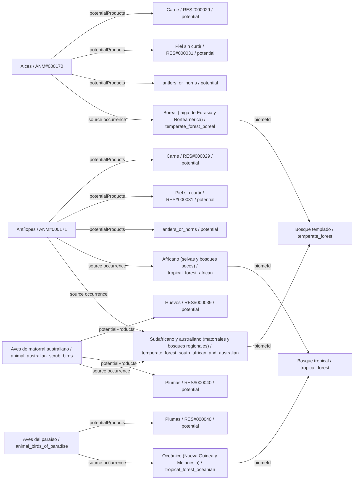
```mermaid
flowchart LR
    c0["Alces / ANM#000170"]
    v7["Boreal (taiga de Eurasia y Norteamérica) / temperate_forest_boreal"]
    b1["Bosque templado / temperate_forest"]
    o0_0["Carne / RES#000029 / potential"]
    o0_1["Piel sin curtir / RES#000031 / potential"]
    o0_2["antlers_or_horns / potential"]
    c1["Antílopes / ANM#000171"]
    v1["Africano (selvas y bosques secos) / tropical_forest_african"]
    b0["Bosque tropical / tropical_forest"]
    v6["Sudafricano y australiano (matorrales y bosques regionales) / temperate_forest_south_african_and_australian"]
    o1_0["Carne / RES#000029 / potential"]
    o1_1["Piel sin curtir / RES#000031 / potential"]
    o1_2["antlers_or_horns / potential"]
    c2["Aves de matorral australiano / animal_australian_scrub_birds"]
    o2_0["Huevos / RES#000039 / potential"]
    o2_1["Plumas / RES#000040 / potential"]
    c3["Aves del paraíso / animal_birds_of_paradise"]
    v3["Oceánico (Nueva Guinea y Melanesia) / tropical_forest_oceanian"]
    o3_0["Plumas / RES#000040 / potential"]
    c0 -->|potentialProducts| o0_0
    c0 -->|potentialProducts| o0_1
    c0 -->|potentialProducts| o0_2
    c0 -->|source occurrence| v7
    c1 -->|potentialProducts| o1_0
    c1 -->|potentialProducts| o1_1
    c1 -->|potentialProducts| o1_2
    c1 -->|source occurrence| v1
    c1 -->|source occurrence| v6
    c2 -->|potentialProducts| o2_0
    c2 -->|potentialProducts| o2_1
    c2 -->|source occurrence| v6
    c3 -->|potentialProducts| o3_0
    c3 -->|source occurrence| v3
    v1 -->|biomeId| b0
    v3 -->|biomeId| b0
    v6 -->|biomeId| b1
    v7 -->|biomeId| b1
```

### Grupo 2

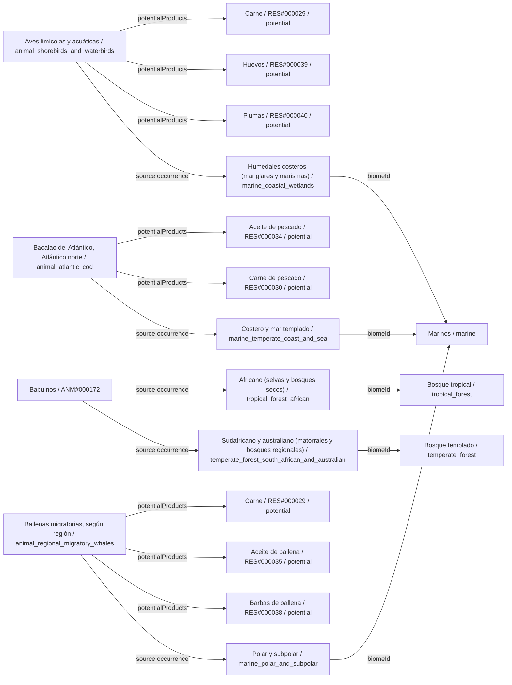
```mermaid
flowchart LR
    c0["Aves limícolas y acuáticas / animal_shorebirds_and_waterbirds"]
    v22["Humedales costeros (manglares y marismas) / marine_coastal_wetlands"]
    b5["Marinos / marine"]
    o0_0["Carne / RES#000029 / potential"]
    o0_1["Huevos / RES#000039 / potential"]
    o0_2["Plumas / RES#000040 / potential"]
    c1["Babuinos / ANM#000172"]
    v1["Africano (selvas y bosques secos) / tropical_forest_african"]
    b0["Bosque tropical / tropical_forest"]
    v6["Sudafricano y australiano (matorrales y bosques regionales) / temperate_forest_south_african_and_australian"]
    b1["Bosque templado / temperate_forest"]
    c2["Bacalao del Atlántico, Atlántico norte / animal_atlantic_cod"]
    v20["Costero y mar templado / marine_temperate_coast_and_sea"]
    o2_0["Aceite de pescado / RES#000034 / potential"]
    o2_1["Carne de pescado / RES#000030 / potential"]
    c3["Ballenas migratorias, según región / animal_regional_migratory_whales"]
    v21["Polar y subpolar / marine_polar_and_subpolar"]
    o3_0["Carne / RES#000029 / potential"]
    o3_1["Aceite de ballena / RES#000035 / potential"]
    o3_2["Barbas de ballena / RES#000038 / potential"]
    c0 -->|potentialProducts| o0_0
    c0 -->|potentialProducts| o0_1
    c0 -->|potentialProducts| o0_2
    c0 -->|source occurrence| v22
    c1 -->|source occurrence| v1
    c1 -->|source occurrence| v6
    c2 -->|potentialProducts| o2_0
    c2 -->|potentialProducts| o2_1
    c2 -->|source occurrence| v20
    c3 -->|potentialProducts| o3_0
    c3 -->|potentialProducts| o3_1
    c3 -->|potentialProducts| o3_2
    c3 -->|source occurrence| v21
    v1 -->|biomeId| b0
    v20 -->|biomeId| b5
    v21 -->|biomeId| b5
    v22 -->|biomeId| b5
    v6 -->|biomeId| b1
```

### Grupo 3

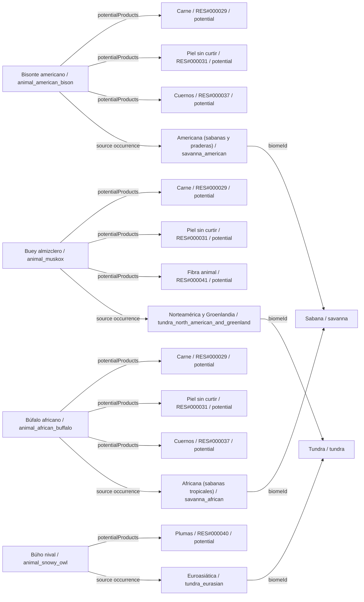
```mermaid
flowchart LR
    c0["Bisonte americano / animal_american_bison"]
    v12["Americana (sabanas y praderas) / savanna_american"]
    b3["Sabana / savanna"]
    o0_0["Carne / RES#000029 / potential"]
    o0_1["Piel sin curtir / RES#000031 / potential"]
    o0_2["Cuernos / RES#000037 / potential"]
    c1["Buey almizclero / animal_muskox"]
    v8["Norteamérica y Groenlandia / tundra_north_american_and_greenland"]
    b2["Tundra / tundra"]
    o1_0["Carne / RES#000029 / potential"]
    o1_1["Piel sin curtir / RES#000031 / potential"]
    o1_2["Fibra animal / RES#000041 / potential"]
    c2["Búfalo africano / animal_african_buffalo"]
    v11["Africana (sabanas tropicales) / savanna_african"]
    o2_0["Carne / RES#000029 / potential"]
    o2_1["Piel sin curtir / RES#000031 / potential"]
    o2_2["Cuernos / RES#000037 / potential"]
    c3["Búho nival / animal_snowy_owl"]
    v9["Euroasiática / tundra_eurasian"]
    o3_0["Plumas / RES#000040 / potential"]
    c0 -->|potentialProducts| o0_0
    c0 -->|potentialProducts| o0_1
    c0 -->|potentialProducts| o0_2
    c0 -->|source occurrence| v12
    c1 -->|potentialProducts| o1_0
    c1 -->|potentialProducts| o1_1
    c1 -->|potentialProducts| o1_2
    c1 -->|source occurrence| v8
    c2 -->|potentialProducts| o2_0
    c2 -->|potentialProducts| o2_1
    c2 -->|potentialProducts| o2_2
    c2 -->|source occurrence| v11
    c3 -->|potentialProducts| o3_0
    c3 -->|source occurrence| v9
    v11 -->|biomeId| b3
    v12 -->|biomeId| b3
    v8 -->|biomeId| b2
    v9 -->|biomeId| b2
```

### Grupo 4

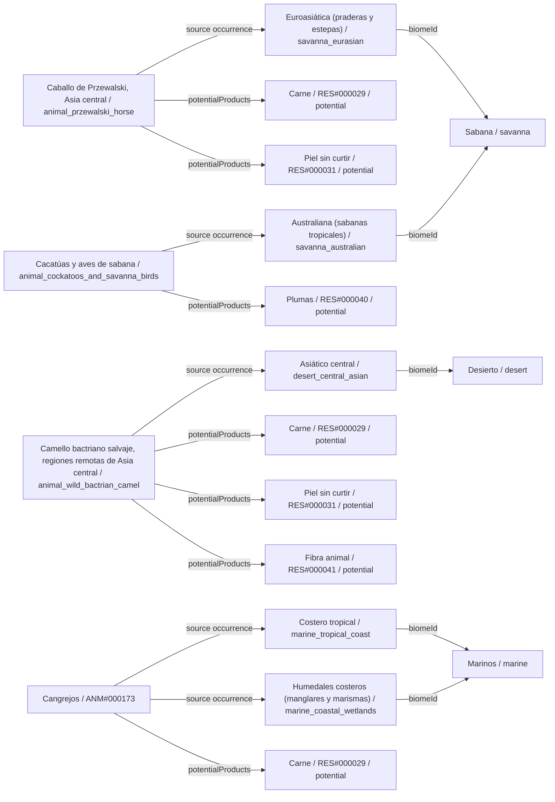
```mermaid
flowchart LR
    c0["Caballo de Przewalski, Asia central / animal_przewalski_horse"]
    v13["Euroasiática (praderas y estepas) / savanna_eurasian"]
    b3["Sabana / savanna"]
    o0_0["Carne / RES#000029 / potential"]
    o0_1["Piel sin curtir / RES#000031 / potential"]
    c1["Cacatúas y aves de sabana / animal_cockatoos_and_savanna_birds"]
    v14["Australiana (sabanas tropicales) / savanna_australian"]
    o1_0["Plumas / RES#000040 / potential"]
    c2["Camello bactriano salvaje, regiones remotas de Asia central / animal_wild_bactrian_camel"]
    v17["Asiático central / desert_central_asian"]
    b4["Desierto / desert"]
    o2_0["Carne / RES#000029 / potential"]
    o2_1["Piel sin curtir / RES#000031 / potential"]
    o2_2["Fibra animal / RES#000041 / potential"]
    c3["Cangrejos / ANM#000173"]
    v19["Costero tropical / marine_tropical_coast"]
    b5["Marinos / marine"]
    v22["Humedales costeros (manglares y marismas) / marine_coastal_wetlands"]
    o3_0["Carne / RES#000029 / potential"]
    c0 -->|potentialProducts| o0_0
    c0 -->|potentialProducts| o0_1
    c0 -->|source occurrence| v13
    c1 -->|potentialProducts| o1_0
    c1 -->|source occurrence| v14
    c2 -->|potentialProducts| o2_0
    c2 -->|potentialProducts| o2_1
    c2 -->|potentialProducts| o2_2
    c2 -->|source occurrence| v17
    c3 -->|potentialProducts| o3_0
    c3 -->|source occurrence| v19
    c3 -->|source occurrence| v22
    v13 -->|biomeId| b3
    v14 -->|biomeId| b3
    v17 -->|biomeId| b4
    v19 -->|biomeId| b5
    v22 -->|biomeId| b5
```

### Grupo 5

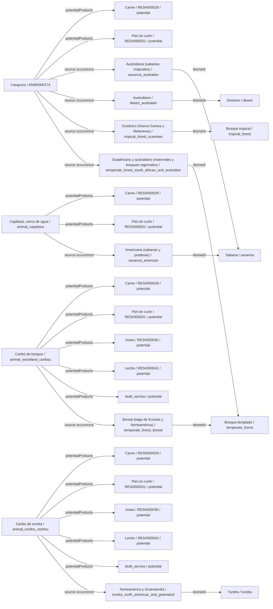
```mermaid
flowchart LR
    c0["Canguros / ANM#000174"]
    v3["Oceánico (Nueva Guinea y Melanesia) / tropical_forest_oceanian"]
    b0["Bosque tropical / tropical_forest"]
    v6["Sudafricano y australiano (matorrales y bosques regionales) / temperate_forest_south_african_and_australian"]
    b1["Bosque templado / temperate_forest"]
    v14["Australiana (sabanas tropicales) / savanna_australian"]
    b3["Sabana / savanna"]
    v18["Australiano / desert_australian"]
    b4["Desierto / desert"]
    o0_0["Carne / RES#000029 / potential"]
    o0_1["Piel sin curtir / RES#000031 / potential"]
    c1["Capibara, cerca de agua / animal_capybara"]
    v12["Americana (sabanas y praderas) / savanna_american"]
    o1_0["Carne / RES#000029 / potential"]
    o1_1["Piel sin curtir / RES#000031 / potential"]
    c2["Caribú de bosque / animal_woodland_caribou"]
    v7["Boreal (taiga de Eurasia y Norteamérica) / temperate_forest_boreal"]
    o2_0["Carne / RES#000029 / potential"]
    o2_1["Piel sin curtir / RES#000031 / potential"]
    o2_2["Astas / RES#000036 / potential"]
    o2_3["Leche / RES#000042 / potential"]
    o2_4["draft_service / potential"]
    c3["Caribú de tundra / animal_tundra_caribou"]
    v8["Norteamérica y Groenlandia / tundra_north_american_and_greenland"]
    b2["Tundra / tundra"]
    o3_0["Carne / RES#000029 / potential"]
    o3_1["Piel sin curtir / RES#000031 / potential"]
    o3_2["Astas / RES#000036 / potential"]
    o3_3["Leche / RES#000042 / potential"]
    o3_4["draft_service / potential"]
    c0 -->|potentialProducts| o0_0
    c0 -->|potentialProducts| o0_1
    c0 -->|source occurrence| v14
    c0 -->|source occurrence| v18
    c0 -->|source occurrence| v3
    c0 -->|source occurrence| v6
    c1 -->|potentialProducts| o1_0
    c1 -->|potentialProducts| o1_1
    c1 -->|source occurrence| v12
    c2 -->|potentialProducts| o2_0
    c2 -->|potentialProducts| o2_1
    c2 -->|potentialProducts| o2_2
    c2 -->|potentialProducts| o2_3
    c2 -->|potentialProducts| o2_4
    c2 -->|source occurrence| v7
    c3 -->|potentialProducts| o3_0
    c3 -->|potentialProducts| o3_1
    c3 -->|potentialProducts| o3_2
    c3 -->|potentialProducts| o3_3
    c3 -->|potentialProducts| o3_4
    c3 -->|source occurrence| v8
    v12 -->|biomeId| b3
    v14 -->|biomeId| b3
    v18 -->|biomeId| b4
    v3 -->|biomeId| b0
    v6 -->|biomeId| b1
    v7 -->|biomeId| b1
    v8 -->|biomeId| b2
```

### Grupo 6

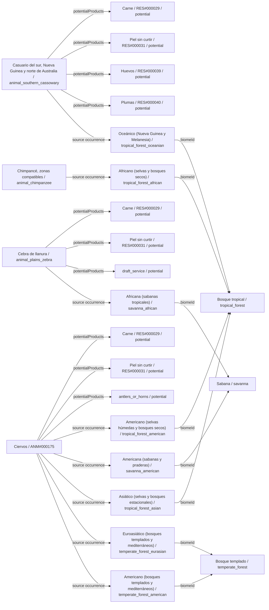
```mermaid
flowchart LR
    c0["Casuario del sur, Nueva Guinea y norte de Australia / animal_southern_cassowary"]
    v3["Oceánico (Nueva Guinea y Melanesia) / tropical_forest_oceanian"]
    b0["Bosque tropical / tropical_forest"]
    o0_0["Carne / RES#000029 / potential"]
    o0_1["Piel sin curtir / RES#000031 / potential"]
    o0_2["Huevos / RES#000039 / potential"]
    o0_3["Plumas / RES#000040 / potential"]
    c1["Cebra de llanura / animal_plains_zebra"]
    v11["Africana (sabanas tropicales) / savanna_african"]
    b3["Sabana / savanna"]
    o1_0["Carne / RES#000029 / potential"]
    o1_1["Piel sin curtir / RES#000031 / potential"]
    o1_2["draft_service / potential"]
    c2["Chimpancé, zonas compatibles / animal_chimpanzee"]
    v1["Africano (selvas y bosques secos) / tropical_forest_african"]
    c3["Ciervos / ANM#000175"]
    v0["Americano (selvas húmedas y bosques secos) / tropical_forest_american"]
    v2["Asiático (selvas y bosques estacionales) / tropical_forest_asian"]
    v4["Euroasiático (bosques templados y mediterráneos) / temperate_forest_eurasian"]
    b1["Bosque templado / temperate_forest"]
    v5["Americano (bosques templados y mediterráneos) / temperate_forest_american"]
    v12["Americana (sabanas y praderas) / savanna_american"]
    o3_0["Carne / RES#000029 / potential"]
    o3_1["Piel sin curtir / RES#000031 / potential"]
    o3_2["antlers_or_horns / potential"]
    c0 -->|potentialProducts| o0_0
    c0 -->|potentialProducts| o0_1
    c0 -->|potentialProducts| o0_2
    c0 -->|potentialProducts| o0_3
    c0 -->|source occurrence| v3
    c1 -->|potentialProducts| o1_0
    c1 -->|potentialProducts| o1_1
    c1 -->|potentialProducts| o1_2
    c1 -->|source occurrence| v11
    c2 -->|source occurrence| v1
    c3 -->|potentialProducts| o3_0
    c3 -->|potentialProducts| o3_1
    c3 -->|potentialProducts| o3_2
    c3 -->|source occurrence| v0
    c3 -->|source occurrence| v12
    c3 -->|source occurrence| v2
    c3 -->|source occurrence| v4
    c3 -->|source occurrence| v5
    v0 -->|biomeId| b0
    v1 -->|biomeId| b0
    v11 -->|biomeId| b3
    v12 -->|biomeId| b3
    v2 -->|biomeId| b0
    v3 -->|biomeId| b0
    v4 -->|biomeId| b1
    v5 -->|biomeId| b1
```

### Grupo 7

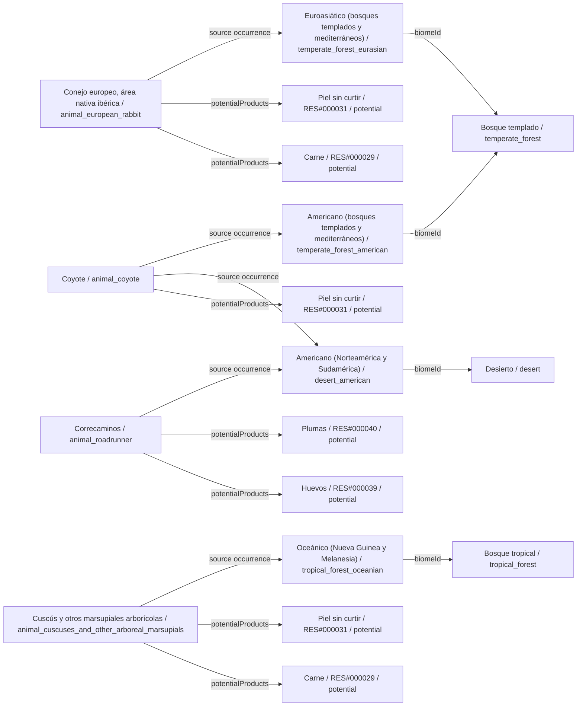
```mermaid
flowchart LR
    c0["Conejo europeo, área nativa ibérica / animal_european_rabbit"]
    v4["Euroasiático (bosques templados y mediterráneos) / temperate_forest_eurasian"]
    b1["Bosque templado / temperate_forest"]
    o0_0["Carne / RES#000029 / potential"]
    o0_1["Piel sin curtir / RES#000031 / potential"]
    c1["Correcaminos / animal_roadrunner"]
    v15["Americano (Norteamérica y Sudamérica) / desert_american"]
    b4["Desierto / desert"]
    o1_0["Huevos / RES#000039 / potential"]
    o1_1["Plumas / RES#000040 / potential"]
    c2["Coyote / animal_coyote"]
    v5["Americano (bosques templados y mediterráneos) / temperate_forest_american"]
    o2_0["Piel sin curtir / RES#000031 / potential"]
    c3["Cuscús y otros marsupiales arborícolas / animal_cuscuses_and_other_arboreal_marsupials"]
    v3["Oceánico (Nueva Guinea y Melanesia) / tropical_forest_oceanian"]
    b0["Bosque tropical / tropical_forest"]
    o3_0["Carne / RES#000029 / potential"]
    o3_1["Piel sin curtir / RES#000031 / potential"]
    c0 -->|potentialProducts| o0_0
    c0 -->|potentialProducts| o0_1
    c0 -->|source occurrence| v4
    c1 -->|potentialProducts| o1_0
    c1 -->|potentialProducts| o1_1
    c1 -->|source occurrence| v15
    c2 -->|potentialProducts| o2_0
    c2 -->|source occurrence| v15
    c2 -->|source occurrence| v5
    c3 -->|potentialProducts| o3_0
    c3 -->|potentialProducts| o3_1
    c3 -->|source occurrence| v3
    v15 -->|biomeId| b4
    v3 -->|biomeId| b0
    v4 -->|biomeId| b1
    v5 -->|biomeId| b1
```

### Grupo 8

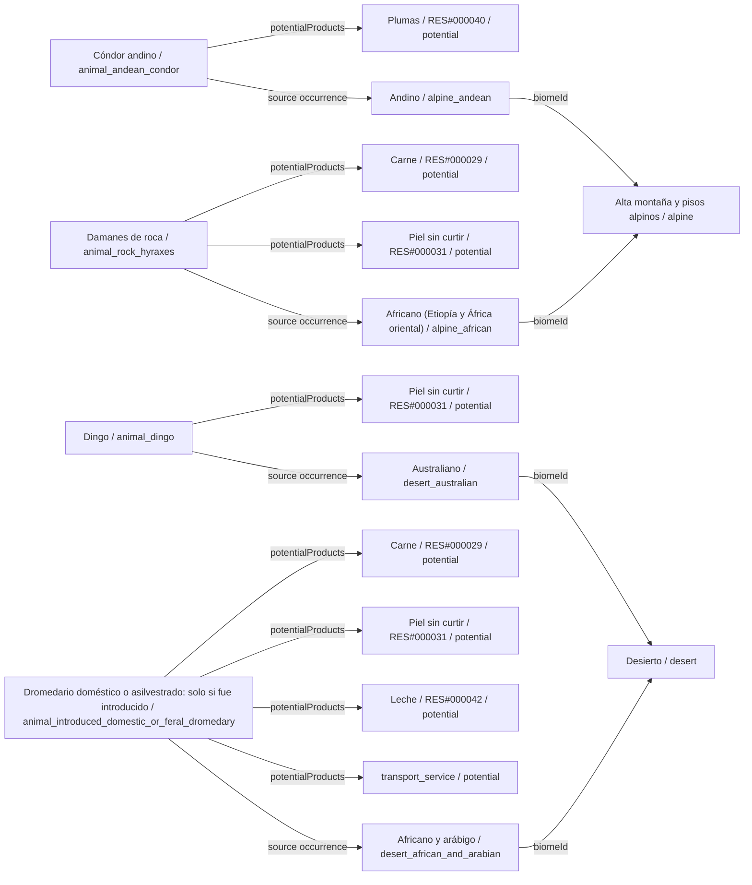
```mermaid
flowchart LR
    c0["Cóndor andino / animal_andean_condor"]
    v23["Andino / alpine_andean"]
    b6["Alta montaña y pisos alpinos / alpine"]
    o0_0["Plumas / RES#000040 / potential"]
    c1["Damanes de roca / animal_rock_hyraxes"]
    v26["Africano (Etiopía y África oriental) / alpine_african"]
    o1_0["Carne / RES#000029 / potential"]
    o1_1["Piel sin curtir / RES#000031 / potential"]
    c2["Dingo / animal_dingo"]
    v18["Australiano / desert_australian"]
    b4["Desierto / desert"]
    o2_0["Piel sin curtir / RES#000031 / potential"]
    c3["Dromedario doméstico o asilvestrado: solo si fue introducido / animal_introduced_domestic_or_feral_dromedary"]
    v16["Africano y arábigo / desert_african_and_arabian"]
    o3_0["Carne / RES#000029 / potential"]
    o3_1["Piel sin curtir / RES#000031 / potential"]
    o3_2["Leche / RES#000042 / potential"]
    o3_3["transport_service / potential"]
    c0 -->|potentialProducts| o0_0
    c0 -->|source occurrence| v23
    c1 -->|potentialProducts| o1_0
    c1 -->|potentialProducts| o1_1
    c1 -->|source occurrence| v26
    c2 -->|potentialProducts| o2_0
    c2 -->|source occurrence| v18
    c3 -->|potentialProducts| o3_0
    c3 -->|potentialProducts| o3_1
    c3 -->|potentialProducts| o3_2
    c3 -->|potentialProducts| o3_3
    c3 -->|source occurrence| v16
    v16 -->|biomeId| b4
    v18 -->|biomeId| b4
    v23 -->|biomeId| b6
    v26 -->|biomeId| b6
```

### Grupo 9

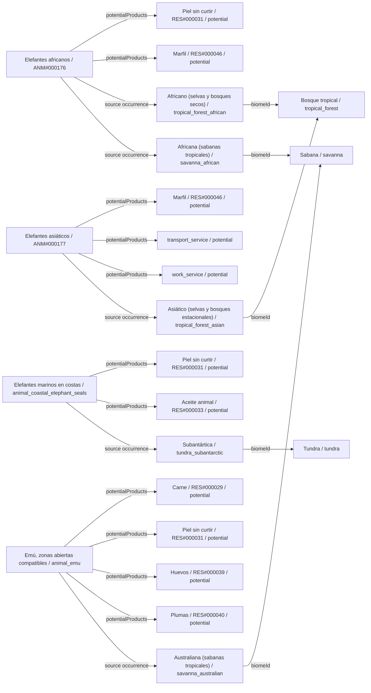
```mermaid
flowchart LR
    c0["Elefantes africanos / ANM#000176"]
    v1["Africano (selvas y bosques secos) / tropical_forest_african"]
    b0["Bosque tropical / tropical_forest"]
    v11["Africana (sabanas tropicales) / savanna_african"]
    b3["Sabana / savanna"]
    o0_0["Piel sin curtir / RES#000031 / potential"]
    o0_1["Marfil / RES#000046 / potential"]
    c1["Elefantes asiáticos / ANM#000177"]
    v2["Asiático (selvas y bosques estacionales) / tropical_forest_asian"]
    o1_0["Marfil / RES#000046 / potential"]
    o1_1["transport_service / potential"]
    o1_2["work_service / potential"]
    c2["Elefantes marinos en costas / animal_coastal_elephant_seals"]
    v10["Subantártica / tundra_subantarctic"]
    b2["Tundra / tundra"]
    o2_0["Piel sin curtir / RES#000031 / potential"]
    o2_1["Aceite animal / RES#000033 / potential"]
    c3["Emú, zonas abiertas compatibles / animal_emu"]
    v14["Australiana (sabanas tropicales) / savanna_australian"]
    o3_0["Carne / RES#000029 / potential"]
    o3_1["Piel sin curtir / RES#000031 / potential"]
    o3_2["Huevos / RES#000039 / potential"]
    o3_3["Plumas / RES#000040 / potential"]
    c0 -->|potentialProducts| o0_0
    c0 -->|potentialProducts| o0_1
    c0 -->|source occurrence| v1
    c0 -->|source occurrence| v11
    c1 -->|potentialProducts| o1_0
    c1 -->|potentialProducts| o1_1
    c1 -->|potentialProducts| o1_2
    c1 -->|source occurrence| v2
    c2 -->|potentialProducts| o2_0
    c2 -->|potentialProducts| o2_1
    c2 -->|source occurrence| v10
    c3 -->|potentialProducts| o3_0
    c3 -->|potentialProducts| o3_1
    c3 -->|potentialProducts| o3_2
    c3 -->|potentialProducts| o3_3
    c3 -->|source occurrence| v14
    v1 -->|biomeId| b0
    v10 -->|biomeId| b2
    v11 -->|biomeId| b3
    v14 -->|biomeId| b3
    v2 -->|biomeId| b0
```

### Grupo 10

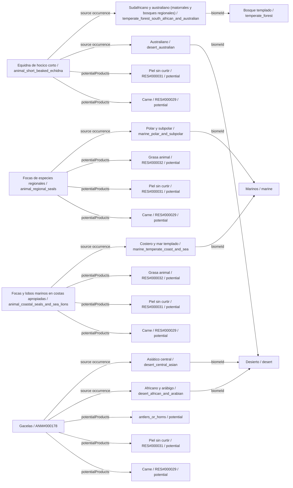
```mermaid
flowchart LR
    c0["Equidna de hocico corto / animal_short_beaked_echidna"]
    v6["Sudafricano y australiano (matorrales y bosques regionales) / temperate_forest_south_african_and_australian"]
    b1["Bosque templado / temperate_forest"]
    v18["Australiano / desert_australian"]
    b4["Desierto / desert"]
    o0_0["Carne / RES#000029 / potential"]
    o0_1["Piel sin curtir / RES#000031 / potential"]
    c1["Focas de especies regionales / animal_regional_seals"]
    v21["Polar y subpolar / marine_polar_and_subpolar"]
    b5["Marinos / marine"]
    o1_0["Carne / RES#000029 / potential"]
    o1_1["Piel sin curtir / RES#000031 / potential"]
    o1_2["Grasa animal / RES#000032 / potential"]
    c2["Focas y lobos marinos en costas apropiadas / animal_coastal_seals_and_sea_lions"]
    v20["Costero y mar templado / marine_temperate_coast_and_sea"]
    o2_0["Carne / RES#000029 / potential"]
    o2_1["Piel sin curtir / RES#000031 / potential"]
    o2_2["Grasa animal / RES#000032 / potential"]
    c3["Gacelas / ANM#000178"]
    v16["Africano y arábigo / desert_african_and_arabian"]
    v17["Asiático central / desert_central_asian"]
    o3_0["Carne / RES#000029 / potential"]
    o3_1["Piel sin curtir / RES#000031 / potential"]
    o3_2["antlers_or_horns / potential"]
    c0 -->|potentialProducts| o0_0
    c0 -->|potentialProducts| o0_1
    c0 -->|source occurrence| v18
    c0 -->|source occurrence| v6
    c1 -->|potentialProducts| o1_0
    c1 -->|potentialProducts| o1_1
    c1 -->|potentialProducts| o1_2
    c1 -->|source occurrence| v21
    c2 -->|potentialProducts| o2_0
    c2 -->|potentialProducts| o2_1
    c2 -->|potentialProducts| o2_2
    c2 -->|source occurrence| v20
    c3 -->|potentialProducts| o3_0
    c3 -->|potentialProducts| o3_1
    c3 -->|potentialProducts| o3_2
    c3 -->|source occurrence| v16
    c3 -->|source occurrence| v17
    v16 -->|biomeId| b4
    v17 -->|biomeId| b4
    v18 -->|biomeId| b4
    v20 -->|biomeId| b5
    v21 -->|biomeId| b5
    v6 -->|biomeId| b1
```

### Grupo 11

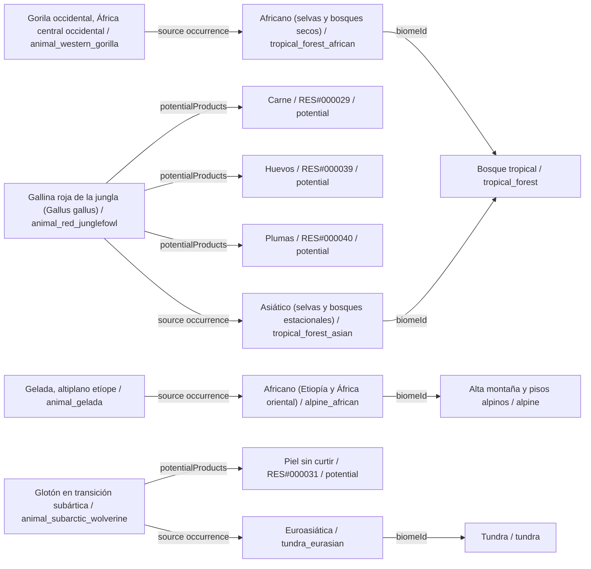
```mermaid
flowchart LR
    c0["Gallina roja de la jungla (Gallus gallus) / animal_red_junglefowl"]
    v2["Asiático (selvas y bosques estacionales) / tropical_forest_asian"]
    b0["Bosque tropical / tropical_forest"]
    o0_0["Carne / RES#000029 / potential"]
    o0_1["Huevos / RES#000039 / potential"]
    o0_2["Plumas / RES#000040 / potential"]
    c1["Gelada, altiplano etíope / animal_gelada"]
    v26["Africano (Etiopía y África oriental) / alpine_african"]
    b6["Alta montaña y pisos alpinos / alpine"]
    c2["Glotón en transición subártica / animal_subarctic_wolverine"]
    v9["Euroasiática / tundra_eurasian"]
    b2["Tundra / tundra"]
    o2_0["Piel sin curtir / RES#000031 / potential"]
    c3["Gorila occidental, África central occidental / animal_western_gorilla"]
    v1["Africano (selvas y bosques secos) / tropical_forest_african"]
    c0 -->|potentialProducts| o0_0
    c0 -->|potentialProducts| o0_1
    c0 -->|potentialProducts| o0_2
    c0 -->|source occurrence| v2
    c1 -->|source occurrence| v26
    c2 -->|potentialProducts| o2_0
    c2 -->|source occurrence| v9
    c3 -->|source occurrence| v1
    v1 -->|biomeId| b0
    v2 -->|biomeId| b0
    v26 -->|biomeId| b6
    v9 -->|biomeId| b2
```

### Grupo 12

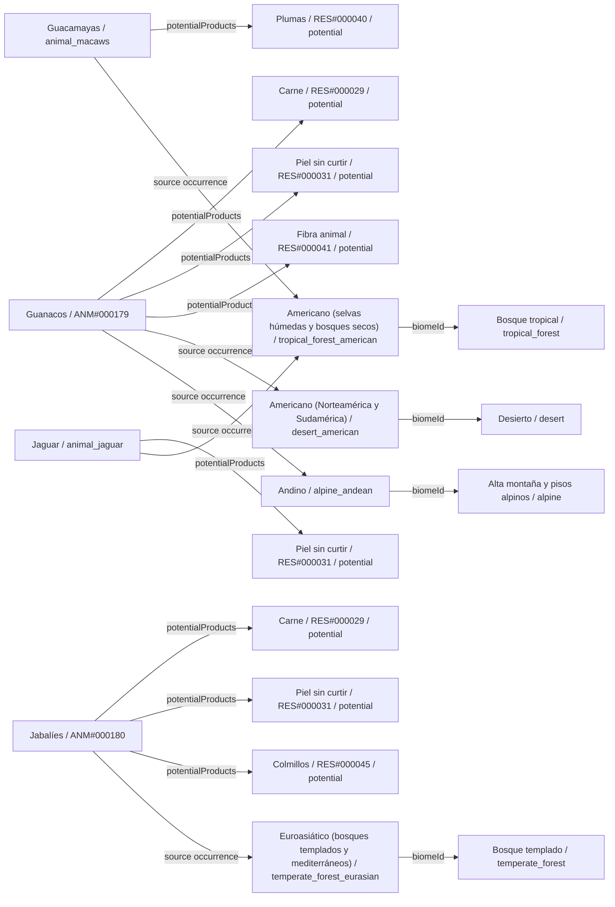
```mermaid
flowchart LR
    c0["Guacamayas / animal_macaws"]
    v0["Americano (selvas húmedas y bosques secos) / tropical_forest_american"]
    b0["Bosque tropical / tropical_forest"]
    o0_0["Plumas / RES#000040 / potential"]
    c1["Guanacos / ANM#000179"]
    v15["Americano (Norteamérica y Sudamérica) / desert_american"]
    b4["Desierto / desert"]
    v23["Andino / alpine_andean"]
    b6["Alta montaña y pisos alpinos / alpine"]
    o1_0["Carne / RES#000029 / potential"]
    o1_1["Piel sin curtir / RES#000031 / potential"]
    o1_2["Fibra animal / RES#000041 / potential"]
    c2["Jabalíes / ANM#000180"]
    v4["Euroasiático (bosques templados y mediterráneos) / temperate_forest_eurasian"]
    b1["Bosque templado / temperate_forest"]
    o2_0["Carne / RES#000029 / potential"]
    o2_1["Piel sin curtir / RES#000031 / potential"]
    o2_2["Colmillos / RES#000045 / potential"]
    c3["Jaguar / animal_jaguar"]
    o3_0["Piel sin curtir / RES#000031 / potential"]
    c0 -->|potentialProducts| o0_0
    c0 -->|source occurrence| v0
    c1 -->|potentialProducts| o1_0
    c1 -->|potentialProducts| o1_1
    c1 -->|potentialProducts| o1_2
    c1 -->|source occurrence| v15
    c1 -->|source occurrence| v23
    c2 -->|potentialProducts| o2_0
    c2 -->|potentialProducts| o2_1
    c2 -->|potentialProducts| o2_2
    c2 -->|source occurrence| v4
    c3 -->|potentialProducts| o3_0
    c3 -->|source occurrence| v0
    v0 -->|biomeId| b0
    v15 -->|biomeId| b4
    v23 -->|biomeId| b6
    v4 -->|biomeId| b1
```

### Grupo 13

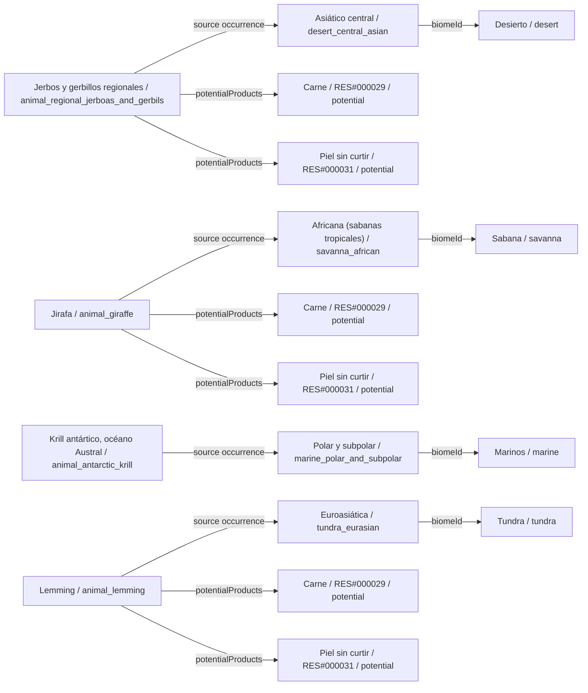
```mermaid
flowchart LR
    c0["Jerbos y gerbillos regionales / animal_regional_jerboas_and_gerbils"]
    v17["Asiático central / desert_central_asian"]
    b4["Desierto / desert"]
    o0_0["Carne / RES#000029 / potential"]
    o0_1["Piel sin curtir / RES#000031 / potential"]
    c1["Jirafa / animal_giraffe"]
    v11["Africana (sabanas tropicales) / savanna_african"]
    b3["Sabana / savanna"]
    o1_0["Carne / RES#000029 / potential"]
    o1_1["Piel sin curtir / RES#000031 / potential"]
    c2["Krill antártico, océano Austral / animal_antarctic_krill"]
    v21["Polar y subpolar / marine_polar_and_subpolar"]
    b5["Marinos / marine"]
    c3["Lemming / animal_lemming"]
    v9["Euroasiática / tundra_eurasian"]
    b2["Tundra / tundra"]
    o3_0["Carne / RES#000029 / potential"]
    o3_1["Piel sin curtir / RES#000031 / potential"]
    c0 -->|potentialProducts| o0_0
    c0 -->|potentialProducts| o0_1
    c0 -->|source occurrence| v17
    c1 -->|potentialProducts| o1_0
    c1 -->|potentialProducts| o1_1
    c1 -->|source occurrence| v11
    c2 -->|source occurrence| v21
    c3 -->|potentialProducts| o3_0
    c3 -->|potentialProducts| o3_1
    c3 -->|source occurrence| v9
    v11 -->|biomeId| b3
    v17 -->|biomeId| b4
    v21 -->|biomeId| b5
    v9 -->|biomeId| b2
```

### Grupo 14

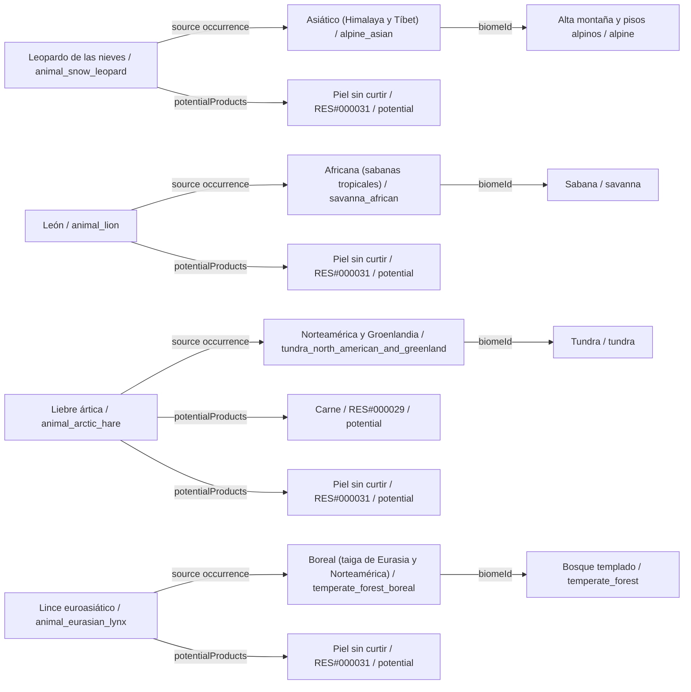
```mermaid
flowchart LR
    c0["Leopardo de las nieves / animal_snow_leopard"]
    v24["Asiático (Himalaya y Tíbet) / alpine_asian"]
    b6["Alta montaña y pisos alpinos / alpine"]
    o0_0["Piel sin curtir / RES#000031 / potential"]
    c1["León / animal_lion"]
    v11["Africana (sabanas tropicales) / savanna_african"]
    b3["Sabana / savanna"]
    o1_0["Piel sin curtir / RES#000031 / potential"]
    c2["Liebre ártica / animal_arctic_hare"]
    v8["Norteamérica y Groenlandia / tundra_north_american_and_greenland"]
    b2["Tundra / tundra"]
    o2_0["Carne / RES#000029 / potential"]
    o2_1["Piel sin curtir / RES#000031 / potential"]
    c3["Lince euroasiático / animal_eurasian_lynx"]
    v7["Boreal (taiga de Eurasia y Norteamérica) / temperate_forest_boreal"]
    b1["Bosque templado / temperate_forest"]
    o3_0["Piel sin curtir / RES#000031 / potential"]
    c0 -->|potentialProducts| o0_0
    c0 -->|source occurrence| v24
    c1 -->|potentialProducts| o1_0
    c1 -->|source occurrence| v11
    c2 -->|potentialProducts| o2_0
    c2 -->|potentialProducts| o2_1
    c2 -->|source occurrence| v8
    c3 -->|potentialProducts| o3_0
    c3 -->|source occurrence| v7
    v11 -->|biomeId| b3
    v24 -->|biomeId| b6
    v7 -->|biomeId| b1
    v8 -->|biomeId| b2
```

### Grupo 15

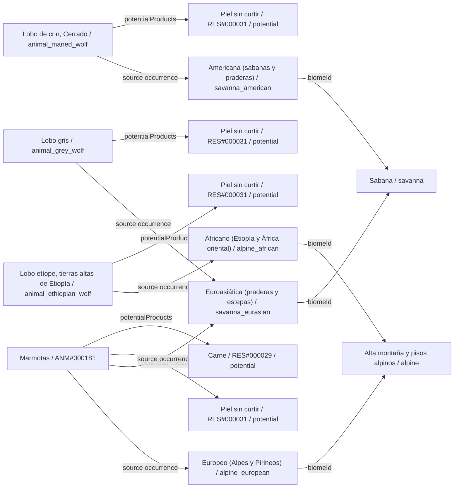
```mermaid
flowchart LR
    c0["Lobo de crin, Cerrado / animal_maned_wolf"]
    v12["Americana (sabanas y praderas) / savanna_american"]
    b3["Sabana / savanna"]
    o0_0["Piel sin curtir / RES#000031 / potential"]
    c1["Lobo etíope, tierras altas de Etiopía / animal_ethiopian_wolf"]
    v26["Africano (Etiopía y África oriental) / alpine_african"]
    b6["Alta montaña y pisos alpinos / alpine"]
    o1_0["Piel sin curtir / RES#000031 / potential"]
    c2["Lobo gris / animal_grey_wolf"]
    v13["Euroasiática (praderas y estepas) / savanna_eurasian"]
    o2_0["Piel sin curtir / RES#000031 / potential"]
    c3["Marmotas / ANM#000181"]
    v25["Europeo (Alpes y Pirineos) / alpine_european"]
    o3_0["Carne / RES#000029 / potential"]
    o3_1["Piel sin curtir / RES#000031 / potential"]
    c0 -->|potentialProducts| o0_0
    c0 -->|source occurrence| v12
    c1 -->|potentialProducts| o1_0
    c1 -->|source occurrence| v26
    c2 -->|potentialProducts| o2_0
    c2 -->|source occurrence| v13
    c3 -->|potentialProducts| o3_0
    c3 -->|potentialProducts| o3_1
    c3 -->|source occurrence| v13
    c3 -->|source occurrence| v25
    v12 -->|biomeId| b3
    v13 -->|biomeId| b3
    v25 -->|biomeId| b6
    v26 -->|biomeId| b6
```

### Grupo 16

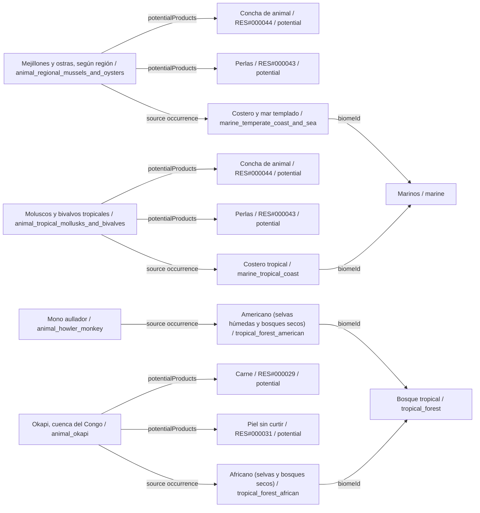
```mermaid
flowchart LR
    c0["Mejillones y ostras, según región / animal_regional_mussels_and_oysters"]
    v20["Costero y mar templado / marine_temperate_coast_and_sea"]
    b5["Marinos / marine"]
    o0_0["Concha de animal / RES#000044 / potential"]
    o0_1["Perlas / RES#000043 / potential"]
    c1["Moluscos y bivalvos tropicales / animal_tropical_mollusks_and_bivalves"]
    v19["Costero tropical / marine_tropical_coast"]
    o1_0["Concha de animal / RES#000044 / potential"]
    o1_1["Perlas / RES#000043 / potential"]
    c2["Mono aullador / animal_howler_monkey"]
    v0["Americano (selvas húmedas y bosques secos) / tropical_forest_american"]
    b0["Bosque tropical / tropical_forest"]
    c3["Okapi, cuenca del Congo / animal_okapi"]
    v1["Africano (selvas y bosques secos) / tropical_forest_african"]
    o3_0["Carne / RES#000029 / potential"]
    o3_1["Piel sin curtir / RES#000031 / potential"]
    c0 -->|potentialProducts| o0_0
    c0 -->|potentialProducts| o0_1
    c0 -->|source occurrence| v20
    c1 -->|potentialProducts| o1_0
    c1 -->|potentialProducts| o1_1
    c1 -->|source occurrence| v19
    c2 -->|source occurrence| v0
    c3 -->|potentialProducts| o3_0
    c3 -->|potentialProducts| o3_1
    c3 -->|source occurrence| v1
    v0 -->|biomeId| b0
    v1 -->|biomeId| b0
    v19 -->|biomeId| b5
    v20 -->|biomeId| b5
```

### Grupo 17

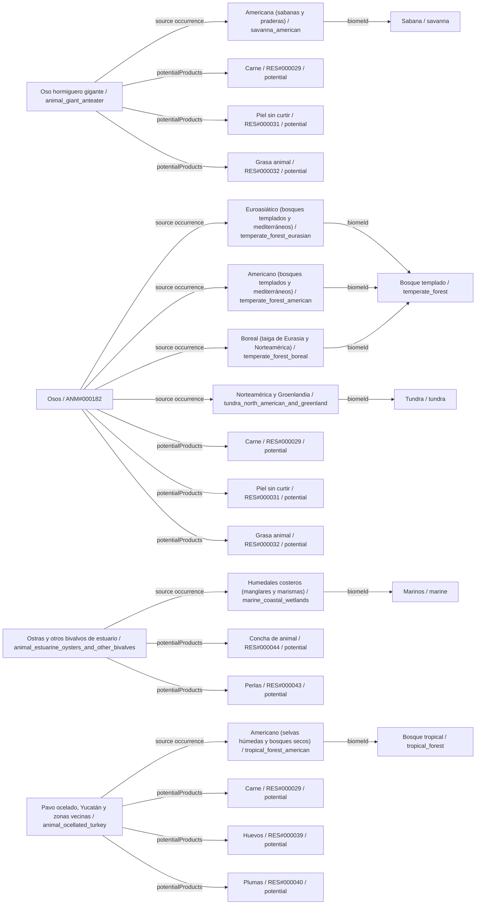
```mermaid
flowchart LR
    c0["Oso hormiguero gigante / animal_giant_anteater"]
    v12["Americana (sabanas y praderas) / savanna_american"]
    b3["Sabana / savanna"]
    o0_0["Carne / RES#000029 / potential"]
    o0_1["Piel sin curtir / RES#000031 / potential"]
    o0_2["Grasa animal / RES#000032 / potential"]
    c1["Osos / ANM#000182"]
    v4["Euroasiático (bosques templados y mediterráneos) / temperate_forest_eurasian"]
    b1["Bosque templado / temperate_forest"]
    v5["Americano (bosques templados y mediterráneos) / temperate_forest_american"]
    v7["Boreal (taiga de Eurasia y Norteamérica) / temperate_forest_boreal"]
    v8["Norteamérica y Groenlandia / tundra_north_american_and_greenland"]
    b2["Tundra / tundra"]
    o1_0["Carne / RES#000029 / potential"]
    o1_1["Piel sin curtir / RES#000031 / potential"]
    o1_2["Grasa animal / RES#000032 / potential"]
    c2["Ostras y otros bivalvos de estuario / animal_estuarine_oysters_and_other_bivalves"]
    v22["Humedales costeros (manglares y marismas) / marine_coastal_wetlands"]
    b5["Marinos / marine"]
    o2_0["Concha de animal / RES#000044 / potential"]
    o2_1["Perlas / RES#000043 / potential"]
    c3["Pavo ocelado, Yucatán y zonas vecinas / animal_ocellated_turkey"]
    v0["Americano (selvas húmedas y bosques secos) / tropical_forest_american"]
    b0["Bosque tropical / tropical_forest"]
    o3_0["Carne / RES#000029 / potential"]
    o3_1["Huevos / RES#000039 / potential"]
    o3_2["Plumas / RES#000040 / potential"]
    c0 -->|potentialProducts| o0_0
    c0 -->|potentialProducts| o0_1
    c0 -->|potentialProducts| o0_2
    c0 -->|source occurrence| v12
    c1 -->|potentialProducts| o1_0
    c1 -->|potentialProducts| o1_1
    c1 -->|potentialProducts| o1_2
    c1 -->|source occurrence| v4
    c1 -->|source occurrence| v5
    c1 -->|source occurrence| v7
    c1 -->|source occurrence| v8
    c2 -->|potentialProducts| o2_0
    c2 -->|potentialProducts| o2_1
    c2 -->|source occurrence| v22
    c3 -->|potentialProducts| o3_0
    c3 -->|potentialProducts| o3_1
    c3 -->|potentialProducts| o3_2
    c3 -->|source occurrence| v0
    v0 -->|biomeId| b0
    v12 -->|biomeId| b3
    v22 -->|biomeId| b5
    v4 -->|biomeId| b1
    v5 -->|biomeId| b1
    v7 -->|biomeId| b1
    v8 -->|biomeId| b2
```

### Grupo 18

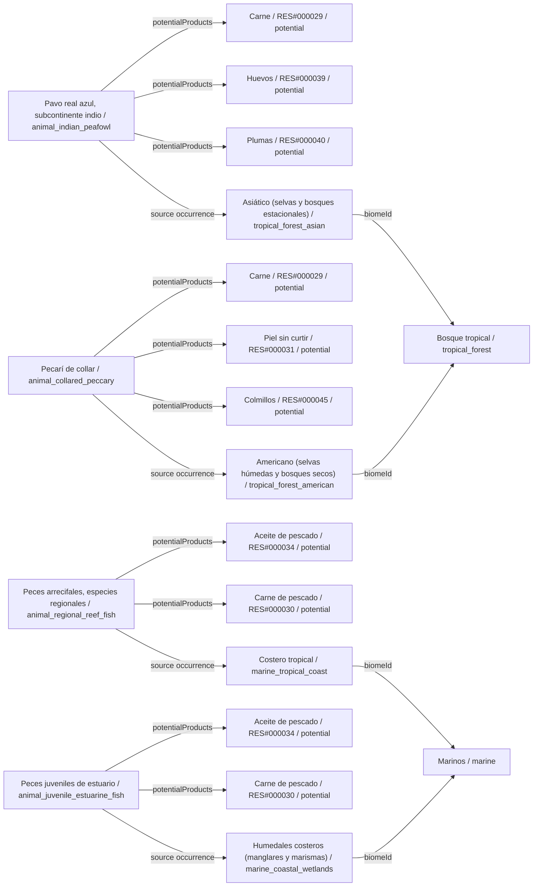
```mermaid
flowchart LR
    c0["Pavo real azul, subcontinente indio / animal_indian_peafowl"]
    v2["Asiático (selvas y bosques estacionales) / tropical_forest_asian"]
    b0["Bosque tropical / tropical_forest"]
    o0_0["Carne / RES#000029 / potential"]
    o0_1["Huevos / RES#000039 / potential"]
    o0_2["Plumas / RES#000040 / potential"]
    c1["Pecarí de collar / animal_collared_peccary"]
    v0["Americano (selvas húmedas y bosques secos) / tropical_forest_american"]
    o1_0["Carne / RES#000029 / potential"]
    o1_1["Piel sin curtir / RES#000031 / potential"]
    o1_2["Colmillos / RES#000045 / potential"]
    c2["Peces arrecifales, especies regionales / animal_regional_reef_fish"]
    v19["Costero tropical / marine_tropical_coast"]
    b5["Marinos / marine"]
    o2_0["Aceite de pescado / RES#000034 / potential"]
    o2_1["Carne de pescado / RES#000030 / potential"]
    c3["Peces juveniles de estuario / animal_juvenile_estuarine_fish"]
    v22["Humedales costeros (manglares y marismas) / marine_coastal_wetlands"]
    o3_0["Aceite de pescado / RES#000034 / potential"]
    o3_1["Carne de pescado / RES#000030 / potential"]
    c0 -->|potentialProducts| o0_0
    c0 -->|potentialProducts| o0_1
    c0 -->|potentialProducts| o0_2
    c0 -->|source occurrence| v2
    c1 -->|potentialProducts| o1_0
    c1 -->|potentialProducts| o1_1
    c1 -->|potentialProducts| o1_2
    c1 -->|source occurrence| v0
    c2 -->|potentialProducts| o2_0
    c2 -->|potentialProducts| o2_1
    c2 -->|source occurrence| v19
    c3 -->|potentialProducts| o3_0
    c3 -->|potentialProducts| o3_1
    c3 -->|source occurrence| v22
    v0 -->|biomeId| b0
    v19 -->|biomeId| b5
    v2 -->|biomeId| b0
    v22 -->|biomeId| b5
```

### Grupo 19

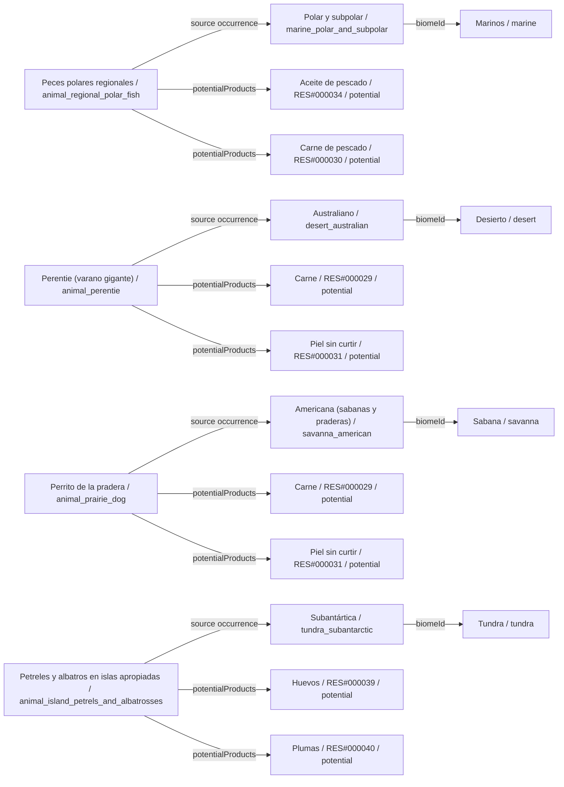
```mermaid
flowchart LR
    c0["Peces polares regionales / animal_regional_polar_fish"]
    v21["Polar y subpolar / marine_polar_and_subpolar"]
    b5["Marinos / marine"]
    o0_0["Aceite de pescado / RES#000034 / potential"]
    o0_1["Carne de pescado / RES#000030 / potential"]
    c1["Perentie (varano gigante) / animal_perentie"]
    v18["Australiano / desert_australian"]
    b4["Desierto / desert"]
    o1_0["Carne / RES#000029 / potential"]
    o1_1["Piel sin curtir / RES#000031 / potential"]
    c2["Perrito de la pradera / animal_prairie_dog"]
    v12["Americana (sabanas y praderas) / savanna_american"]
    b3["Sabana / savanna"]
    o2_0["Carne / RES#000029 / potential"]
    o2_1["Piel sin curtir / RES#000031 / potential"]
    c3["Petreles y albatros en islas apropiadas / animal_island_petrels_and_albatrosses"]
    v10["Subantártica / tundra_subantarctic"]
    b2["Tundra / tundra"]
    o3_0["Huevos / RES#000039 / potential"]
    o3_1["Plumas / RES#000040 / potential"]
    c0 -->|potentialProducts| o0_0
    c0 -->|potentialProducts| o0_1
    c0 -->|source occurrence| v21
    c1 -->|potentialProducts| o1_0
    c1 -->|potentialProducts| o1_1
    c1 -->|source occurrence| v18
    c2 -->|potentialProducts| o2_0
    c2 -->|potentialProducts| o2_1
    c2 -->|source occurrence| v12
    c3 -->|potentialProducts| o3_0
    c3 -->|potentialProducts| o3_1
    c3 -->|source occurrence| v10
    v10 -->|biomeId| b2
    v12 -->|biomeId| b3
    v18 -->|biomeId| b4
    v21 -->|biomeId| b5
```

### Grupo 20

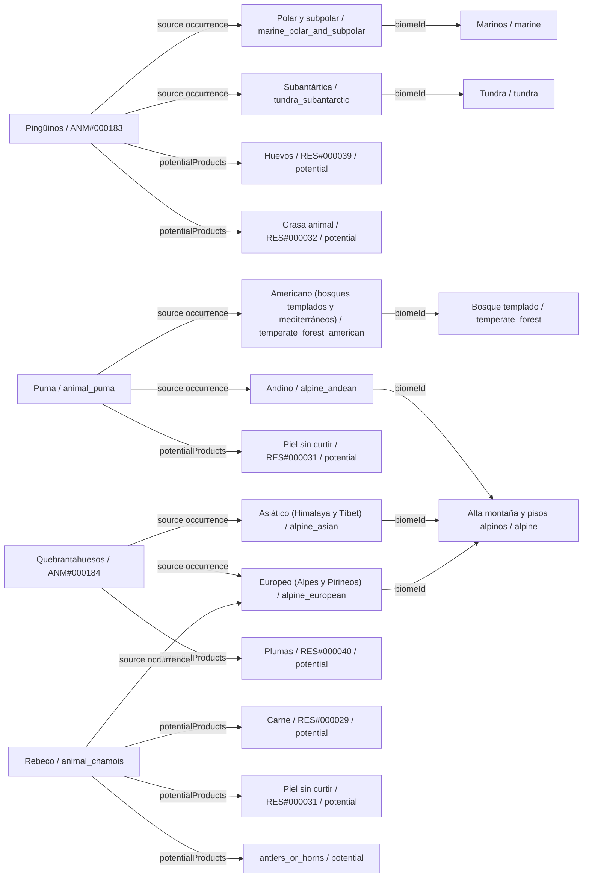
```mermaid
flowchart LR
    c0["Pingüinos / ANM#000183"]
    v10["Subantártica / tundra_subantarctic"]
    b2["Tundra / tundra"]
    v21["Polar y subpolar / marine_polar_and_subpolar"]
    b5["Marinos / marine"]
    o0_0["Huevos / RES#000039 / potential"]
    o0_1["Grasa animal / RES#000032 / potential"]
    c1["Puma / animal_puma"]
    v5["Americano (bosques templados y mediterráneos) / temperate_forest_american"]
    b1["Bosque templado / temperate_forest"]
    v23["Andino / alpine_andean"]
    b6["Alta montaña y pisos alpinos / alpine"]
    o1_0["Piel sin curtir / RES#000031 / potential"]
    c2["Quebrantahuesos / ANM#000184"]
    v24["Asiático (Himalaya y Tíbet) / alpine_asian"]
    v25["Europeo (Alpes y Pirineos) / alpine_european"]
    o2_0["Plumas / RES#000040 / potential"]
    c3["Rebeco / animal_chamois"]
    o3_0["Carne / RES#000029 / potential"]
    o3_1["Piel sin curtir / RES#000031 / potential"]
    o3_2["antlers_or_horns / potential"]
    c0 -->|potentialProducts| o0_0
    c0 -->|potentialProducts| o0_1
    c0 -->|source occurrence| v10
    c0 -->|source occurrence| v21
    c1 -->|potentialProducts| o1_0
    c1 -->|source occurrence| v23
    c1 -->|source occurrence| v5
    c2 -->|potentialProducts| o2_0
    c2 -->|source occurrence| v24
    c2 -->|source occurrence| v25
    c3 -->|potentialProducts| o3_0
    c3 -->|potentialProducts| o3_1
    c3 -->|potentialProducts| o3_2
    c3 -->|source occurrence| v25
    v10 -->|biomeId| b2
    v21 -->|biomeId| b5
    v23 -->|biomeId| b6
    v24 -->|biomeId| b6
    v25 -->|biomeId| b6
    v5 -->|biomeId| b1
```

### Grupo 21

```mermaid
flowchart LR
    c0["Reno / animal_reindeer"]
    v7["Boreal (taiga de Eurasia y Norteamérica) / temperate_forest_boreal"]
    b1["Bosque templado / temperate_forest"]
    v9["Euroasiática / tundra_eurasian"]
    b2["Tundra / tundra"]
    o0_0["Carne / RES#000029 / potential"]
    o0_1["Piel sin curtir / RES#000031 / potential"]
    o0_2["Astas / RES#000036 / potential"]
    o0_3["Leche / RES#000042 / potential"]
    o0_4["draft_service / potential"]
    c1["Saiga, estepas euroasiáticas / animal_eurasian_saiga"]
    v13["Euroasiática (praderas y estepas) / savanna_eurasian"]
    b3["Sabana / savanna"]
    o1_0["Carne / RES#000029 / potential"]
    o1_1["Piel sin curtir / RES#000031 / potential"]
    o1_2["antlers_or_horns / potential"]
    c2["Sardinas regionales / animal_regional_sardines"]
    v20["Costero y mar templado / marine_temperate_coast_and_sea"]
    b5["Marinos / marine"]
    o2_0["Aceite de pescado / RES#000034 / potential"]
    o2_1["Carne de pescado / RES#000030 / potential"]
    c3["Serpientes de cascabel regionales / animal_regional_rattlesnakes"]
    v15["Americano (Norteamérica y Sudamérica) / desert_american"]
    b4["Desierto / desert"]
    o3_0["Carne / RES#000029 / potential"]
    o3_1["Piel sin curtir / RES#000031 / potential"]
    c0 -->|potentialProducts| o0_0
    c0 -->|potentialProducts| o0_1
    c0 -->|potentialProducts| o0_2
    c0 -->|potentialProducts| o0_3
    c0 -->|potentialProducts| o0_4
    c0 -->|source occurrence| v7
    c0 -->|source occurrence| v9
    c1 -->|potentialProducts| o1_0
    c1 -->|potentialProducts| o1_1
    c1 -->|potentialProducts| o1_2
    c1 -->|source occurrence| v13
    c2 -->|potentialProducts| o2_0
    c2 -->|potentialProducts| o2_1
    c2 -->|source occurrence| v20
    c3 -->|potentialProducts| o3_0
    c3 -->|potentialProducts| o3_1
    c3 -->|source occurrence| v15
    v13 -->|biomeId| b3
    v15 -->|biomeId| b4
    v20 -->|biomeId| b5
    v7 -->|biomeId| b1
    v9 -->|biomeId| b2
```

### Grupo 22

```mermaid
flowchart LR
    c0["Tahr del Himalaya / animal_himalayan_tahr"]
    v24["Asiático (Himalaya y Tíbet) / alpine_asian"]
    b6["Alta montaña y pisos alpinos / alpine"]
    o0_0["Carne / RES#000029 / potential"]
    o0_1["Piel sin curtir / RES#000031 / potential"]
    o0_2["antlers_or_horns / potential"]
    c1["Tapires / ANM#000185"]
    v0["Americano (selvas húmedas y bosques secos) / tropical_forest_american"]
    b0["Bosque tropical / tropical_forest"]
    v2["Asiático (selvas y bosques estacionales) / tropical_forest_asian"]
    o1_0["Carne / RES#000029 / potential"]
    o1_1["Piel sin curtir / RES#000031 / potential"]
    c2["Tigre, en hábitats adecuados / animal_tiger"]
    o2_0["Piel sin curtir / RES#000031 / potential"]
    c3["Tortuga del desierto / animal_desert_tortoise"]
    v15["Americano (Norteamérica y Sudamérica) / desert_american"]
    b4["Desierto / desert"]
    o3_0["Carne / RES#000029 / potential"]
    o3_1["Huevos / RES#000039 / potential"]
    o3_2["Concha de animal / RES#000044 / potential"]
    c0 -->|potentialProducts| o0_0
    c0 -->|potentialProducts| o0_1
    c0 -->|potentialProducts| o0_2
    c0 -->|source occurrence| v24
    c1 -->|potentialProducts| o1_0
    c1 -->|potentialProducts| o1_1
    c1 -->|source occurrence| v0
    c1 -->|source occurrence| v2
    c2 -->|potentialProducts| o2_0
    c2 -->|source occurrence| v2
    c3 -->|potentialProducts| o3_0
    c3 -->|potentialProducts| o3_1
    c3 -->|potentialProducts| o3_2
    c3 -->|source occurrence| v15
    v0 -->|biomeId| b0
    v15 -->|biomeId| b4
    v2 -->|biomeId| b0
    v24 -->|biomeId| b6
```

### Grupo 23

```mermaid
flowchart LR
    c0["Tortugas marinas en zonas de alimentación y anidación / animal_sea_turtles"]
    v19["Costero tropical / marine_tropical_coast"]
    b5["Marinos / marine"]
    o0_0["Carne / RES#000029 / potential"]
    o0_1["Huevos / RES#000039 / potential"]
    o0_2["Concha de animal / RES#000044 / potential"]
    c1["Tortugas terrestres regionales / animal_regional_land_tortoises"]
    v6["Sudafricano y australiano (matorrales y bosques regionales) / temperate_forest_south_african_and_australian"]
    b1["Bosque templado / temperate_forest"]
    o1_0["Carne / RES#000029 / potential"]
    o1_1["Huevos / RES#000039 / potential"]
    o1_2["Concha de animal / RES#000044 / potential"]
    c2["Ualabíes regionales / animal_regional_wallabies"]
    v14["Australiana (sabanas tropicales) / savanna_australian"]
    b3["Sabana / savanna"]
    o2_0["Carne / RES#000029 / potential"]
    o2_1["Piel sin curtir / RES#000031 / potential"]
    c3["Vicuña / animal_vicuna"]
    v23["Andino / alpine_andean"]
    b6["Alta montaña y pisos alpinos / alpine"]
    o3_0["Carne / RES#000029 / potential"]
    o3_1["Piel sin curtir / RES#000031 / potential"]
    o3_2["Fibra animal / RES#000041 / potential"]
    c0 -->|potentialProducts| o0_0
    c0 -->|potentialProducts| o0_1
    c0 -->|potentialProducts| o0_2
    c0 -->|source occurrence| v19
    c1 -->|potentialProducts| o1_0
    c1 -->|potentialProducts| o1_1
    c1 -->|potentialProducts| o1_2
    c1 -->|source occurrence| v6
    c2 -->|potentialProducts| o2_0
    c2 -->|potentialProducts| o2_1
    c2 -->|source occurrence| v14
    c2 -->|source occurrence| v6
    c3 -->|potentialProducts| o3_0
    c3 -->|potentialProducts| o3_1
    c3 -->|potentialProducts| o3_2
    c3 -->|source occurrence| v23
    v14 -->|biomeId| b3
    v19 -->|biomeId| b5
    v23 -->|biomeId| b6
    v6 -->|biomeId| b1
```

### Grupo 24

```mermaid
flowchart LR
    c0["Vizcacha andina / animal_andean_viscacha"]
    v23["Andino / alpine_andean"]
    b6["Alta montaña y pisos alpinos / alpine"]
    o0_0["Carne / RES#000029 / potential"]
    o0_1["Piel sin curtir / RES#000031 / potential"]
    c1["Vizcachas en roquedos / animal_rock_dwelling_viscachas"]
    v15["Americano (Norteamérica y Sudamérica) / desert_american"]
    b4["Desierto / desert"]
    o1_0["Carne / RES#000029 / potential"]
    o1_1["Piel sin curtir / RES#000031 / potential"]
    c2["Yak salvaje, altiplano tibetano / animal_wild_yak"]
    v24["Asiático (Himalaya y Tíbet) / alpine_asian"]
    o2_0["Carne / RES#000029 / potential"]
    o2_1["Piel sin curtir / RES#000031 / potential"]
    o2_2["Fibra animal / RES#000041 / potential"]
    c3["Zorros / ANM#000169"]
    v5["Americano (bosques templados y mediterráneos) / temperate_forest_american"]
    b1["Bosque templado / temperate_forest"]
    v8["Norteamérica y Groenlandia / tundra_north_american_and_greenland"]
    b2["Tundra / tundra"]
    v9["Euroasiática / tundra_eurasian"]
    v16["Africano y arábigo / desert_african_and_arabian"]
    v17["Asiático central / desert_central_asian"]
    o3_0["Piel sin curtir / RES#000031 / potential"]
    o3_1["Carne / RES#000029 / potential"]
    o3_2["Huesos / RES#000105 / potential"]
    o3_3["Grasa animal / RES#000032 / potential"]
    c0 -->|potentialProducts| o0_0
    c0 -->|potentialProducts| o0_1
    c0 -->|source occurrence| v23
    c1 -->|potentialProducts| o1_0
    c1 -->|potentialProducts| o1_1
    c1 -->|source occurrence| v15
    c2 -->|potentialProducts| o2_0
    c2 -->|potentialProducts| o2_1
    c2 -->|potentialProducts| o2_2
    c2 -->|source occurrence| v24
    c3 -->|potentialProducts| o3_0
    c3 -->|potentialProducts| o3_1
    c3 -->|potentialProducts| o3_2
    c3 -->|potentialProducts| o3_3
    c3 -->|source occurrence| v15
    c3 -->|source occurrence| v16
    c3 -->|source occurrence| v17
    c3 -->|source occurrence| v5
    c3 -->|source occurrence| v8
    c3 -->|source occurrence| v9
    v15 -->|biomeId| b4
    v16 -->|biomeId| b4
    v17 -->|biomeId| b4
    v23 -->|biomeId| b6
    v24 -->|biomeId| b6
    v5 -->|biomeId| b1
    v8 -->|biomeId| b2
    v9 -->|biomeId| b2
```

### Grupo 25

```mermaid
flowchart LR
    c0["Águila real / animal_golden_eagle"]
    v25["Europeo (Alpes y Pirineos) / alpine_european"]
    b6["Alta montaña y pisos alpinos / alpine"]
    o0_0["Plumas / RES#000040 / potential"]
    c1["Íbices / ANM#000186"]
    v24["Asiático (Himalaya y Tíbet) / alpine_asian"]
    v26["Africano (Etiopía y África oriental) / alpine_african"]
    o1_0["Carne / RES#000029 / potential"]
    o1_1["Piel sin curtir / RES#000031 / potential"]
    o1_2["antlers_or_horns / potential"]
    c2["Ñandú común, Pampas / animal_greater_rhea"]
    v12["Americana (sabanas y praderas) / savanna_american"]
    b3["Sabana / savanna"]
    o2_0["Carne / RES#000029 / potential"]
    o2_1["Piel sin curtir / RES#000031 / potential"]
    o2_2["Huevos / RES#000039 / potential"]
    o2_3["Plumas / RES#000040 / potential"]
    c3["Ñu / animal_wildebeest"]
    v11["Africana (sabanas tropicales) / savanna_african"]
    o3_0["Carne / RES#000029 / potential"]
    o3_1["Piel sin curtir / RES#000031 / potential"]
    o3_2["antlers_or_horns / potential"]
    c0 -->|potentialProducts| o0_0
    c0 -->|source occurrence| v25
    c1 -->|potentialProducts| o1_0
    c1 -->|potentialProducts| o1_1
    c1 -->|potentialProducts| o1_2
    c1 -->|source occurrence| v24
    c1 -->|source occurrence| v25
    c1 -->|source occurrence| v26
    c2 -->|potentialProducts| o2_0
    c2 -->|potentialProducts| o2_1
    c2 -->|potentialProducts| o2_2
    c2 -->|potentialProducts| o2_3
    c2 -->|source occurrence| v12
    c3 -->|potentialProducts| o3_0
    c3 -->|potentialProducts| o3_1
    c3 -->|potentialProducts| o3_2
    c3 -->|source occurrence| v11
    v11 -->|biomeId| b3
    v12 -->|biomeId| b3
    v24 -->|biomeId| b6
    v25 -->|biomeId| b6
    v26 -->|biomeId| b6
```

### Grupo 26

```mermaid
flowchart LR
    c0["Órix de Arabia, Arabia / animal_arabian_oryx"]
    v16["Africano y arábigo / desert_african_and_arabian"]
    b4["Desierto / desert"]
    o0_0["Carne / RES#000029 / potential"]
    o0_1["Piel sin curtir / RES#000031 / potential"]
    o0_2["antlers_or_horns / potential"]
    c0 -->|potentialProducts| o0_0
    c0 -->|potentialProducts| o0_1
    c0 -->|potentialProducts| o0_2
    c0 -->|source occurrence| v16
    v16 -->|biomeId| b4
```

## Categorías agrupadas y compatibilidad

Los IDs anteriores apuntan a una sola entidad. La taxonomía científica es opcional.

| previousId | entityId |
| --- | --- |
| animal_corsac_fox | ANM#000169 |
| animal_culpeo_fox | ANM#000169 |
| animal_culpeo_fox_in_arid_habitats | ANM#000169 |
| animal_fennec_fox | ANM#000169 |
| animal_arctic_fox | ANM#000169 |
| animal_eurasian_moose | ANM#000170 |
| animal_north_american_moose | ANM#000170 |
| animal_regional_small_antelopes | ANM#000171 |
| animal_regional_antelopes | ANM#000171 |
| animal_chacma_baboon | ANM#000172 |
| animal_baboons | ANM#000172 |
| animal_coastal_crabs | ANM#000173 |
| animal_mangrove_crabs | ANM#000173 |
| animal_antilopine_kangaroo | ANM#000174 |
| animal_western_grey_kangaroo | ANM#000174 |
| animal_red_kangaroo | ANM#000174 |
| animal_new_guinea_tree_kangaroos | ANM#000174 |
| animal_chital | ANM#000175 |
| animal_red_deer | ANM#000175 |
| animal_sika_deer | ANM#000175 |
| animal_huemul | ANM#000175 |
| animal_pudu | ANM#000175 |
| animal_white_tailed_deer | ANM#000175 |
| animal_mesoamerican_white_tailed_deer | ANM#000175 |
| animal_pampas_deer | ANM#000175 |
| animal_african_forest_elephant | ANM#000176 |
| animal_african_savanna_elephant | ANM#000176 |
| animal_african_savanna_elephant_in_dry_forest_mosaics | ANM#000176 |
| animal_asian_elephant | ANM#000177 |
| animal_asian_elephant_in_suitable_forests | ANM#000177 |
| animal_mongolian_gazelle | ANM#000178 |
| animal_desert_gazelles | ANM#000178 |
| animal_guanaco_in_coastal_deserts_and_foothills | ANM#000179 |
| animal_guanaco_at_suitable_elevations | ANM#000179 |
| animal_wild_boar | ANM#000180 |
| animal_eurasian_wild_boar | ANM#000180 |
| animal_alpine_marmot | ANM#000181 |
| animal_steppe_marmots | ANM#000181 |
| animal_american_black_bear | ANM#000182 |
| animal_asian_black_bear | ANM#000182 |
| animal_brown_bear | ANM#000182 |
| animal_coastal_and_sea_ice_polar_bear | ANM#000182 |
| animal_island_coastal_penguins | ANM#000183 |
| animal_southern_regional_penguins | ANM#000183 |
| animal_bearded_vulture | ANM#000184 |
| animal_bearded_vulture_in_suitable_mountains | ANM#000184 |
| animal_regional_amazonian_or_central_american_tapir | ANM#000185 |
| animal_malayan_tapir | ANM#000185 |
| animal_alpine_ibex | ANM#000186 |
| animal_walia_ibex | ANM#000186 |
| animal_siberian_ibex | ANM#000186 |

## Todas las apariciones de la fuente

Esta tabla conserva cada vínculo regional y método de extracción aunque el diagrama agrupe flechas repetidas. La presencia inicial sigue deshabilitada.

| id | definitionId | biomeId | variantId | extractionMethodId | sourceText |
| --- | --- | --- | --- | --- | --- |
| occurrence_0009 | animal_jaguar | tropical_forest | tropical_forest_american | None | Jaguar [terrestre · piel (lujo) · caza; no ganadería] |
| occurrence_0010 | ANM#000175 | tropical_forest | tropical_forest_american | None | Venado cola blanca, Mesoamérica [terrestre · carne, piel (lujo), astas/cuernos (según especie) · caza] |
| occurrence_0011 | ANM#000185 | tropical_forest | tropical_forest_american | None | Tapir amazónico o centroamericano, según zona [terrestre · carne, piel (lujo) · caza] |
| occurrence_0012 | animal_collared_peccary | tropical_forest | tropical_forest_american | None | Pecarí de collar [terrestre · carne, piel (lujo), colmillos · caza; domesticación no automática] |
| occurrence_0013 | animal_howler_monkey | tropical_forest | tropical_forest_american | None | Mono aullador [terrestre · fauna silvestre; sin producción ganadera] |
| occurrence_0014 | animal_ocellated_turkey | tropical_forest | tropical_forest_american | None | Pavo ocelado, Yucatán y zonas vecinas [terrestre · carne, huevos, plumas · cría potencial según especie] |
| occurrence_0015 | animal_macaws | tropical_forest | tropical_forest_american | None | Guacamayas [terrestre · plumas ornamentales (lujo) · captura] |
| occurrence_0031 | animal_western_gorilla | tropical_forest | tropical_forest_african | None | Gorila occidental, África central occidental [terrestre · fauna silvestre; sin producción ganadera] |
| occurrence_0032 | ANM#000176 | tropical_forest | tropical_forest_african | None | Elefante africano de sabana, mosaicos de bosque seco [terrestre · marfil (lujo), piel (lujo) · fauna silvestre] |
| occurrence_0033 | animal_okapi | tropical_forest | tropical_forest_african | None | Okapi, cuenca del Congo [terrestre · piel (lujo), carne · caza; no ganadería] |
| occurrence_0034 | ANM#000172 | tropical_forest | tropical_forest_african | None | Babuinos [terrestre · fauna silvestre; sin producción ganadera] |
| occurrence_0035 | ANM#000176 | tropical_forest | tropical_forest_african | None | Elefante africano de bosque [terrestre · marfil (lujo), piel (lujo) · fauna silvestre] |
| occurrence_0036 | ANM#000171 | tropical_forest | tropical_forest_african | None | Antílopes regionales [terrestre · carne, piel (lujo), astas/cuernos (según especie) · caza] |
| occurrence_0037 | animal_chimpanzee | tropical_forest | tropical_forest_african | None | Chimpancé, zonas compatibles [terrestre · fauna silvestre; sin producción ganadera] |
| occurrence_0053 | ANM#000177 | tropical_forest | tropical_forest_asian | None | Elefante asiático [terrestre · trabajo y transporte (adiestramiento); marfil (lujo) · no domesticación plena] |
| occurrence_0054 | animal_indian_peafowl | tropical_forest | tropical_forest_asian | None | Pavo real azul, subcontinente indio [terrestre · carne, huevos, plumas · cría potencial según especie] |
| occurrence_0055 | animal_tiger | tropical_forest | tropical_forest_asian | None | Tigre, en hábitats adecuados [terrestre · piel (lujo) · caza; no ganadería] |
| occurrence_0056 | ANM#000175 | tropical_forest | tropical_forest_asian | None | Ciervo axis, India y Sri Lanka [terrestre · carne, piel (lujo), astas/cuernos (según especie) · caza] |
| occurrence_0057 | animal_red_junglefowl | tropical_forest | tropical_forest_asian | None | Gallina roja de la jungla (Gallus gallus) [terrestre · carne, huevos, plumas · cría potencial según especie] |
| occurrence_0058 | ANM#000177 | tropical_forest | tropical_forest_asian | None | Elefante asiático en bosques apropiados [terrestre · trabajo y transporte (adiestramiento); marfil (lujo) · no domesticación plena] |
| occurrence_0059 | ANM#000185 | tropical_forest | tropical_forest_asian | None | Tapir malayo, península malaya y Sumatra [terrestre · carne, piel (lujo) · caza] |
| occurrence_0075 | animal_southern_cassowary | tropical_forest | tropical_forest_oceanian | None | Casuario del sur, Nueva Guinea y norte de Australia [terrestre · carne, huevos, plumas, piel · caza/cría según especie] |
| occurrence_0076 | ANM#000174 | tropical_forest | tropical_forest_oceanian | None | Canguros arborícolas de Nueva Guinea [terrestre · carne, piel (lujo) · caza] |
| occurrence_0077 | animal_birds_of_paradise | tropical_forest | tropical_forest_oceanian | None | Aves del paraíso [terrestre · plumas ornamentales (lujo) · captura] |
| occurrence_0078 | animal_cuscuses_and_other_arboreal_marsupials | tropical_forest | tropical_forest_oceanian | None | Cuscús y otros marsupiales arborícolas [terrestre · carne, piel (lujo) · caza] |
| occurrence_0091 | ANM#000175 | temperate_forest | temperate_forest_eurasian | None | Ciervo rojo [terrestre · carne, piel (lujo), astas/cuernos (según especie) · caza] |
| occurrence_0092 | ANM#000175 | temperate_forest | temperate_forest_eurasian | None | Ciervo sika [terrestre · carne, piel (lujo), astas/cuernos (según especie) · caza] |
| occurrence_0093 | ANM#000180 | temperate_forest | temperate_forest_eurasian | None | Jabalí [terrestre · carne, piel (lujo), colmillos · caza; domesticación no automática] |
| occurrence_0094 | ANM#000180 | temperate_forest | temperate_forest_eurasian | None | Jabalí euroasiático [terrestre · carne, piel (lujo), colmillos · caza; domesticación no automática] |
| occurrence_0095 | animal_european_rabbit | temperate_forest | temperate_forest_eurasian | None | Conejo europeo, área nativa ibérica [terrestre · carne, piel (lujo) · caza; cría solo si es viable] |
| occurrence_0096 | ANM#000182 | temperate_forest | temperate_forest_eurasian | None | Oso pardo [terrestre · carne, grasa, piel (lujo) · caza] |
| occurrence_0097 | ANM#000182 | temperate_forest | temperate_forest_eurasian | None | Oso negro asiático [terrestre · carne, grasa, piel (lujo) · caza] |
| occurrence_0113 | ANM#000175 | temperate_forest | temperate_forest_american | None | Venado cola blanca [terrestre · carne, piel (lujo), astas/cuernos (según especie) · caza] |
| occurrence_0114 | ANM#000175 | temperate_forest | temperate_forest_american | None | Pudú [terrestre · carne, piel (lujo), astas/cuernos (según especie) · caza] |
| occurrence_0115 | animal_coyote | temperate_forest | temperate_forest_american | None | Coyote [terrestre · piel (lujo) · caza; no ganadería] |
| occurrence_0116 | ANM#000169 | temperate_forest | temperate_forest_american | None | Zorro culpeo [terrestre · piel (lujo) · caza; no ganadería] |
| occurrence_0117 | ANM#000182 | temperate_forest | temperate_forest_american | None | Oso negro americano [terrestre · carne, grasa, piel (lujo) · caza] |
| occurrence_0118 | ANM#000175 | temperate_forest | temperate_forest_american | None | Huemul en bosques andino-patagónicos [terrestre · carne, piel (lujo), astas/cuernos (según especie) · caza] |
| occurrence_0119 | animal_puma | temperate_forest | temperate_forest_american | None | Puma [terrestre · piel (lujo) · caza; no ganadería] |
| occurrence_0135 | ANM#000171 | temperate_forest | temperate_forest_south_african_and_australian | None | Antílopes pequeños regionales [terrestre · carne, piel (lujo), astas/cuernos (según especie) · caza] |
| occurrence_0136 | ANM#000174 | temperate_forest | temperate_forest_south_african_and_australian | None | Canguro gris occidental [terrestre · carne, piel (lujo) · caza] |
| occurrence_0137 | ANM#000172 | temperate_forest | temperate_forest_south_african_and_australian | None | Babuino chacma en zonas compatibles [terrestre · fauna silvestre; sin producción ganadera] |
| occurrence_0138 | animal_regional_wallabies | temperate_forest | temperate_forest_south_african_and_australian | None | Ualabíes regionales [terrestre · carne, piel (lujo) · caza] |
| occurrence_0139 | animal_regional_land_tortoises | temperate_forest | temperate_forest_south_african_and_australian | None | Tortugas terrestres regionales [terrestre · carne, huevos, caparazón · caza/recolección] |
| occurrence_0140 | animal_short_beaked_echidna | temperate_forest | temperate_forest_south_african_and_australian | None | Equidna de hocico corto [terrestre · carne, piel (lujo) · fauna silvestre] |
| occurrence_0141 | animal_australian_scrub_birds | temperate_forest | temperate_forest_south_african_and_australian | None | Aves de matorral australiano [terrestre · huevos, plumas · fauna silvestre] |
| occurrence_0157 | ANM#000170 | temperate_forest | temperate_forest_boreal | None | Alce euroasiático [terrestre · carne, piel (lujo), astas/cuernos (según especie) · caza] |
| occurrence_0158 | ANM#000170 | temperate_forest | temperate_forest_boreal | None | Alce norteamericano [terrestre · carne, piel (lujo), astas/cuernos (según especie) · caza] |
| occurrence_0159 | animal_reindeer | temperate_forest | temperate_forest_boreal | None | Reno [terrestre · carne, piel (lujo), astas; leche/tracción solo con domesticación apta] |
| occurrence_0160 | animal_woodland_caribou | temperate_forest | temperate_forest_boreal | None | Caribú de bosque [terrestre · carne, piel (lujo), astas; leche/tracción solo con domesticación apta] |
| occurrence_0161 | ANM#000182 | temperate_forest | temperate_forest_boreal | None | Oso pardo [terrestre · carne, grasa, piel (lujo) · caza] |
| occurrence_0162 | ANM#000182 | temperate_forest | temperate_forest_boreal | None | Oso negro americano [terrestre · carne, grasa, piel (lujo) · caza] |
| occurrence_0163 | animal_eurasian_lynx | temperate_forest | temperate_forest_boreal | None | Lince euroasiático [terrestre · piel (lujo) · caza; no ganadería] |
| occurrence_0179 | animal_muskox | tundra | tundra_north_american_and_greenland | None | Buey almizclero [terrestre · carne, fibra, piel (lujo) · silvestre] |
| occurrence_0180 | animal_tundra_caribou | tundra | tundra_north_american_and_greenland | None | Caribú de tundra [terrestre · carne, piel (lujo), astas; leche/tracción solo con domesticación apta] |
| occurrence_0181 | ANM#000169 | tundra | tundra_north_american_and_greenland | None | Zorro ártico [terrestre · piel (lujo) · caza; no ganadería] |
| occurrence_0182 | animal_arctic_hare | tundra | tundra_north_american_and_greenland | None | Liebre ártica [terrestre · carne, piel (lujo) · caza; cría solo si es viable] |
| occurrence_0183 | ANM#000182 | tundra | tundra_north_american_and_greenland | None | Oso polar solo en costas y hielo marino [terrestre · carne, grasa, piel (lujo) · caza] |
| occurrence_0197 | animal_reindeer | tundra | tundra_eurasian | None | Reno [terrestre · carne, piel (lujo), astas; leche/tracción solo con domesticación apta] |
| occurrence_0198 | ANM#000169 | tundra | tundra_eurasian | None | Zorro ártico [terrestre · piel (lujo) · caza; no ganadería] |
| occurrence_0199 | animal_lemming | tundra | tundra_eurasian | None | Lemming [terrestre · carne, piel (lujo) · caza; cría solo si es viable] |
| occurrence_0200 | animal_snowy_owl | tundra | tundra_eurasian | None | Búho nival [terrestre · plumas · fauna silvestre] |
| occurrence_0201 | animal_subarctic_wolverine | tundra | tundra_eurasian | None | Glotón en transición subártica [terrestre · piel (lujo) · caza; no ganadería] |
| occurrence_0214 | ANM#000183 | tundra | tundra_subantarctic | None | Pingüinos en costas de islas apropiadas [marino-costero · huevos, grasa · recolección/caza] |
| occurrence_0215 | animal_coastal_elephant_seals | tundra | tundra_subantarctic | None | Elefantes marinos en costas [marino-costero · aceite animal, piel (lujo) · caza] |
| occurrence_0216 | animal_island_petrels_and_albatrosses | tundra | tundra_subantarctic | None | Petreles y albatros en islas apropiadas [marino-costero · huevos, plumas · recolección] |
| occurrence_0229 | ANM#000176 | savanna | savanna_african | None | Elefante africano de sabana [terrestre · marfil (lujo), piel (lujo) · fauna silvestre] |
| occurrence_0230 | animal_giraffe | savanna | savanna_african | None | Jirafa [terrestre · piel (lujo), carne · caza; no ganadería] |
| occurrence_0231 | animal_plains_zebra | savanna | savanna_african | None | Cebra de llanura [terrestre · carne, piel (lujo) · silvestre; no tracción ganadera automática] |
| occurrence_0232 | animal_lion | savanna | savanna_african | None | León [terrestre · piel (lujo) · caza; no ganadería] |
| occurrence_0233 | animal_wildebeest | savanna | savanna_african | None | Ñu [terrestre · carne, piel (lujo), astas/cuernos (según especie) · caza] |
| occurrence_0234 | animal_african_buffalo | savanna | savanna_african | None | Búfalo africano [terrestre · carne, piel (lujo), cuernos · caza; no ganadería automática] |
| occurrence_0248 | animal_capybara | savanna | savanna_american | None | Capibara, cerca de agua [terrestre · carne, piel (lujo) · caza] |
| occurrence_0249 | animal_american_bison | savanna | savanna_american | None | Bisonte americano [terrestre · carne, piel (lujo), cuernos · caza; no ganadería automática] |
| occurrence_0250 | animal_greater_rhea | savanna | savanna_american | None | Ñandú común, Pampas [terrestre · carne, huevos, plumas, piel · caza/cría según especie] |
| occurrence_0251 | animal_giant_anteater | savanna | savanna_american | None | Oso hormiguero gigante [terrestre · carne, grasa, piel (lujo) · caza] |
| occurrence_0252 | animal_prairie_dog | savanna | savanna_american | None | Perrito de la pradera [terrestre · carne, piel (lujo) · caza; cría solo si es viable] |
| occurrence_0253 | ANM#000175 | savanna | savanna_american | None | Venado de las pampas [terrestre · carne, piel (lujo), astas/cuernos (según especie) · caza] |
| occurrence_0254 | animal_maned_wolf | savanna | savanna_american | None | Lobo de crin, Cerrado [terrestre · piel (lujo) · caza; no ganadería] |
| occurrence_0270 | animal_eurasian_saiga | savanna | savanna_eurasian | None | Saiga, estepas euroasiáticas [terrestre · carne, piel (lujo), astas/cuernos (según especie) · caza] |
| occurrence_0271 | animal_przewalski_horse | savanna | savanna_eurasian | None | Caballo de Przewalski, Asia central [terrestre · carne, piel (lujo) · silvestre; no caballo doméstico] |
| occurrence_0272 | ANM#000181 | savanna | savanna_eurasian | None | Marmotas de estepa [terrestre · carne, piel (lujo) · caza; cría solo si es viable] |
| occurrence_0273 | animal_grey_wolf | savanna | savanna_eurasian | None | Lobo gris [terrestre · piel (lujo) · caza; no ganadería] |
| occurrence_0286 | ANM#000174 | savanna | savanna_australian | None | Canguro antilopino, norte de Australia [terrestre · carne, piel (lujo) · caza] |
| occurrence_0287 | animal_emu | savanna | savanna_australian | None | Emú, zonas abiertas compatibles [terrestre · carne, huevos, plumas, piel · caza/cría según especie] |
| occurrence_0288 | animal_regional_wallabies | savanna | savanna_australian | None | Ualabíes regionales [terrestre · carne, piel (lujo) · caza] |
| occurrence_0289 | animal_cockatoos_and_savanna_birds | savanna | savanna_australian | None | Cacatúas y aves de sabana [terrestre · plumas ornamentales (lujo) · captura] |
| occurrence_0302 | animal_roadrunner | desert | desert_american | None | Correcaminos [terrestre · huevos, plumas · fauna silvestre] |
| occurrence_0303 | ANM#000169 | desert | desert_american | None | Zorro culpeo en ambientes áridos [terrestre · piel (lujo) · caza; no ganadería] |
| occurrence_0304 | animal_coyote | desert | desert_american | None | Coyote [terrestre · piel (lujo) · caza; no ganadería] |
| occurrence_0305 | animal_rock_dwelling_viscachas | desert | desert_american | None | Vizcachas en roquedos [terrestre · carne, piel (lujo) · caza; cría solo si es viable] |
| occurrence_0306 | animal_regional_rattlesnakes | desert | desert_american | None | Serpientes de cascabel regionales [terrestre · piel (lujo), carne · caza] |
| occurrence_0307 | ANM#000179 | desert | desert_american | None | Guanaco en desiertos costeros y piedemonte [terrestre · fibra, carne, piel (lujo) · silvestre; fibra por captura/esquila] |
| occurrence_0308 | animal_desert_tortoise | desert | desert_american | None | Tortuga del desierto [terrestre · carne, huevos, caparazón · caza/recolección] |
| occurrence_0324 | ANM#000169 | desert | desert_african_and_arabian | None | Zorro fénec, Sáhara [terrestre · piel (lujo) · caza; no ganadería] |
| occurrence_0325 | animal_arabian_oryx | desert | desert_african_and_arabian | None | Órix de Arabia, Arabia [terrestre · carne, piel (lujo), astas/cuernos (según especie) · caza] |
| occurrence_0326 | ANM#000178 | desert | desert_african_and_arabian | None | Gacelas desérticas [terrestre · carne, piel (lujo), astas/cuernos (según especie) · caza] |
| occurrence_0327 | animal_introduced_domestic_or_feral_dromedary | desert | desert_african_and_arabian | None | Dromedario doméstico o asilvestrado: solo si fue introducido [terrestre · leche, carne, piel (lujo), carga y transporte · ganadería si introducido] |
| occurrence_0340 | animal_wild_bactrian_camel | desert | desert_central_asian | None | Camello bactriano salvaje, regiones remotas de Asia central [terrestre · carne, piel (lujo), fibra · silvestre; no equivale a camello doméstico] |
| occurrence_0341 | animal_regional_jerboas_and_gerbils | desert | desert_central_asian | None | Jerbos y gerbillos regionales [terrestre · carne, piel (lujo) · caza; cría solo si es viable] |
| occurrence_0342 | ANM#000178 | desert | desert_central_asian | None | Gacela de Mongolia, Gobi [terrestre · carne, piel (lujo), astas/cuernos (según especie) · caza] |
| occurrence_0343 | ANM#000169 | desert | desert_central_asian | None | Zorro corsac [terrestre · piel (lujo) · caza; no ganadería] |
| occurrence_0356 | animal_dingo | desert | desert_australian | None | Dingo [terrestre · piel (lujo) · caza; no ganadería] |
| occurrence_0357 | ANM#000174 | desert | desert_australian | None | Canguro rojo [terrestre · carne, piel (lujo) · caza] |
| occurrence_0358 | animal_perentie | desert | desert_australian | None | Perentie (varano gigante) [terrestre · carne, piel (lujo) · caza] |
| occurrence_0359 | animal_short_beaked_echidna | desert | desert_australian | None | Equidna de hocico corto [terrestre · carne, piel (lujo) · fauna silvestre] |
| occurrence_0370 | animal_regional_reef_fish | marine | marine_tropical_coast | None | Peces arrecifales, especies regionales [marino · pescado (alimento), aceite de pescado (según especie) · pesca] |
| occurrence_0371 | animal_sea_turtles | marine | marine_tropical_coast | None | Tortugas marinas en zonas de alimentación y anidación [marino · carne, huevos, caparazón · caza/recolección] |
| occurrence_0372 | ANM#000173 | marine | marine_tropical_coast | None | Cangrejos costeros [marino-costero · carne, caparazones · pesca/recolección] |
| occurrence_0373 | animal_tropical_mollusks_and_bivalves | marine | marine_tropical_coast | None | Moluscos y bivalvos tropicales [marino · alimento, conchas; perlas (solo especies aptas) · recolección] |
| occurrence_0383 | animal_atlantic_cod | marine | marine_temperate_coast_and_sea | None | Bacalao del Atlántico, Atlántico norte [marino · pescado (alimento), aceite de pescado (según especie) · pesca] |
| occurrence_0384 | animal_regional_sardines | marine | marine_temperate_coast_and_sea | None | Sardinas regionales [marino · pescado (alimento), aceite de pescado (según especie) · pesca] |
| occurrence_0385 | animal_regional_mussels_and_oysters | marine | marine_temperate_coast_and_sea | None | Mejillones y ostras, según región [marino · alimento, conchas; perlas (solo especies aptas) · recolección] |
| occurrence_0386 | animal_coastal_seals_and_sea_lions | marine | marine_temperate_coast_and_sea | None | Focas y lobos marinos en costas apropiadas [marino-costero · carne, grasa/aceite, piel (lujo) · caza] |
| occurrence_0396 | animal_regional_seals | marine | marine_polar_and_subpolar | None | Focas de especies regionales [marino-costero · carne, grasa/aceite, piel (lujo) · caza] |
| occurrence_0397 | animal_regional_migratory_whales | marine | marine_polar_and_subpolar | None | Ballenas migratorias, según región [marino · aceite de ballena, carne, barbas (según especie) · caza marítima] |
| occurrence_0398 | animal_antarctic_krill | marine | marine_polar_and_subpolar | None | Krill antártico, océano Austral [marino · alimento marino · pesca] |
| occurrence_0399 | animal_regional_polar_fish | marine | marine_polar_and_subpolar | None | Peces polares regionales [marino · pescado (alimento), aceite de pescado (según especie) · pesca] |
| occurrence_0400 | ANM#000183 | marine | marine_polar_and_subpolar | None | Pingüinos únicamente en regiones australes apropiadas [marino-costero · huevos, grasa · recolección/caza] |
| occurrence_0411 | ANM#000173 | marine | marine_coastal_wetlands | None | Cangrejos de manglar (costas tropicales) [marino-costero · carne, caparazones · pesca/recolección] |
| occurrence_0412 | animal_estuarine_oysters_and_other_bivalves | marine | marine_coastal_wetlands | None | Ostras y otros bivalvos de estuario [marino · alimento, conchas; perlas (solo especies aptas) · recolección] |
| occurrence_0413 | animal_juvenile_estuarine_fish | marine | marine_coastal_wetlands | None | Peces juveniles de estuario [marino · pescado (alimento), aceite de pescado (según especie) · pesca] |
| occurrence_0414 | animal_shorebirds_and_waterbirds | marine | marine_coastal_wetlands | None | Aves limícolas y acuáticas [costero · carne, huevos, plumas · caza/recolección] |
| occurrence_0426 | animal_vicuna | alpine | alpine_andean | None | Vicuña [terrestre · fibra, carne, piel (lujo) · silvestre; fibra por captura/esquila] |
| occurrence_0427 | ANM#000179 | alpine | alpine_andean | None | Guanaco en pisos adecuados [terrestre · fibra, carne, piel (lujo) · silvestre; fibra por captura/esquila] |
| occurrence_0428 | animal_andean_condor | alpine | alpine_andean | None | Cóndor andino [terrestre · plumas · fauna silvestre] |
| occurrence_0429 | animal_puma | alpine | alpine_andean | None | Puma [terrestre · piel (lujo) · caza; no ganadería] |
| occurrence_0430 | animal_andean_viscacha | alpine | alpine_andean | None | Vizcacha andina [terrestre · carne, piel (lujo) · caza; cría solo si es viable] |
| occurrence_0444 | animal_snow_leopard | alpine | alpine_asian | None | Leopardo de las nieves [terrestre · piel (lujo) · caza; no ganadería] |
| occurrence_0445 | animal_wild_yak | alpine | alpine_asian | None | Yak salvaje, altiplano tibetano [terrestre · carne, piel (lujo), fibra · silvestre; domesticación requiere población apta] |
| occurrence_0446 | ANM#000186 | alpine | alpine_asian | None | Íbice siberiano, Asia central [terrestre · carne, piel (lujo), astas/cuernos (según especie) · caza] |
| occurrence_0447 | animal_himalayan_tahr | alpine | alpine_asian | None | Tahr del Himalaya [terrestre · carne, piel (lujo), astas/cuernos (según especie) · caza] |
| occurrence_0448 | ANM#000184 | alpine | alpine_asian | None | Quebrantahuesos [terrestre · plumas · fauna silvestre] |
| occurrence_0461 | ANM#000186 | alpine | alpine_european | None | Íbice alpino, Alpes [terrestre · carne, piel (lujo), astas/cuernos (según especie) · caza] |
| occurrence_0462 | animal_chamois | alpine | alpine_european | None | Rebeco [terrestre · carne, piel (lujo), astas/cuernos (según especie) · caza] |
| occurrence_0463 | ANM#000181 | alpine | alpine_european | None | Marmota alpina [terrestre · carne, piel (lujo) · caza; cría solo si es viable] |
| occurrence_0464 | animal_golden_eagle | alpine | alpine_european | None | Águila real [terrestre · plumas · fauna silvestre] |
| occurrence_0465 | ANM#000184 | alpine | alpine_european | None | Quebrantahuesos en cordilleras apropiadas [terrestre · plumas · fauna silvestre] |
| occurrence_0478 | animal_gelada | alpine | alpine_african | None | Gelada, altiplano etíope [terrestre · fauna silvestre; sin producción ganadera] |
| occurrence_0479 | ANM#000186 | alpine | alpine_african | None | Íbice de Walia, macizo de Simien [terrestre · carne, piel (lujo), astas/cuernos (según especie) · caza] |
| occurrence_0480 | animal_ethiopian_wolf | alpine | alpine_african | None | Lobo etíope, tierras altas de Etiopía [terrestre · piel (lujo) · caza; no ganadería] |
| occurrence_0481 | animal_rock_hyraxes | alpine | alpine_african | None | Damanes de roca [terrestre · carne, piel (lujo) · fauna silvestre] |

[Optional scientific background / Referencia científica opcional](BIOLOGY.es.md)
