# Animals — Complete reference diagrams

[Diagram index](../../lang/en/catalog-diagrams.md) · [English](DIAGRAMS.md) · [Español](DIAGRAMS.es.md)

[JSON](animals.catalog.guide.json) · [Complete JSON structure](../../lang/en/json-structures.md)

Every catalog record is included. Several small diagrams in this file keep the reference readable. Arrows represent documented links, not yield, guaranteed presence or inferred evolution. Existing IDs are preserved.

Candidates do not have finalized taxonomy, ecology, products or processes. Only existing relationships are drawn. Potential product tags are not resource IDs or confirmed production quantities.

## Complete inventory

| id | Name |
| --- | --- |
| animal_eurasian_moose | Eurasian Moose |
| animal_north_american_moose | North American Moose |
| animal_regional_small_antelopes | Regional Small Antelopes |
| animal_regional_antelopes | Regional Antelopes |
| animal_australian_scrub_birds | Australian Scrub Birds |
| animal_birds_of_paradise | Birds of Paradise |
| animal_shorebirds_and_waterbirds | Shorebirds and Waterbirds |
| animal_chacma_baboon | Chacma Baboon |
| animal_baboons | Baboons |
| animal_atlantic_cod | Atlantic Cod |
| animal_regional_migratory_whales | Regional Migratory Whales |
| animal_american_bison | American Bison |
| animal_muskox | Muskox |
| animal_african_buffalo | African Buffalo |
| animal_snowy_owl | Snowy Owl |
| animal_przewalski_horse | Przewalski Horse |
| animal_cockatoos_and_savanna_birds | Cockatoos and Savanna Birds |
| animal_wild_bactrian_camel | Wild Bactrian Camel |
| animal_coastal_crabs | Coastal Crabs |
| animal_mangrove_crabs | Mangrove Crabs |
| animal_antilopine_kangaroo | Antilopine Kangaroo |
| animal_western_grey_kangaroo | Western Grey Kangaroo |
| animal_red_kangaroo | Red Kangaroo |
| animal_new_guinea_tree_kangaroos | New Guinea Tree Kangaroos |
| animal_capybara | Capybara |
| animal_woodland_caribou | Woodland Caribou |
| animal_tundra_caribou | Tundra Caribou |
| animal_southern_cassowary | Southern Cassowary |
| animal_plains_zebra | Plains Zebra |
| animal_chimpanzee | Chimpanzee |
| animal_chital | Chital |
| animal_red_deer | Red Deer |
| animal_sika_deer | Sika Deer |
| animal_european_rabbit | European Rabbit |
| animal_roadrunner | Roadrunner |
| animal_coyote | Coyote |
| animal_cuscuses_and_other_arboreal_marsupials | Cuscuses and Other Arboreal Marsupials |
| animal_andean_condor | Andean Condor |
| animal_rock_hyraxes | Rock Hyraxes |
| animal_dingo | Dingo |
| animal_introduced_domestic_or_feral_dromedary | Introduced Domestic or Feral Dromedary |
| animal_african_forest_elephant | African Forest Elephant |
| animal_african_savanna_elephant | African Savanna Elephant |
| animal_african_savanna_elephant_in_dry_forest_mosaics | African Savanna Elephant in Dry-Forest Mosaics |
| animal_asian_elephant | Asian Elephant |
| animal_asian_elephant_in_suitable_forests | Asian Elephant in Suitable Forests |
| animal_coastal_elephant_seals | Coastal Elephant Seals |
| animal_emu | Emu |
| animal_short_beaked_echidna | Short-Beaked Echidna |
| animal_regional_seals | Regional Seals |
| animal_coastal_seals_and_sea_lions | Coastal Seals and Sea Lions |
| animal_mongolian_gazelle | Mongolian Gazelle |
| animal_desert_gazelles | Desert Gazelles |
| animal_red_junglefowl | Red Junglefowl |
| animal_gelada | Gelada |
| animal_subarctic_wolverine | Subarctic Wolverine |
| animal_western_gorilla | Western Gorilla |
| animal_macaws | Macaws |
| animal_guanaco_in_coastal_deserts_and_foothills | Guanaco in Coastal Deserts and Foothills |
| animal_guanaco_at_suitable_elevations | Guanaco at Suitable Elevations |
| animal_huemul | Huemul |
| animal_wild_boar | Wild Boar |
| animal_eurasian_wild_boar | Eurasian Wild Boar |
| animal_jaguar | Jaguar |
| animal_regional_jerboas_and_gerbils | Regional Jerboas and Gerbils |
| animal_giraffe | Giraffe |
| animal_antarctic_krill | Antarctic Krill |
| animal_lemming | Lemming |
| animal_snow_leopard | Snow Leopard |
| animal_lion | Lion |
| animal_arctic_hare | Arctic Hare |
| animal_eurasian_lynx | Eurasian Lynx |
| animal_maned_wolf | Maned Wolf |
| animal_ethiopian_wolf | Ethiopian Wolf |
| animal_grey_wolf | Grey Wolf |
| animal_alpine_marmot | Alpine Marmot |
| animal_steppe_marmots | Steppe Marmots |
| animal_regional_mussels_and_oysters | Regional Mussels and Oysters |
| animal_tropical_mollusks_and_bivalves | Tropical Mollusks and Bivalves |
| animal_howler_monkey | Howler Monkey |
| animal_okapi | Okapi |
| animal_giant_anteater | Giant Anteater |
| animal_american_black_bear | American Black Bear |
| animal_asian_black_bear | Asian Black Bear |
| animal_brown_bear | Brown Bear |
| animal_coastal_and_sea_ice_polar_bear | Coastal and Sea-Ice Polar Bear |
| animal_estuarine_oysters_and_other_bivalves | Estuarine Oysters and Other Bivalves |
| animal_ocellated_turkey | Ocellated Turkey |
| animal_indian_peafowl | Indian Peafowl |
| animal_collared_peccary | Collared Peccary |
| animal_regional_reef_fish | Regional Reef Fish |
| animal_juvenile_estuarine_fish | Juvenile Estuarine Fish |
| animal_regional_polar_fish | Regional Polar Fish |
| animal_perentie | Perentie |
| animal_prairie_dog | Prairie Dog |
| animal_island_petrels_and_albatrosses | Island Petrels and Albatrosses |
| animal_island_coastal_penguins | Island Coastal Penguins |
| animal_southern_regional_penguins | Southern Regional Penguins |
| animal_pudu | Pudu |
| animal_puma | Puma |
| animal_bearded_vulture | Bearded Vulture |
| animal_bearded_vulture_in_suitable_mountains | Bearded Vulture in Suitable Mountains |
| animal_chamois | Chamois |
| animal_reindeer | Reindeer |
| animal_eurasian_saiga | Eurasian Saiga |
| animal_regional_sardines | Regional Sardines |
| animal_regional_rattlesnakes | Regional Rattlesnakes |
| animal_himalayan_tahr | Himalayan Tahr |
| animal_regional_amazonian_or_central_american_tapir | Regional Amazonian or Central American Tapir |
| animal_malayan_tapir | Malayan Tapir |
| animal_tiger | Tiger |
| animal_desert_tortoise | Desert Tortoise |
| animal_sea_turtles | Sea Turtles |
| animal_regional_land_tortoises | Regional Land Tortoises |
| animal_regional_wallabies | Regional Wallabies |
| animal_white_tailed_deer | White-Tailed Deer |
| animal_mesoamerican_white_tailed_deer | Mesoamerican White-Tailed Deer |
| animal_pampas_deer | Pampas Deer |
| animal_vicuna | Vicuna |
| animal_andean_viscacha | Andean Viscacha |
| animal_rock_dwelling_viscachas | Rock-Dwelling Viscachas |
| animal_wild_yak | Wild Yak |
| animal_corsac_fox | Corsac Fox |
| animal_culpeo_fox | Culpeo Fox |
| animal_culpeo_fox_in_arid_habitats | Culpeo Fox in Arid Habitats |
| animal_fennec_fox | Fennec Fox |
| animal_arctic_fox | Arctic Fox |
| animal_golden_eagle | Golden Eagle |
| animal_alpine_ibex | Alpine Ibex |
| animal_walia_ibex | Walia Ibex |
| animal_siberian_ibex | Siberian Ibex |
| animal_greater_rhea | Greater Rhea |
| animal_wildebeest | Wildebeest |
| animal_arabian_oryx | Arabian Oryx |

## Relationships for every candidate

### Group 1

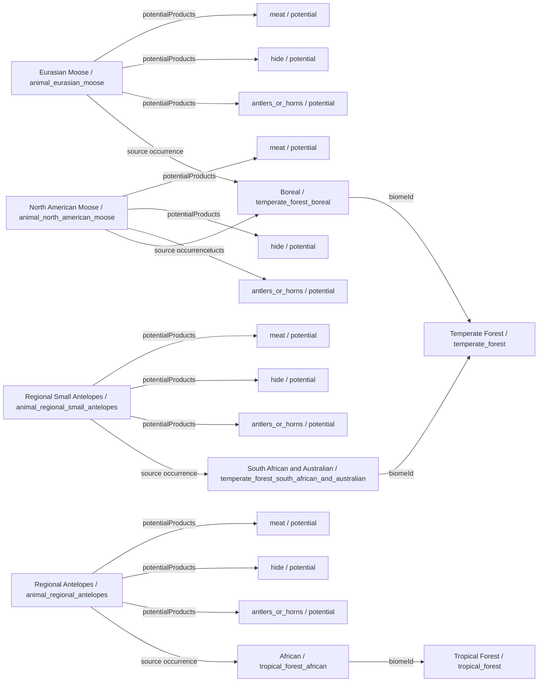
```mermaid
flowchart LR
    c0["Eurasian Moose / animal_eurasian_moose"]
    v7["Boreal / temperate_forest_boreal"]
    b1["Temperate Forest / temperate_forest"]
    o0_0["meat / potential"]
    o0_1["hide / potential"]
    o0_2["antlers_or_horns / potential"]
    c1["North American Moose / animal_north_american_moose"]
    o1_0["meat / potential"]
    o1_1["hide / potential"]
    o1_2["antlers_or_horns / potential"]
    c2["Regional Small Antelopes / animal_regional_small_antelopes"]
    v6["South African and Australian / temperate_forest_south_african_and_australian"]
    o2_0["meat / potential"]
    o2_1["hide / potential"]
    o2_2["antlers_or_horns / potential"]
    c3["Regional Antelopes / animal_regional_antelopes"]
    v1["African / tropical_forest_african"]
    b0["Tropical Forest / tropical_forest"]
    o3_0["meat / potential"]
    o3_1["hide / potential"]
    o3_2["antlers_or_horns / potential"]
    c0 -->|potentialProducts| o0_0
    c0 -->|potentialProducts| o0_1
    c0 -->|potentialProducts| o0_2
    c0 -->|source occurrence| v7
    c1 -->|potentialProducts| o1_0
    c1 -->|potentialProducts| o1_1
    c1 -->|potentialProducts| o1_2
    c1 -->|source occurrence| v7
    c2 -->|potentialProducts| o2_0
    c2 -->|potentialProducts| o2_1
    c2 -->|potentialProducts| o2_2
    c2 -->|source occurrence| v6
    c3 -->|potentialProducts| o3_0
    c3 -->|potentialProducts| o3_1
    c3 -->|potentialProducts| o3_2
    c3 -->|source occurrence| v1
    v1 -->|biomeId| b0
    v6 -->|biomeId| b1
    v7 -->|biomeId| b1
```

### Group 2

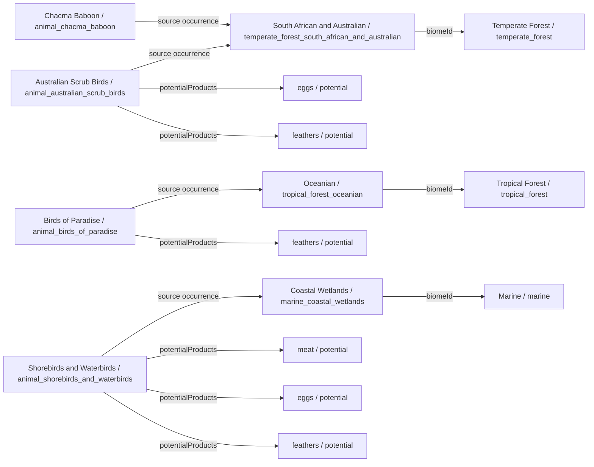
```mermaid
flowchart LR
    c0["Australian Scrub Birds / animal_australian_scrub_birds"]
    v6["South African and Australian / temperate_forest_south_african_and_australian"]
    b1["Temperate Forest / temperate_forest"]
    o0_0["eggs / potential"]
    o0_1["feathers / potential"]
    c1["Birds of Paradise / animal_birds_of_paradise"]
    v3["Oceanian / tropical_forest_oceanian"]
    b0["Tropical Forest / tropical_forest"]
    o1_0["feathers / potential"]
    c2["Shorebirds and Waterbirds / animal_shorebirds_and_waterbirds"]
    v22["Coastal Wetlands / marine_coastal_wetlands"]
    b5["Marine / marine"]
    o2_0["meat / potential"]
    o2_1["eggs / potential"]
    o2_2["feathers / potential"]
    c3["Chacma Baboon / animal_chacma_baboon"]
    c0 -->|potentialProducts| o0_0
    c0 -->|potentialProducts| o0_1
    c0 -->|source occurrence| v6
    c1 -->|potentialProducts| o1_0
    c1 -->|source occurrence| v3
    c2 -->|potentialProducts| o2_0
    c2 -->|potentialProducts| o2_1
    c2 -->|potentialProducts| o2_2
    c2 -->|source occurrence| v22
    c3 -->|source occurrence| v6
    v22 -->|biomeId| b5
    v3 -->|biomeId| b0
    v6 -->|biomeId| b1
```

### Group 3

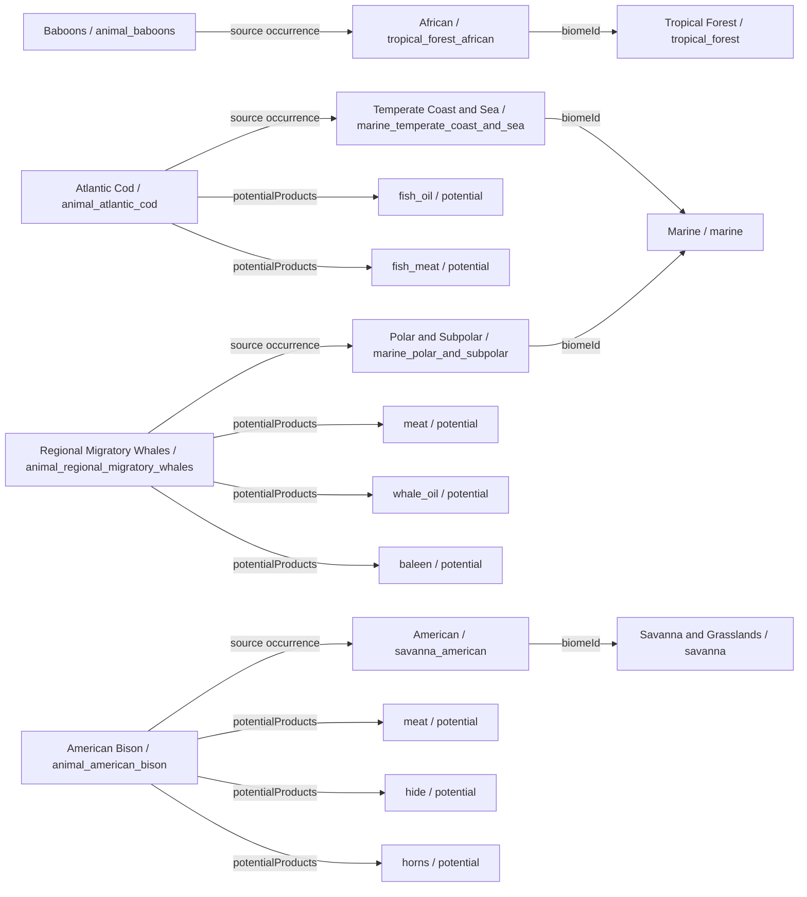
```mermaid
flowchart LR
    c0["Baboons / animal_baboons"]
    v1["African / tropical_forest_african"]
    b0["Tropical Forest / tropical_forest"]
    c1["Atlantic Cod / animal_atlantic_cod"]
    v20["Temperate Coast and Sea / marine_temperate_coast_and_sea"]
    b5["Marine / marine"]
    o1_0["fish_oil / potential"]
    o1_1["fish_meat / potential"]
    c2["Regional Migratory Whales / animal_regional_migratory_whales"]
    v21["Polar and Subpolar / marine_polar_and_subpolar"]
    o2_0["meat / potential"]
    o2_1["whale_oil / potential"]
    o2_2["baleen / potential"]
    c3["American Bison / animal_american_bison"]
    v12["American / savanna_american"]
    b3["Savanna and Grasslands / savanna"]
    o3_0["meat / potential"]
    o3_1["hide / potential"]
    o3_2["horns / potential"]
    c0 -->|source occurrence| v1
    c1 -->|potentialProducts| o1_0
    c1 -->|potentialProducts| o1_1
    c1 -->|source occurrence| v20
    c2 -->|potentialProducts| o2_0
    c2 -->|potentialProducts| o2_1
    c2 -->|potentialProducts| o2_2
    c2 -->|source occurrence| v21
    c3 -->|potentialProducts| o3_0
    c3 -->|potentialProducts| o3_1
    c3 -->|potentialProducts| o3_2
    c3 -->|source occurrence| v12
    v1 -->|biomeId| b0
    v12 -->|biomeId| b3
    v20 -->|biomeId| b5
    v21 -->|biomeId| b5
```

### Group 4

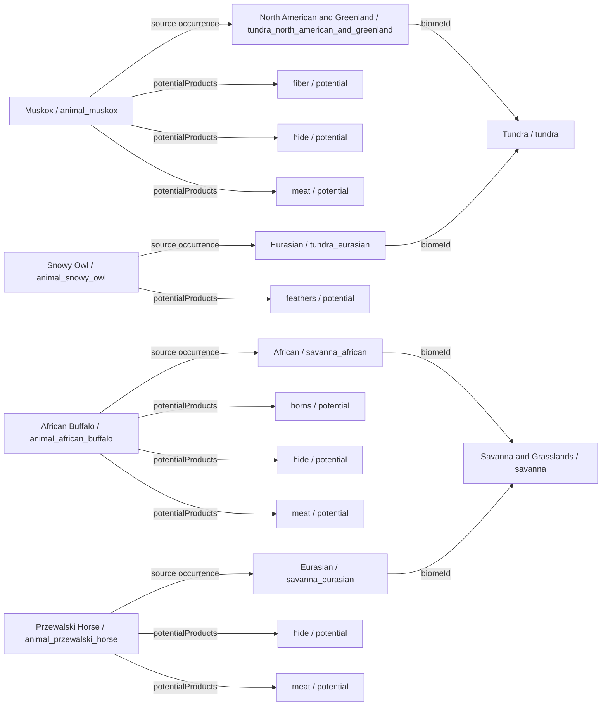
```mermaid
flowchart LR
    c0["Muskox / animal_muskox"]
    v8["North American and Greenland / tundra_north_american_and_greenland"]
    b2["Tundra / tundra"]
    o0_0["meat / potential"]
    o0_1["hide / potential"]
    o0_2["fiber / potential"]
    c1["African Buffalo / animal_african_buffalo"]
    v11["African / savanna_african"]
    b3["Savanna and Grasslands / savanna"]
    o1_0["meat / potential"]
    o1_1["hide / potential"]
    o1_2["horns / potential"]
    c2["Snowy Owl / animal_snowy_owl"]
    v9["Eurasian / tundra_eurasian"]
    o2_0["feathers / potential"]
    c3["Przewalski Horse / animal_przewalski_horse"]
    v13["Eurasian / savanna_eurasian"]
    o3_0["meat / potential"]
    o3_1["hide / potential"]
    c0 -->|potentialProducts| o0_0
    c0 -->|potentialProducts| o0_1
    c0 -->|potentialProducts| o0_2
    c0 -->|source occurrence| v8
    c1 -->|potentialProducts| o1_0
    c1 -->|potentialProducts| o1_1
    c1 -->|potentialProducts| o1_2
    c1 -->|source occurrence| v11
    c2 -->|potentialProducts| o2_0
    c2 -->|source occurrence| v9
    c3 -->|potentialProducts| o3_0
    c3 -->|potentialProducts| o3_1
    c3 -->|source occurrence| v13
    v11 -->|biomeId| b3
    v13 -->|biomeId| b3
    v8 -->|biomeId| b2
    v9 -->|biomeId| b2
```

### Group 5

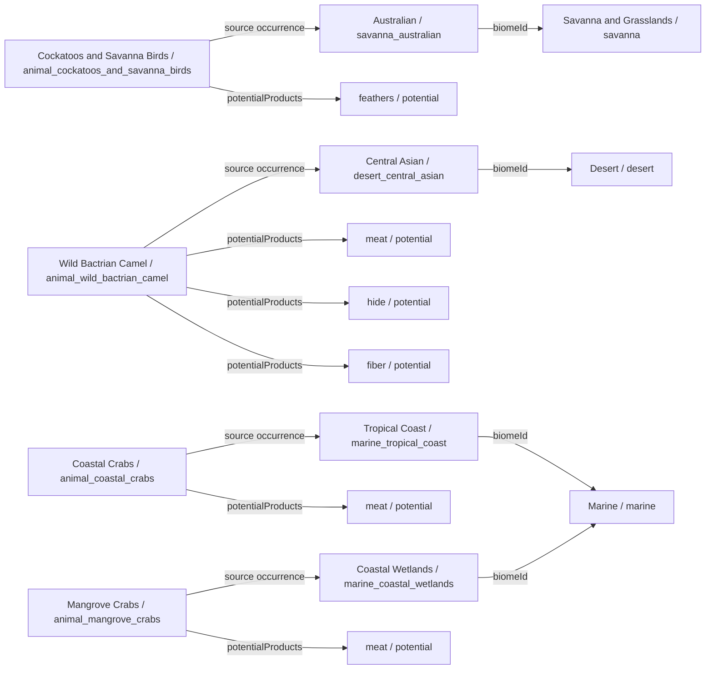
```mermaid
flowchart LR
    c0["Cockatoos and Savanna Birds / animal_cockatoos_and_savanna_birds"]
    v14["Australian / savanna_australian"]
    b3["Savanna and Grasslands / savanna"]
    o0_0["feathers / potential"]
    c1["Wild Bactrian Camel / animal_wild_bactrian_camel"]
    v17["Central Asian / desert_central_asian"]
    b4["Desert / desert"]
    o1_0["meat / potential"]
    o1_1["hide / potential"]
    o1_2["fiber / potential"]
    c2["Coastal Crabs / animal_coastal_crabs"]
    v19["Tropical Coast / marine_tropical_coast"]
    b5["Marine / marine"]
    o2_0["meat / potential"]
    c3["Mangrove Crabs / animal_mangrove_crabs"]
    v22["Coastal Wetlands / marine_coastal_wetlands"]
    o3_0["meat / potential"]
    c0 -->|potentialProducts| o0_0
    c0 -->|source occurrence| v14
    c1 -->|potentialProducts| o1_0
    c1 -->|potentialProducts| o1_1
    c1 -->|potentialProducts| o1_2
    c1 -->|source occurrence| v17
    c2 -->|potentialProducts| o2_0
    c2 -->|source occurrence| v19
    c3 -->|potentialProducts| o3_0
    c3 -->|source occurrence| v22
    v14 -->|biomeId| b3
    v17 -->|biomeId| b4
    v19 -->|biomeId| b5
    v22 -->|biomeId| b5
```

### Group 6

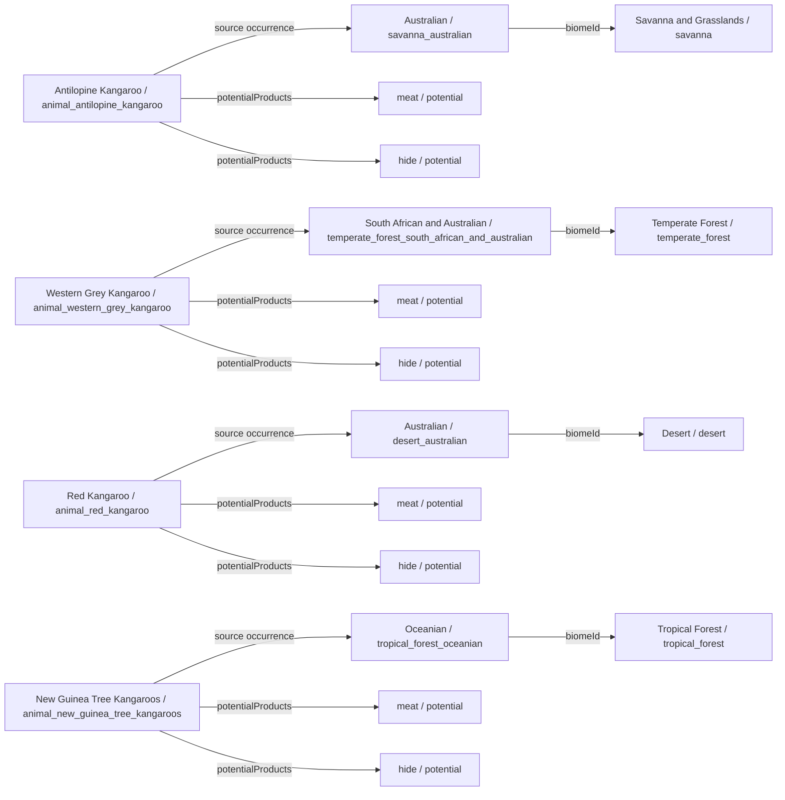
```mermaid
flowchart LR
    c0["Antilopine Kangaroo / animal_antilopine_kangaroo"]
    v14["Australian / savanna_australian"]
    b3["Savanna and Grasslands / savanna"]
    o0_0["meat / potential"]
    o0_1["hide / potential"]
    c1["Western Grey Kangaroo / animal_western_grey_kangaroo"]
    v6["South African and Australian / temperate_forest_south_african_and_australian"]
    b1["Temperate Forest / temperate_forest"]
    o1_0["meat / potential"]
    o1_1["hide / potential"]
    c2["Red Kangaroo / animal_red_kangaroo"]
    v18["Australian / desert_australian"]
    b4["Desert / desert"]
    o2_0["meat / potential"]
    o2_1["hide / potential"]
    c3["New Guinea Tree Kangaroos / animal_new_guinea_tree_kangaroos"]
    v3["Oceanian / tropical_forest_oceanian"]
    b0["Tropical Forest / tropical_forest"]
    o3_0["meat / potential"]
    o3_1["hide / potential"]
    c0 -->|potentialProducts| o0_0
    c0 -->|potentialProducts| o0_1
    c0 -->|source occurrence| v14
    c1 -->|potentialProducts| o1_0
    c1 -->|potentialProducts| o1_1
    c1 -->|source occurrence| v6
    c2 -->|potentialProducts| o2_0
    c2 -->|potentialProducts| o2_1
    c2 -->|source occurrence| v18
    c3 -->|potentialProducts| o3_0
    c3 -->|potentialProducts| o3_1
    c3 -->|source occurrence| v3
    v14 -->|biomeId| b3
    v18 -->|biomeId| b4
    v3 -->|biomeId| b0
    v6 -->|biomeId| b1
```

### Group 7

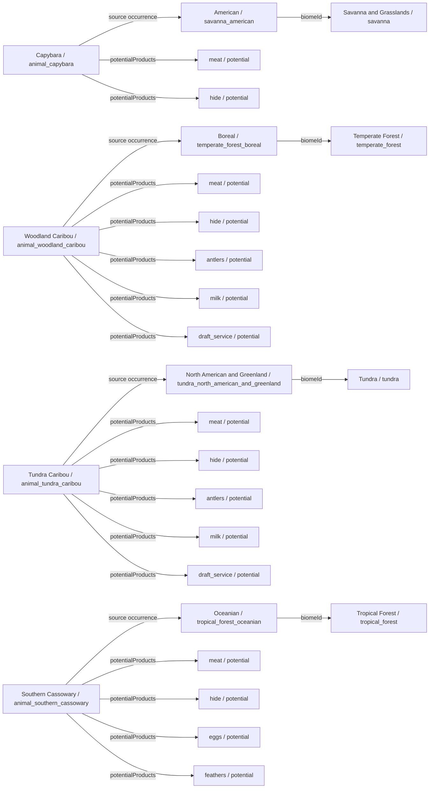
```mermaid
flowchart LR
    c0["Capybara / animal_capybara"]
    v12["American / savanna_american"]
    b3["Savanna and Grasslands / savanna"]
    o0_0["meat / potential"]
    o0_1["hide / potential"]
    c1["Woodland Caribou / animal_woodland_caribou"]
    v7["Boreal / temperate_forest_boreal"]
    b1["Temperate Forest / temperate_forest"]
    o1_0["meat / potential"]
    o1_1["hide / potential"]
    o1_2["antlers / potential"]
    o1_3["milk / potential"]
    o1_4["draft_service / potential"]
    c2["Tundra Caribou / animal_tundra_caribou"]
    v8["North American and Greenland / tundra_north_american_and_greenland"]
    b2["Tundra / tundra"]
    o2_0["meat / potential"]
    o2_1["hide / potential"]
    o2_2["antlers / potential"]
    o2_3["milk / potential"]
    o2_4["draft_service / potential"]
    c3["Southern Cassowary / animal_southern_cassowary"]
    v3["Oceanian / tropical_forest_oceanian"]
    b0["Tropical Forest / tropical_forest"]
    o3_0["meat / potential"]
    o3_1["hide / potential"]
    o3_2["eggs / potential"]
    o3_3["feathers / potential"]
    c0 -->|potentialProducts| o0_0
    c0 -->|potentialProducts| o0_1
    c0 -->|source occurrence| v12
    c1 -->|potentialProducts| o1_0
    c1 -->|potentialProducts| o1_1
    c1 -->|potentialProducts| o1_2
    c1 -->|potentialProducts| o1_3
    c1 -->|potentialProducts| o1_4
    c1 -->|source occurrence| v7
    c2 -->|potentialProducts| o2_0
    c2 -->|potentialProducts| o2_1
    c2 -->|potentialProducts| o2_2
    c2 -->|potentialProducts| o2_3
    c2 -->|potentialProducts| o2_4
    c2 -->|source occurrence| v8
    c3 -->|potentialProducts| o3_0
    c3 -->|potentialProducts| o3_1
    c3 -->|potentialProducts| o3_2
    c3 -->|potentialProducts| o3_3
    c3 -->|source occurrence| v3
    v12 -->|biomeId| b3
    v3 -->|biomeId| b0
    v7 -->|biomeId| b1
    v8 -->|biomeId| b2
```

### Group 8

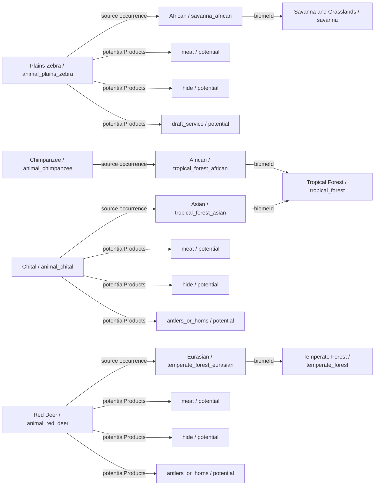
```mermaid
flowchart LR
    c0["Plains Zebra / animal_plains_zebra"]
    v11["African / savanna_african"]
    b3["Savanna and Grasslands / savanna"]
    o0_0["meat / potential"]
    o0_1["hide / potential"]
    o0_2["draft_service / potential"]
    c1["Chimpanzee / animal_chimpanzee"]
    v1["African / tropical_forest_african"]
    b0["Tropical Forest / tropical_forest"]
    c2["Chital / animal_chital"]
    v2["Asian / tropical_forest_asian"]
    o2_0["meat / potential"]
    o2_1["hide / potential"]
    o2_2["antlers_or_horns / potential"]
    c3["Red Deer / animal_red_deer"]
    v4["Eurasian / temperate_forest_eurasian"]
    b1["Temperate Forest / temperate_forest"]
    o3_0["meat / potential"]
    o3_1["hide / potential"]
    o3_2["antlers_or_horns / potential"]
    c0 -->|potentialProducts| o0_0
    c0 -->|potentialProducts| o0_1
    c0 -->|potentialProducts| o0_2
    c0 -->|source occurrence| v11
    c1 -->|source occurrence| v1
    c2 -->|potentialProducts| o2_0
    c2 -->|potentialProducts| o2_1
    c2 -->|potentialProducts| o2_2
    c2 -->|source occurrence| v2
    c3 -->|potentialProducts| o3_0
    c3 -->|potentialProducts| o3_1
    c3 -->|potentialProducts| o3_2
    c3 -->|source occurrence| v4
    v1 -->|biomeId| b0
    v11 -->|biomeId| b3
    v2 -->|biomeId| b0
    v4 -->|biomeId| b1
```

### Group 9

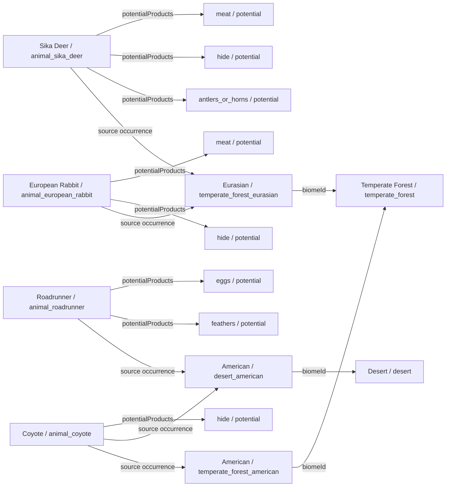
```mermaid
flowchart LR
    c0["Sika Deer / animal_sika_deer"]
    v4["Eurasian / temperate_forest_eurasian"]
    b1["Temperate Forest / temperate_forest"]
    o0_0["meat / potential"]
    o0_1["hide / potential"]
    o0_2["antlers_or_horns / potential"]
    c1["European Rabbit / animal_european_rabbit"]
    o1_0["meat / potential"]
    o1_1["hide / potential"]
    c2["Roadrunner / animal_roadrunner"]
    v15["American / desert_american"]
    b4["Desert / desert"]
    o2_0["eggs / potential"]
    o2_1["feathers / potential"]
    c3["Coyote / animal_coyote"]
    v5["American / temperate_forest_american"]
    o3_0["hide / potential"]
    c0 -->|potentialProducts| o0_0
    c0 -->|potentialProducts| o0_1
    c0 -->|potentialProducts| o0_2
    c0 -->|source occurrence| v4
    c1 -->|potentialProducts| o1_0
    c1 -->|potentialProducts| o1_1
    c1 -->|source occurrence| v4
    c2 -->|potentialProducts| o2_0
    c2 -->|potentialProducts| o2_1
    c2 -->|source occurrence| v15
    c3 -->|potentialProducts| o3_0
    c3 -->|source occurrence| v15
    c3 -->|source occurrence| v5
    v15 -->|biomeId| b4
    v4 -->|biomeId| b1
    v5 -->|biomeId| b1
```

### Group 10

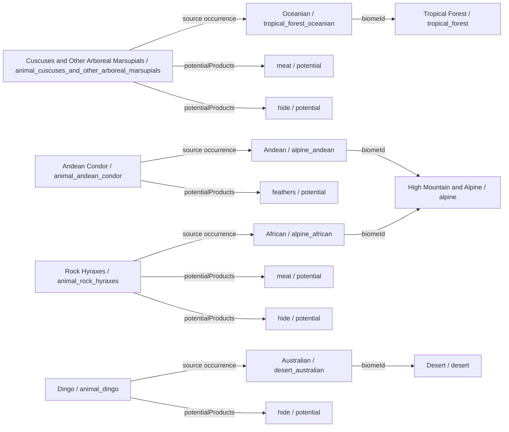
```mermaid
flowchart LR
    c0["Cuscuses and Other Arboreal Marsupials / animal_cuscuses_and_other_arboreal_marsupials"]
    v3["Oceanian / tropical_forest_oceanian"]
    b0["Tropical Forest / tropical_forest"]
    o0_0["meat / potential"]
    o0_1["hide / potential"]
    c1["Andean Condor / animal_andean_condor"]
    v23["Andean / alpine_andean"]
    b6["High Mountain and Alpine / alpine"]
    o1_0["feathers / potential"]
    c2["Rock Hyraxes / animal_rock_hyraxes"]
    v26["African / alpine_african"]
    o2_0["meat / potential"]
    o2_1["hide / potential"]
    c3["Dingo / animal_dingo"]
    v18["Australian / desert_australian"]
    b4["Desert / desert"]
    o3_0["hide / potential"]
    c0 -->|potentialProducts| o0_0
    c0 -->|potentialProducts| o0_1
    c0 -->|source occurrence| v3
    c1 -->|potentialProducts| o1_0
    c1 -->|source occurrence| v23
    c2 -->|potentialProducts| o2_0
    c2 -->|potentialProducts| o2_1
    c2 -->|source occurrence| v26
    c3 -->|potentialProducts| o3_0
    c3 -->|source occurrence| v18
    v18 -->|biomeId| b4
    v23 -->|biomeId| b6
    v26 -->|biomeId| b6
    v3 -->|biomeId| b0
```

### Group 11

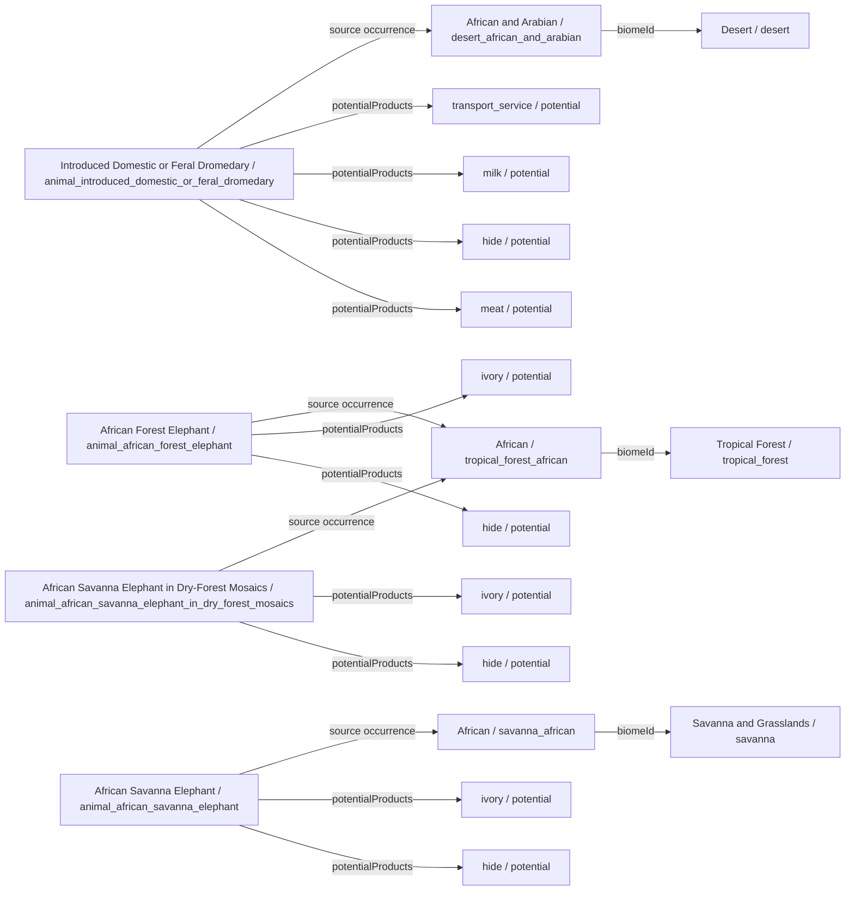
```mermaid
flowchart LR
    c0["Introduced Domestic or Feral Dromedary / animal_introduced_domestic_or_feral_dromedary"]
    v16["African and Arabian / desert_african_and_arabian"]
    b4["Desert / desert"]
    o0_0["meat / potential"]
    o0_1["hide / potential"]
    o0_2["milk / potential"]
    o0_3["transport_service / potential"]
    c1["African Forest Elephant / animal_african_forest_elephant"]
    v1["African / tropical_forest_african"]
    b0["Tropical Forest / tropical_forest"]
    o1_0["hide / potential"]
    o1_1["ivory / potential"]
    c2["African Savanna Elephant / animal_african_savanna_elephant"]
    v11["African / savanna_african"]
    b3["Savanna and Grasslands / savanna"]
    o2_0["hide / potential"]
    o2_1["ivory / potential"]
    c3["African Savanna Elephant in Dry-Forest Mosaics / animal_african_savanna_elephant_in_dry_forest_mosaics"]
    o3_0["hide / potential"]
    o3_1["ivory / potential"]
    c0 -->|potentialProducts| o0_0
    c0 -->|potentialProducts| o0_1
    c0 -->|potentialProducts| o0_2
    c0 -->|potentialProducts| o0_3
    c0 -->|source occurrence| v16
    c1 -->|potentialProducts| o1_0
    c1 -->|potentialProducts| o1_1
    c1 -->|source occurrence| v1
    c2 -->|potentialProducts| o2_0
    c2 -->|potentialProducts| o2_1
    c2 -->|source occurrence| v11
    c3 -->|potentialProducts| o3_0
    c3 -->|potentialProducts| o3_1
    c3 -->|source occurrence| v1
    v1 -->|biomeId| b0
    v11 -->|biomeId| b3
    v16 -->|biomeId| b4
```

### Group 12

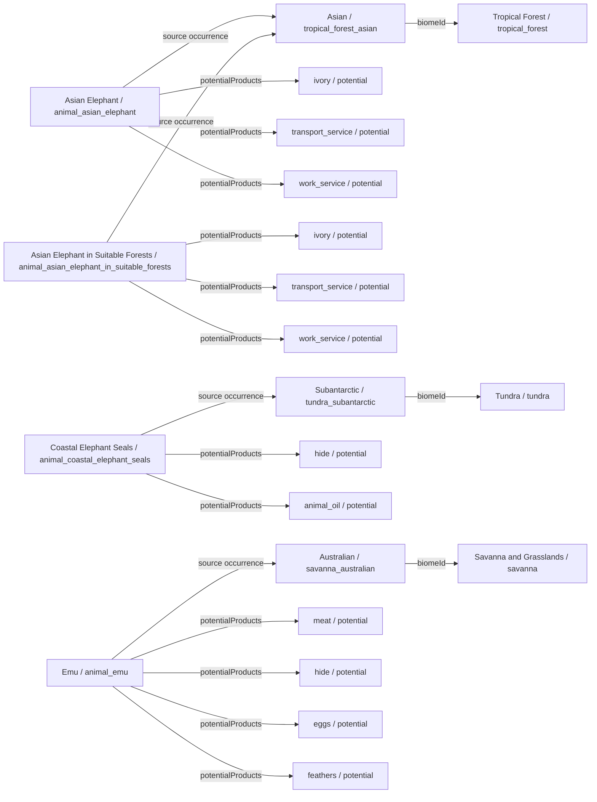
```mermaid
flowchart LR
    c0["Asian Elephant / animal_asian_elephant"]
    v2["Asian / tropical_forest_asian"]
    b0["Tropical Forest / tropical_forest"]
    o0_0["ivory / potential"]
    o0_1["transport_service / potential"]
    o0_2["work_service / potential"]
    c1["Asian Elephant in Suitable Forests / animal_asian_elephant_in_suitable_forests"]
    o1_0["ivory / potential"]
    o1_1["transport_service / potential"]
    o1_2["work_service / potential"]
    c2["Coastal Elephant Seals / animal_coastal_elephant_seals"]
    v10["Subantarctic / tundra_subantarctic"]
    b2["Tundra / tundra"]
    o2_0["hide / potential"]
    o2_1["animal_oil / potential"]
    c3["Emu / animal_emu"]
    v14["Australian / savanna_australian"]
    b3["Savanna and Grasslands / savanna"]
    o3_0["meat / potential"]
    o3_1["hide / potential"]
    o3_2["eggs / potential"]
    o3_3["feathers / potential"]
    c0 -->|potentialProducts| o0_0
    c0 -->|potentialProducts| o0_1
    c0 -->|potentialProducts| o0_2
    c0 -->|source occurrence| v2
    c1 -->|potentialProducts| o1_0
    c1 -->|potentialProducts| o1_1
    c1 -->|potentialProducts| o1_2
    c1 -->|source occurrence| v2
    c2 -->|potentialProducts| o2_0
    c2 -->|potentialProducts| o2_1
    c2 -->|source occurrence| v10
    c3 -->|potentialProducts| o3_0
    c3 -->|potentialProducts| o3_1
    c3 -->|potentialProducts| o3_2
    c3 -->|potentialProducts| o3_3
    c3 -->|source occurrence| v14
    v10 -->|biomeId| b2
    v14 -->|biomeId| b3
    v2 -->|biomeId| b0
```

### Group 13

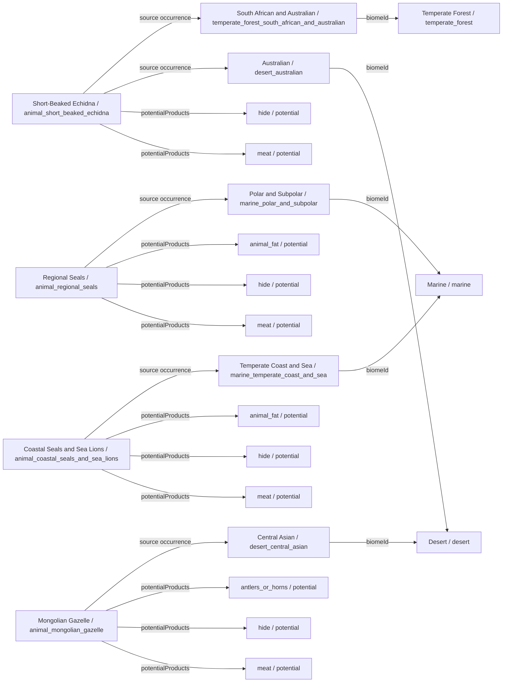
```mermaid
flowchart LR
    c0["Short-Beaked Echidna / animal_short_beaked_echidna"]
    v6["South African and Australian / temperate_forest_south_african_and_australian"]
    b1["Temperate Forest / temperate_forest"]
    v18["Australian / desert_australian"]
    b4["Desert / desert"]
    o0_0["meat / potential"]
    o0_1["hide / potential"]
    c1["Regional Seals / animal_regional_seals"]
    v21["Polar and Subpolar / marine_polar_and_subpolar"]
    b5["Marine / marine"]
    o1_0["meat / potential"]
    o1_1["hide / potential"]
    o1_2["animal_fat / potential"]
    c2["Coastal Seals and Sea Lions / animal_coastal_seals_and_sea_lions"]
    v20["Temperate Coast and Sea / marine_temperate_coast_and_sea"]
    o2_0["meat / potential"]
    o2_1["hide / potential"]
    o2_2["animal_fat / potential"]
    c3["Mongolian Gazelle / animal_mongolian_gazelle"]
    v17["Central Asian / desert_central_asian"]
    o3_0["meat / potential"]
    o3_1["hide / potential"]
    o3_2["antlers_or_horns / potential"]
    c0 -->|potentialProducts| o0_0
    c0 -->|potentialProducts| o0_1
    c0 -->|source occurrence| v18
    c0 -->|source occurrence| v6
    c1 -->|potentialProducts| o1_0
    c1 -->|potentialProducts| o1_1
    c1 -->|potentialProducts| o1_2
    c1 -->|source occurrence| v21
    c2 -->|potentialProducts| o2_0
    c2 -->|potentialProducts| o2_1
    c2 -->|potentialProducts| o2_2
    c2 -->|source occurrence| v20
    c3 -->|potentialProducts| o3_0
    c3 -->|potentialProducts| o3_1
    c3 -->|potentialProducts| o3_2
    c3 -->|source occurrence| v17
    v17 -->|biomeId| b4
    v18 -->|biomeId| b4
    v20 -->|biomeId| b5
    v21 -->|biomeId| b5
    v6 -->|biomeId| b1
```

### Group 14

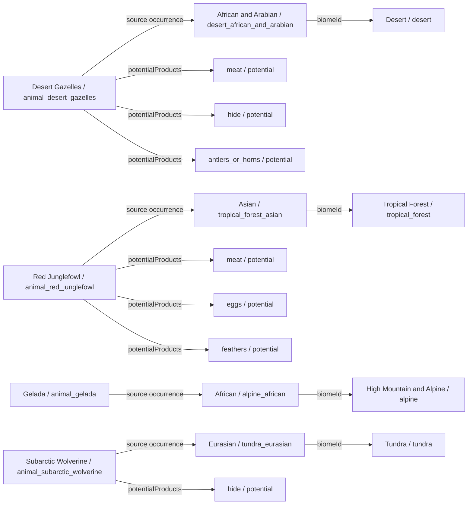
```mermaid
flowchart LR
    c0["Desert Gazelles / animal_desert_gazelles"]
    v16["African and Arabian / desert_african_and_arabian"]
    b4["Desert / desert"]
    o0_0["meat / potential"]
    o0_1["hide / potential"]
    o0_2["antlers_or_horns / potential"]
    c1["Red Junglefowl / animal_red_junglefowl"]
    v2["Asian / tropical_forest_asian"]
    b0["Tropical Forest / tropical_forest"]
    o1_0["meat / potential"]
    o1_1["eggs / potential"]
    o1_2["feathers / potential"]
    c2["Gelada / animal_gelada"]
    v26["African / alpine_african"]
    b6["High Mountain and Alpine / alpine"]
    c3["Subarctic Wolverine / animal_subarctic_wolverine"]
    v9["Eurasian / tundra_eurasian"]
    b2["Tundra / tundra"]
    o3_0["hide / potential"]
    c0 -->|potentialProducts| o0_0
    c0 -->|potentialProducts| o0_1
    c0 -->|potentialProducts| o0_2
    c0 -->|source occurrence| v16
    c1 -->|potentialProducts| o1_0
    c1 -->|potentialProducts| o1_1
    c1 -->|potentialProducts| o1_2
    c1 -->|source occurrence| v2
    c2 -->|source occurrence| v26
    c3 -->|potentialProducts| o3_0
    c3 -->|source occurrence| v9
    v16 -->|biomeId| b4
    v2 -->|biomeId| b0
    v26 -->|biomeId| b6
    v9 -->|biomeId| b2
```

### Group 15

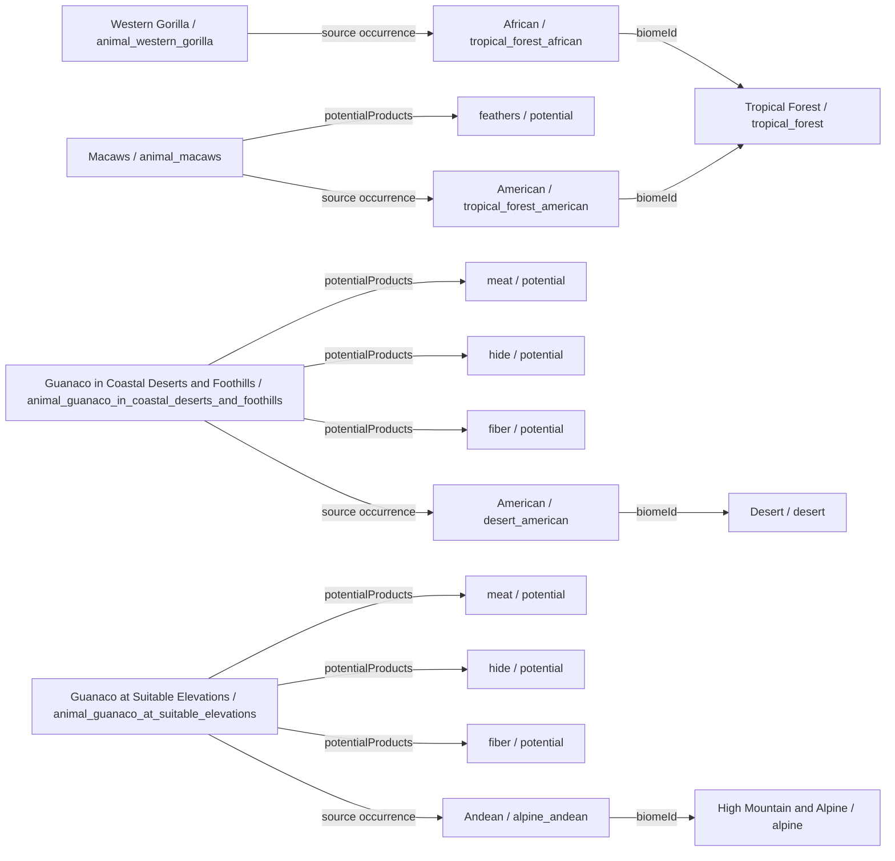
```mermaid
flowchart LR
    c0["Western Gorilla / animal_western_gorilla"]
    v1["African / tropical_forest_african"]
    b0["Tropical Forest / tropical_forest"]
    c1["Macaws / animal_macaws"]
    v0["American / tropical_forest_american"]
    o1_0["feathers / potential"]
    c2["Guanaco in Coastal Deserts and Foothills / animal_guanaco_in_coastal_deserts_and_foothills"]
    v15["American / desert_american"]
    b4["Desert / desert"]
    o2_0["meat / potential"]
    o2_1["hide / potential"]
    o2_2["fiber / potential"]
    c3["Guanaco at Suitable Elevations / animal_guanaco_at_suitable_elevations"]
    v23["Andean / alpine_andean"]
    b6["High Mountain and Alpine / alpine"]
    o3_0["meat / potential"]
    o3_1["hide / potential"]
    o3_2["fiber / potential"]
    c0 -->|source occurrence| v1
    c1 -->|potentialProducts| o1_0
    c1 -->|source occurrence| v0
    c2 -->|potentialProducts| o2_0
    c2 -->|potentialProducts| o2_1
    c2 -->|potentialProducts| o2_2
    c2 -->|source occurrence| v15
    c3 -->|potentialProducts| o3_0
    c3 -->|potentialProducts| o3_1
    c3 -->|potentialProducts| o3_2
    c3 -->|source occurrence| v23
    v0 -->|biomeId| b0
    v1 -->|biomeId| b0
    v15 -->|biomeId| b4
    v23 -->|biomeId| b6
```

### Group 16

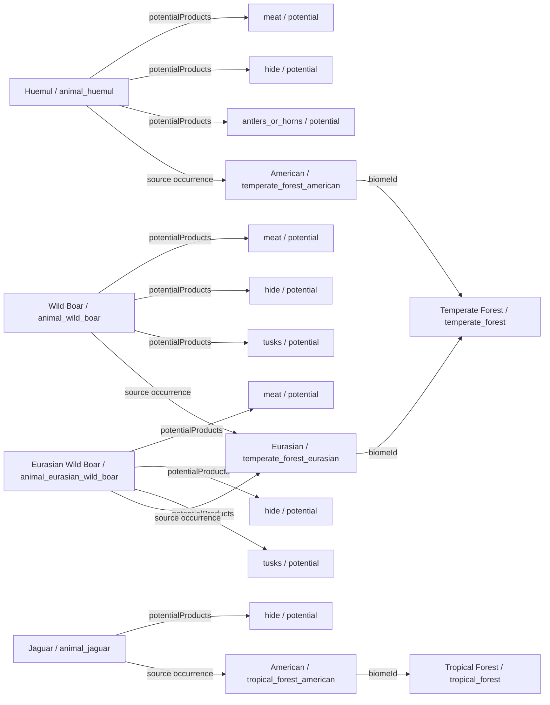
```mermaid
flowchart LR
    c0["Huemul / animal_huemul"]
    v5["American / temperate_forest_american"]
    b1["Temperate Forest / temperate_forest"]
    o0_0["meat / potential"]
    o0_1["hide / potential"]
    o0_2["antlers_or_horns / potential"]
    c1["Wild Boar / animal_wild_boar"]
    v4["Eurasian / temperate_forest_eurasian"]
    o1_0["meat / potential"]
    o1_1["hide / potential"]
    o1_2["tusks / potential"]
    c2["Eurasian Wild Boar / animal_eurasian_wild_boar"]
    o2_0["meat / potential"]
    o2_1["hide / potential"]
    o2_2["tusks / potential"]
    c3["Jaguar / animal_jaguar"]
    v0["American / tropical_forest_american"]
    b0["Tropical Forest / tropical_forest"]
    o3_0["hide / potential"]
    c0 -->|potentialProducts| o0_0
    c0 -->|potentialProducts| o0_1
    c0 -->|potentialProducts| o0_2
    c0 -->|source occurrence| v5
    c1 -->|potentialProducts| o1_0
    c1 -->|potentialProducts| o1_1
    c1 -->|potentialProducts| o1_2
    c1 -->|source occurrence| v4
    c2 -->|potentialProducts| o2_0
    c2 -->|potentialProducts| o2_1
    c2 -->|potentialProducts| o2_2
    c2 -->|source occurrence| v4
    c3 -->|potentialProducts| o3_0
    c3 -->|source occurrence| v0
    v0 -->|biomeId| b0
    v4 -->|biomeId| b1
    v5 -->|biomeId| b1
```

### Group 17

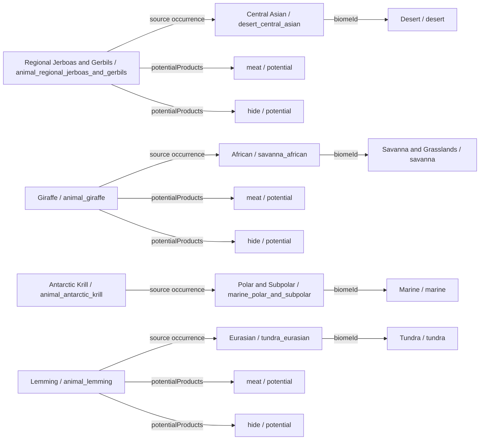
```mermaid
flowchart LR
    c0["Regional Jerboas and Gerbils / animal_regional_jerboas_and_gerbils"]
    v17["Central Asian / desert_central_asian"]
    b4["Desert / desert"]
    o0_0["meat / potential"]
    o0_1["hide / potential"]
    c1["Giraffe / animal_giraffe"]
    v11["African / savanna_african"]
    b3["Savanna and Grasslands / savanna"]
    o1_0["meat / potential"]
    o1_1["hide / potential"]
    c2["Antarctic Krill / animal_antarctic_krill"]
    v21["Polar and Subpolar / marine_polar_and_subpolar"]
    b5["Marine / marine"]
    c3["Lemming / animal_lemming"]
    v9["Eurasian / tundra_eurasian"]
    b2["Tundra / tundra"]
    o3_0["meat / potential"]
    o3_1["hide / potential"]
    c0 -->|potentialProducts| o0_0
    c0 -->|potentialProducts| o0_1
    c0 -->|source occurrence| v17
    c1 -->|potentialProducts| o1_0
    c1 -->|potentialProducts| o1_1
    c1 -->|source occurrence| v11
    c2 -->|source occurrence| v21
    c3 -->|potentialProducts| o3_0
    c3 -->|potentialProducts| o3_1
    c3 -->|source occurrence| v9
    v11 -->|biomeId| b3
    v17 -->|biomeId| b4
    v21 -->|biomeId| b5
    v9 -->|biomeId| b2
```

### Group 18

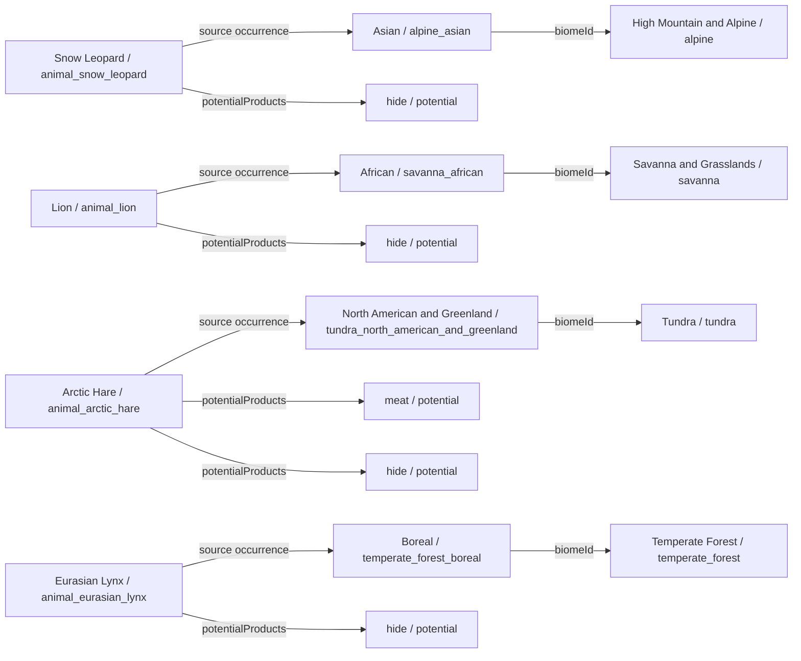
```mermaid
flowchart LR
    c0["Snow Leopard / animal_snow_leopard"]
    v24["Asian / alpine_asian"]
    b6["High Mountain and Alpine / alpine"]
    o0_0["hide / potential"]
    c1["Lion / animal_lion"]
    v11["African / savanna_african"]
    b3["Savanna and Grasslands / savanna"]
    o1_0["hide / potential"]
    c2["Arctic Hare / animal_arctic_hare"]
    v8["North American and Greenland / tundra_north_american_and_greenland"]
    b2["Tundra / tundra"]
    o2_0["meat / potential"]
    o2_1["hide / potential"]
    c3["Eurasian Lynx / animal_eurasian_lynx"]
    v7["Boreal / temperate_forest_boreal"]
    b1["Temperate Forest / temperate_forest"]
    o3_0["hide / potential"]
    c0 -->|potentialProducts| o0_0
    c0 -->|source occurrence| v24
    c1 -->|potentialProducts| o1_0
    c1 -->|source occurrence| v11
    c2 -->|potentialProducts| o2_0
    c2 -->|potentialProducts| o2_1
    c2 -->|source occurrence| v8
    c3 -->|potentialProducts| o3_0
    c3 -->|source occurrence| v7
    v11 -->|biomeId| b3
    v24 -->|biomeId| b6
    v7 -->|biomeId| b1
    v8 -->|biomeId| b2
```

### Group 19

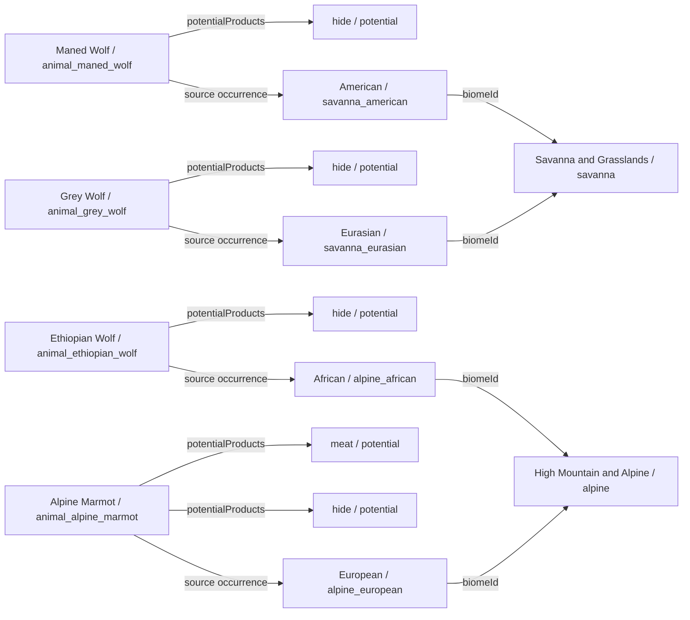
```mermaid
flowchart LR
    c0["Maned Wolf / animal_maned_wolf"]
    v12["American / savanna_american"]
    b3["Savanna and Grasslands / savanna"]
    o0_0["hide / potential"]
    c1["Ethiopian Wolf / animal_ethiopian_wolf"]
    v26["African / alpine_african"]
    b6["High Mountain and Alpine / alpine"]
    o1_0["hide / potential"]
    c2["Grey Wolf / animal_grey_wolf"]
    v13["Eurasian / savanna_eurasian"]
    o2_0["hide / potential"]
    c3["Alpine Marmot / animal_alpine_marmot"]
    v25["European / alpine_european"]
    o3_0["meat / potential"]
    o3_1["hide / potential"]
    c0 -->|potentialProducts| o0_0
    c0 -->|source occurrence| v12
    c1 -->|potentialProducts| o1_0
    c1 -->|source occurrence| v26
    c2 -->|potentialProducts| o2_0
    c2 -->|source occurrence| v13
    c3 -->|potentialProducts| o3_0
    c3 -->|potentialProducts| o3_1
    c3 -->|source occurrence| v25
    v12 -->|biomeId| b3
    v13 -->|biomeId| b3
    v25 -->|biomeId| b6
    v26 -->|biomeId| b6
```

### Group 20

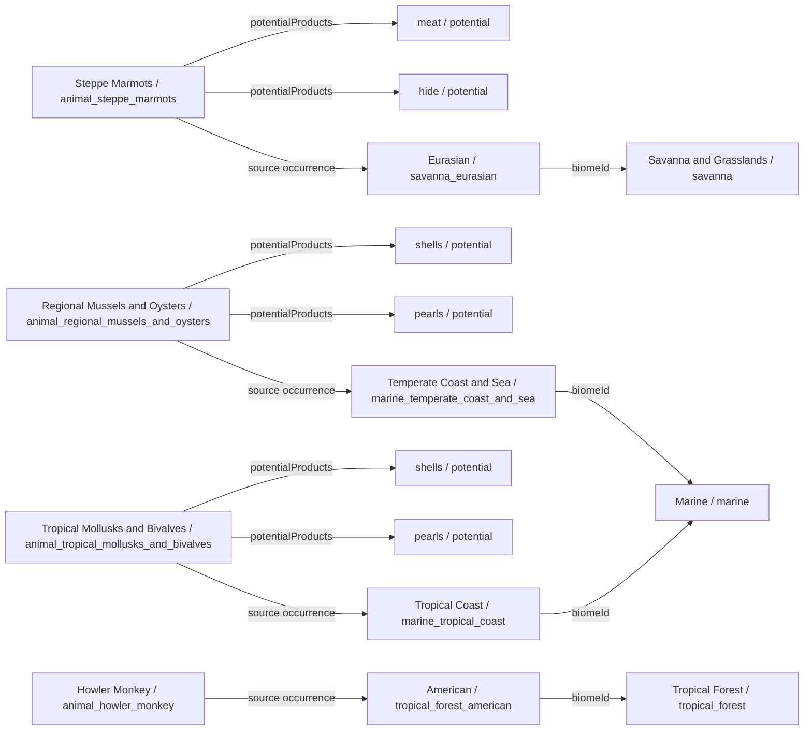
```mermaid
flowchart LR
    c0["Steppe Marmots / animal_steppe_marmots"]
    v13["Eurasian / savanna_eurasian"]
    b3["Savanna and Grasslands / savanna"]
    o0_0["meat / potential"]
    o0_1["hide / potential"]
    c1["Regional Mussels and Oysters / animal_regional_mussels_and_oysters"]
    v20["Temperate Coast and Sea / marine_temperate_coast_and_sea"]
    b5["Marine / marine"]
    o1_0["shells / potential"]
    o1_1["pearls / potential"]
    c2["Tropical Mollusks and Bivalves / animal_tropical_mollusks_and_bivalves"]
    v19["Tropical Coast / marine_tropical_coast"]
    o2_0["shells / potential"]
    o2_1["pearls / potential"]
    c3["Howler Monkey / animal_howler_monkey"]
    v0["American / tropical_forest_american"]
    b0["Tropical Forest / tropical_forest"]
    c0 -->|potentialProducts| o0_0
    c0 -->|potentialProducts| o0_1
    c0 -->|source occurrence| v13
    c1 -->|potentialProducts| o1_0
    c1 -->|potentialProducts| o1_1
    c1 -->|source occurrence| v20
    c2 -->|potentialProducts| o2_0
    c2 -->|potentialProducts| o2_1
    c2 -->|source occurrence| v19
    c3 -->|source occurrence| v0
    v0 -->|biomeId| b0
    v13 -->|biomeId| b3
    v19 -->|biomeId| b5
    v20 -->|biomeId| b5
```

### Group 21

```mermaid
flowchart LR
    c0["Okapi / animal_okapi"]
    v1["African / tropical_forest_african"]
    b0["Tropical Forest / tropical_forest"]
    o0_0["meat / potential"]
    o0_1["hide / potential"]
    c1["Giant Anteater / animal_giant_anteater"]
    v12["American / savanna_american"]
    b3["Savanna and Grasslands / savanna"]
    o1_0["meat / potential"]
    o1_1["hide / potential"]
    o1_2["animal_fat / potential"]
    c2["American Black Bear / animal_american_black_bear"]
    v5["American / temperate_forest_american"]
    b1["Temperate Forest / temperate_forest"]
    v7["Boreal / temperate_forest_boreal"]
    o2_0["meat / potential"]
    o2_1["hide / potential"]
    o2_2["animal_fat / potential"]
    c3["Asian Black Bear / animal_asian_black_bear"]
    v4["Eurasian / temperate_forest_eurasian"]
    o3_0["meat / potential"]
    o3_1["hide / potential"]
    o3_2["animal_fat / potential"]
    c0 -->|potentialProducts| o0_0
    c0 -->|potentialProducts| o0_1
    c0 -->|source occurrence| v1
    c1 -->|potentialProducts| o1_0
    c1 -->|potentialProducts| o1_1
    c1 -->|potentialProducts| o1_2
    c1 -->|source occurrence| v12
    c2 -->|potentialProducts| o2_0
    c2 -->|potentialProducts| o2_1
    c2 -->|potentialProducts| o2_2
    c2 -->|source occurrence| v5
    c2 -->|source occurrence| v7
    c3 -->|potentialProducts| o3_0
    c3 -->|potentialProducts| o3_1
    c3 -->|potentialProducts| o3_2
    c3 -->|source occurrence| v4
    v1 -->|biomeId| b0
    v12 -->|biomeId| b3
    v4 -->|biomeId| b1
    v5 -->|biomeId| b1
    v7 -->|biomeId| b1
```

### Group 22

```mermaid
flowchart LR
    c0["Brown Bear / animal_brown_bear"]
    v4["Eurasian / temperate_forest_eurasian"]
    b1["Temperate Forest / temperate_forest"]
    v7["Boreal / temperate_forest_boreal"]
    o0_0["meat / potential"]
    o0_1["hide / potential"]
    o0_2["animal_fat / potential"]
    c1["Coastal and Sea-Ice Polar Bear / animal_coastal_and_sea_ice_polar_bear"]
    v8["North American and Greenland / tundra_north_american_and_greenland"]
    b2["Tundra / tundra"]
    o1_0["meat / potential"]
    o1_1["hide / potential"]
    o1_2["animal_fat / potential"]
    c2["Estuarine Oysters and Other Bivalves / animal_estuarine_oysters_and_other_bivalves"]
    v22["Coastal Wetlands / marine_coastal_wetlands"]
    b5["Marine / marine"]
    o2_0["shells / potential"]
    o2_1["pearls / potential"]
    c3["Ocellated Turkey / animal_ocellated_turkey"]
    v0["American / tropical_forest_american"]
    b0["Tropical Forest / tropical_forest"]
    o3_0["meat / potential"]
    o3_1["eggs / potential"]
    o3_2["feathers / potential"]
    c0 -->|potentialProducts| o0_0
    c0 -->|potentialProducts| o0_1
    c0 -->|potentialProducts| o0_2
    c0 -->|source occurrence| v4
    c0 -->|source occurrence| v7
    c1 -->|potentialProducts| o1_0
    c1 -->|potentialProducts| o1_1
    c1 -->|potentialProducts| o1_2
    c1 -->|source occurrence| v8
    c2 -->|potentialProducts| o2_0
    c2 -->|potentialProducts| o2_1
    c2 -->|source occurrence| v22
    c3 -->|potentialProducts| o3_0
    c3 -->|potentialProducts| o3_1
    c3 -->|potentialProducts| o3_2
    c3 -->|source occurrence| v0
    v0 -->|biomeId| b0
    v22 -->|biomeId| b5
    v4 -->|biomeId| b1
    v7 -->|biomeId| b1
    v8 -->|biomeId| b2
```

### Group 23

```mermaid
flowchart LR
    c0["Indian Peafowl / animal_indian_peafowl"]
    v2["Asian / tropical_forest_asian"]
    b0["Tropical Forest / tropical_forest"]
    o0_0["meat / potential"]
    o0_1["eggs / potential"]
    o0_2["feathers / potential"]
    c1["Collared Peccary / animal_collared_peccary"]
    v0["American / tropical_forest_american"]
    o1_0["meat / potential"]
    o1_1["hide / potential"]
    o1_2["tusks / potential"]
    c2["Regional Reef Fish / animal_regional_reef_fish"]
    v19["Tropical Coast / marine_tropical_coast"]
    b5["Marine / marine"]
    o2_0["fish_oil / potential"]
    o2_1["fish_meat / potential"]
    c3["Juvenile Estuarine Fish / animal_juvenile_estuarine_fish"]
    v22["Coastal Wetlands / marine_coastal_wetlands"]
    o3_0["fish_oil / potential"]
    o3_1["fish_meat / potential"]
    c0 -->|potentialProducts| o0_0
    c0 -->|potentialProducts| o0_1
    c0 -->|potentialProducts| o0_2
    c0 -->|source occurrence| v2
    c1 -->|potentialProducts| o1_0
    c1 -->|potentialProducts| o1_1
    c1 -->|potentialProducts| o1_2
    c1 -->|source occurrence| v0
    c2 -->|potentialProducts| o2_0
    c2 -->|potentialProducts| o2_1
    c2 -->|source occurrence| v19
    c3 -->|potentialProducts| o3_0
    c3 -->|potentialProducts| o3_1
    c3 -->|source occurrence| v22
    v0 -->|biomeId| b0
    v19 -->|biomeId| b5
    v2 -->|biomeId| b0
    v22 -->|biomeId| b5
```

### Group 24

```mermaid
flowchart LR
    c0["Regional Polar Fish / animal_regional_polar_fish"]
    v21["Polar and Subpolar / marine_polar_and_subpolar"]
    b5["Marine / marine"]
    o0_0["fish_oil / potential"]
    o0_1["fish_meat / potential"]
    c1["Perentie / animal_perentie"]
    v18["Australian / desert_australian"]
    b4["Desert / desert"]
    o1_0["meat / potential"]
    o1_1["hide / potential"]
    c2["Prairie Dog / animal_prairie_dog"]
    v12["American / savanna_american"]
    b3["Savanna and Grasslands / savanna"]
    o2_0["meat / potential"]
    o2_1["hide / potential"]
    c3["Island Petrels and Albatrosses / animal_island_petrels_and_albatrosses"]
    v10["Subantarctic / tundra_subantarctic"]
    b2["Tundra / tundra"]
    o3_0["eggs / potential"]
    o3_1["feathers / potential"]
    c0 -->|potentialProducts| o0_0
    c0 -->|potentialProducts| o0_1
    c0 -->|source occurrence| v21
    c1 -->|potentialProducts| o1_0
    c1 -->|potentialProducts| o1_1
    c1 -->|source occurrence| v18
    c2 -->|potentialProducts| o2_0
    c2 -->|potentialProducts| o2_1
    c2 -->|source occurrence| v12
    c3 -->|potentialProducts| o3_0
    c3 -->|potentialProducts| o3_1
    c3 -->|source occurrence| v10
    v10 -->|biomeId| b2
    v12 -->|biomeId| b3
    v18 -->|biomeId| b4
    v21 -->|biomeId| b5
```

### Group 25

```mermaid
flowchart LR
    c0["Island Coastal Penguins / animal_island_coastal_penguins"]
    v10["Subantarctic / tundra_subantarctic"]
    b2["Tundra / tundra"]
    o0_0["eggs / potential"]
    o0_1["animal_fat / potential"]
    c1["Southern Regional Penguins / animal_southern_regional_penguins"]
    v21["Polar and Subpolar / marine_polar_and_subpolar"]
    b5["Marine / marine"]
    o1_0["eggs / potential"]
    o1_1["animal_fat / potential"]
    c2["Pudu / animal_pudu"]
    v5["American / temperate_forest_american"]
    b1["Temperate Forest / temperate_forest"]
    o2_0["meat / potential"]
    o2_1["hide / potential"]
    o2_2["antlers_or_horns / potential"]
    c3["Puma / animal_puma"]
    v23["Andean / alpine_andean"]
    b6["High Mountain and Alpine / alpine"]
    o3_0["hide / potential"]
    c0 -->|potentialProducts| o0_0
    c0 -->|potentialProducts| o0_1
    c0 -->|source occurrence| v10
    c1 -->|potentialProducts| o1_0
    c1 -->|potentialProducts| o1_1
    c1 -->|source occurrence| v21
    c2 -->|potentialProducts| o2_0
    c2 -->|potentialProducts| o2_1
    c2 -->|potentialProducts| o2_2
    c2 -->|source occurrence| v5
    c3 -->|potentialProducts| o3_0
    c3 -->|source occurrence| v23
    c3 -->|source occurrence| v5
    v10 -->|biomeId| b2
    v21 -->|biomeId| b5
    v23 -->|biomeId| b6
    v5 -->|biomeId| b1
```

### Group 26

```mermaid
flowchart LR
    c0["Bearded Vulture / animal_bearded_vulture"]
    v24["Asian / alpine_asian"]
    b6["High Mountain and Alpine / alpine"]
    o0_0["feathers / potential"]
    c1["Bearded Vulture in Suitable Mountains / animal_bearded_vulture_in_suitable_mountains"]
    v25["European / alpine_european"]
    o1_0["feathers / potential"]
    c2["Chamois / animal_chamois"]
    o2_0["meat / potential"]
    o2_1["hide / potential"]
    o2_2["antlers_or_horns / potential"]
    c3["Reindeer / animal_reindeer"]
    v7["Boreal / temperate_forest_boreal"]
    b1["Temperate Forest / temperate_forest"]
    v9["Eurasian / tundra_eurasian"]
    b2["Tundra / tundra"]
    o3_0["meat / potential"]
    o3_1["hide / potential"]
    o3_2["antlers / potential"]
    o3_3["milk / potential"]
    o3_4["draft_service / potential"]
    c0 -->|potentialProducts| o0_0
    c0 -->|source occurrence| v24
    c1 -->|potentialProducts| o1_0
    c1 -->|source occurrence| v25
    c2 -->|potentialProducts| o2_0
    c2 -->|potentialProducts| o2_1
    c2 -->|potentialProducts| o2_2
    c2 -->|source occurrence| v25
    c3 -->|potentialProducts| o3_0
    c3 -->|potentialProducts| o3_1
    c3 -->|potentialProducts| o3_2
    c3 -->|potentialProducts| o3_3
    c3 -->|potentialProducts| o3_4
    c3 -->|source occurrence| v7
    c3 -->|source occurrence| v9
    v24 -->|biomeId| b6
    v25 -->|biomeId| b6
    v7 -->|biomeId| b1
    v9 -->|biomeId| b2
```

### Group 27

```mermaid
flowchart LR
    c0["Eurasian Saiga / animal_eurasian_saiga"]
    v13["Eurasian / savanna_eurasian"]
    b3["Savanna and Grasslands / savanna"]
    o0_0["meat / potential"]
    o0_1["hide / potential"]
    o0_2["antlers_or_horns / potential"]
    c1["Regional Sardines / animal_regional_sardines"]
    v20["Temperate Coast and Sea / marine_temperate_coast_and_sea"]
    b5["Marine / marine"]
    o1_0["fish_oil / potential"]
    o1_1["fish_meat / potential"]
    c2["Regional Rattlesnakes / animal_regional_rattlesnakes"]
    v15["American / desert_american"]
    b4["Desert / desert"]
    o2_0["meat / potential"]
    o2_1["hide / potential"]
    c3["Himalayan Tahr / animal_himalayan_tahr"]
    v24["Asian / alpine_asian"]
    b6["High Mountain and Alpine / alpine"]
    o3_0["meat / potential"]
    o3_1["hide / potential"]
    o3_2["antlers_or_horns / potential"]
    c0 -->|potentialProducts| o0_0
    c0 -->|potentialProducts| o0_1
    c0 -->|potentialProducts| o0_2
    c0 -->|source occurrence| v13
    c1 -->|potentialProducts| o1_0
    c1 -->|potentialProducts| o1_1
    c1 -->|source occurrence| v20
    c2 -->|potentialProducts| o2_0
    c2 -->|potentialProducts| o2_1
    c2 -->|source occurrence| v15
    c3 -->|potentialProducts| o3_0
    c3 -->|potentialProducts| o3_1
    c3 -->|potentialProducts| o3_2
    c3 -->|source occurrence| v24
    v13 -->|biomeId| b3
    v15 -->|biomeId| b4
    v20 -->|biomeId| b5
    v24 -->|biomeId| b6
```

### Group 28

```mermaid
flowchart LR
    c0["Regional Amazonian or Central American Tapir / animal_regional_amazonian_or_central_american_tapir"]
    v0["American / tropical_forest_american"]
    b0["Tropical Forest / tropical_forest"]
    o0_0["meat / potential"]
    o0_1["hide / potential"]
    c1["Malayan Tapir / animal_malayan_tapir"]
    v2["Asian / tropical_forest_asian"]
    o1_0["meat / potential"]
    o1_1["hide / potential"]
    c2["Tiger / animal_tiger"]
    o2_0["hide / potential"]
    c3["Desert Tortoise / animal_desert_tortoise"]
    v15["American / desert_american"]
    b4["Desert / desert"]
    o3_0["meat / potential"]
    o3_1["eggs / potential"]
    o3_2["shell / potential"]
    c0 -->|potentialProducts| o0_0
    c0 -->|potentialProducts| o0_1
    c0 -->|source occurrence| v0
    c1 -->|potentialProducts| o1_0
    c1 -->|potentialProducts| o1_1
    c1 -->|source occurrence| v2
    c2 -->|potentialProducts| o2_0
    c2 -->|source occurrence| v2
    c3 -->|potentialProducts| o3_0
    c3 -->|potentialProducts| o3_1
    c3 -->|potentialProducts| o3_2
    c3 -->|source occurrence| v15
    v0 -->|biomeId| b0
    v15 -->|biomeId| b4
    v2 -->|biomeId| b0
```

### Group 29

```mermaid
flowchart LR
    c0["Sea Turtles / animal_sea_turtles"]
    v19["Tropical Coast / marine_tropical_coast"]
    b5["Marine / marine"]
    o0_0["meat / potential"]
    o0_1["eggs / potential"]
    o0_2["shell / potential"]
    c1["Regional Land Tortoises / animal_regional_land_tortoises"]
    v6["South African and Australian / temperate_forest_south_african_and_australian"]
    b1["Temperate Forest / temperate_forest"]
    o1_0["meat / potential"]
    o1_1["eggs / potential"]
    o1_2["shell / potential"]
    c2["Regional Wallabies / animal_regional_wallabies"]
    v14["Australian / savanna_australian"]
    b3["Savanna and Grasslands / savanna"]
    o2_0["meat / potential"]
    o2_1["hide / potential"]
    c3["White-Tailed Deer / animal_white_tailed_deer"]
    v5["American / temperate_forest_american"]
    o3_0["meat / potential"]
    o3_1["hide / potential"]
    o3_2["antlers_or_horns / potential"]
    c0 -->|potentialProducts| o0_0
    c0 -->|potentialProducts| o0_1
    c0 -->|potentialProducts| o0_2
    c0 -->|source occurrence| v19
    c1 -->|potentialProducts| o1_0
    c1 -->|potentialProducts| o1_1
    c1 -->|potentialProducts| o1_2
    c1 -->|source occurrence| v6
    c2 -->|potentialProducts| o2_0
    c2 -->|potentialProducts| o2_1
    c2 -->|source occurrence| v14
    c2 -->|source occurrence| v6
    c3 -->|potentialProducts| o3_0
    c3 -->|potentialProducts| o3_1
    c3 -->|potentialProducts| o3_2
    c3 -->|source occurrence| v5
    v14 -->|biomeId| b3
    v19 -->|biomeId| b5
    v5 -->|biomeId| b1
    v6 -->|biomeId| b1
```

### Group 30

```mermaid
flowchart LR
    c0["Mesoamerican White-Tailed Deer / animal_mesoamerican_white_tailed_deer"]
    v0["American / tropical_forest_american"]
    b0["Tropical Forest / tropical_forest"]
    o0_0["meat / potential"]
    o0_1["hide / potential"]
    o0_2["antlers_or_horns / potential"]
    c1["Pampas Deer / animal_pampas_deer"]
    v12["American / savanna_american"]
    b3["Savanna and Grasslands / savanna"]
    o1_0["meat / potential"]
    o1_1["hide / potential"]
    o1_2["antlers_or_horns / potential"]
    c2["Vicuna / animal_vicuna"]
    v23["Andean / alpine_andean"]
    b6["High Mountain and Alpine / alpine"]
    o2_0["meat / potential"]
    o2_1["hide / potential"]
    o2_2["fiber / potential"]
    c3["Andean Viscacha / animal_andean_viscacha"]
    o3_0["meat / potential"]
    o3_1["hide / potential"]
    c0 -->|potentialProducts| o0_0
    c0 -->|potentialProducts| o0_1
    c0 -->|potentialProducts| o0_2
    c0 -->|source occurrence| v0
    c1 -->|potentialProducts| o1_0
    c1 -->|potentialProducts| o1_1
    c1 -->|potentialProducts| o1_2
    c1 -->|source occurrence| v12
    c2 -->|potentialProducts| o2_0
    c2 -->|potentialProducts| o2_1
    c2 -->|potentialProducts| o2_2
    c2 -->|source occurrence| v23
    c3 -->|potentialProducts| o3_0
    c3 -->|potentialProducts| o3_1
    c3 -->|source occurrence| v23
    v0 -->|biomeId| b0
    v12 -->|biomeId| b3
    v23 -->|biomeId| b6
```

### Group 31

```mermaid
flowchart LR
    c0["Rock-Dwelling Viscachas / animal_rock_dwelling_viscachas"]
    v15["American / desert_american"]
    b4["Desert / desert"]
    o0_0["meat / potential"]
    o0_1["hide / potential"]
    c1["Wild Yak / animal_wild_yak"]
    v24["Asian / alpine_asian"]
    b6["High Mountain and Alpine / alpine"]
    o1_0["meat / potential"]
    o1_1["hide / potential"]
    o1_2["fiber / potential"]
    c2["Corsac Fox / animal_corsac_fox"]
    v17["Central Asian / desert_central_asian"]
    o2_0["hide / potential"]
    c3["Culpeo Fox / animal_culpeo_fox"]
    v5["American / temperate_forest_american"]
    b1["Temperate Forest / temperate_forest"]
    o3_0["hide / potential"]
    c0 -->|potentialProducts| o0_0
    c0 -->|potentialProducts| o0_1
    c0 -->|source occurrence| v15
    c1 -->|potentialProducts| o1_0
    c1 -->|potentialProducts| o1_1
    c1 -->|potentialProducts| o1_2
    c1 -->|source occurrence| v24
    c2 -->|potentialProducts| o2_0
    c2 -->|source occurrence| v17
    c3 -->|potentialProducts| o3_0
    c3 -->|source occurrence| v5
    v15 -->|biomeId| b4
    v17 -->|biomeId| b4
    v24 -->|biomeId| b6
    v5 -->|biomeId| b1
```

### Group 32

```mermaid
flowchart LR
    c0["Culpeo Fox in Arid Habitats / animal_culpeo_fox_in_arid_habitats"]
    v15["American / desert_american"]
    b4["Desert / desert"]
    o0_0["hide / potential"]
    c1["Fennec Fox / animal_fennec_fox"]
    v16["African and Arabian / desert_african_and_arabian"]
    o1_0["hide / potential"]
    c2["Arctic Fox / animal_arctic_fox"]
    v8["North American and Greenland / tundra_north_american_and_greenland"]
    b2["Tundra / tundra"]
    v9["Eurasian / tundra_eurasian"]
    o2_0["hide / potential"]
    c3["Golden Eagle / animal_golden_eagle"]
    v25["European / alpine_european"]
    b6["High Mountain and Alpine / alpine"]
    o3_0["feathers / potential"]
    c0 -->|potentialProducts| o0_0
    c0 -->|source occurrence| v15
    c1 -->|potentialProducts| o1_0
    c1 -->|source occurrence| v16
    c2 -->|potentialProducts| o2_0
    c2 -->|source occurrence| v8
    c2 -->|source occurrence| v9
    c3 -->|potentialProducts| o3_0
    c3 -->|source occurrence| v25
    v15 -->|biomeId| b4
    v16 -->|biomeId| b4
    v25 -->|biomeId| b6
    v8 -->|biomeId| b2
    v9 -->|biomeId| b2
```

### Group 33

```mermaid
flowchart LR
    c0["Alpine Ibex / animal_alpine_ibex"]
    v25["European / alpine_european"]
    b6["High Mountain and Alpine / alpine"]
    o0_0["meat / potential"]
    o0_1["hide / potential"]
    o0_2["antlers_or_horns / potential"]
    c1["Walia Ibex / animal_walia_ibex"]
    v26["African / alpine_african"]
    o1_0["meat / potential"]
    o1_1["hide / potential"]
    o1_2["antlers_or_horns / potential"]
    c2["Siberian Ibex / animal_siberian_ibex"]
    v24["Asian / alpine_asian"]
    o2_0["meat / potential"]
    o2_1["hide / potential"]
    o2_2["antlers_or_horns / potential"]
    c3["Greater Rhea / animal_greater_rhea"]
    v12["American / savanna_american"]
    b3["Savanna and Grasslands / savanna"]
    o3_0["meat / potential"]
    o3_1["hide / potential"]
    o3_2["eggs / potential"]
    o3_3["feathers / potential"]
    c0 -->|potentialProducts| o0_0
    c0 -->|potentialProducts| o0_1
    c0 -->|potentialProducts| o0_2
    c0 -->|source occurrence| v25
    c1 -->|potentialProducts| o1_0
    c1 -->|potentialProducts| o1_1
    c1 -->|potentialProducts| o1_2
    c1 -->|source occurrence| v26
    c2 -->|potentialProducts| o2_0
    c2 -->|potentialProducts| o2_1
    c2 -->|potentialProducts| o2_2
    c2 -->|source occurrence| v24
    c3 -->|potentialProducts| o3_0
    c3 -->|potentialProducts| o3_1
    c3 -->|potentialProducts| o3_2
    c3 -->|potentialProducts| o3_3
    c3 -->|source occurrence| v12
    v12 -->|biomeId| b3
    v24 -->|biomeId| b6
    v25 -->|biomeId| b6
    v26 -->|biomeId| b6
```

### Group 34

```mermaid
flowchart LR
    c0["Wildebeest / animal_wildebeest"]
    v11["African / savanna_african"]
    b3["Savanna and Grasslands / savanna"]
    o0_0["meat / potential"]
    o0_1["hide / potential"]
    o0_2["antlers_or_horns / potential"]
    c1["Arabian Oryx / animal_arabian_oryx"]
    v16["African and Arabian / desert_african_and_arabian"]
    b4["Desert / desert"]
    o1_0["meat / potential"]
    o1_1["hide / potential"]
    o1_2["antlers_or_horns / potential"]
    c0 -->|potentialProducts| o0_0
    c0 -->|potentialProducts| o0_1
    c0 -->|potentialProducts| o0_2
    c0 -->|source occurrence| v11
    c1 -->|potentialProducts| o1_0
    c1 -->|potentialProducts| o1_1
    c1 -->|potentialProducts| o1_2
    c1 -->|source occurrence| v16
    v11 -->|biomeId| b3
    v16 -->|biomeId| b4
```

## Every source occurrence

This table retains every regional link and extraction method even when diagrams combine repeated arrows. Initial spawning remains disabled.

| id | definitionId | biomeId | variantId | extractionMethodId | sourceText |
| --- | --- | --- | --- | --- | --- |
| occurrence_0009 | animal_jaguar | tropical_forest | tropical_forest_american | None | Jaguar [terrestre · piel (lujo) · caza; no ganadería] |
| occurrence_0010 | animal_mesoamerican_white_tailed_deer | tropical_forest | tropical_forest_american | None | Venado cola blanca, Mesoamérica [terrestre · carne, piel (lujo), astas/cuernos (según especie) · caza] |
| occurrence_0011 | animal_regional_amazonian_or_central_american_tapir | tropical_forest | tropical_forest_american | None | Tapir amazónico o centroamericano, según zona [terrestre · carne, piel (lujo) · caza] |
| occurrence_0012 | animal_collared_peccary | tropical_forest | tropical_forest_american | None | Pecarí de collar [terrestre · carne, piel (lujo), colmillos · caza; domesticación no automática] |
| occurrence_0013 | animal_howler_monkey | tropical_forest | tropical_forest_american | None | Mono aullador [terrestre · fauna silvestre; sin producción ganadera] |
| occurrence_0014 | animal_ocellated_turkey | tropical_forest | tropical_forest_american | None | Pavo ocelado, Yucatán y zonas vecinas [terrestre · carne, huevos, plumas · cría potencial según especie] |
| occurrence_0015 | animal_macaws | tropical_forest | tropical_forest_american | None | Guacamayas [terrestre · plumas ornamentales (lujo) · captura] |
| occurrence_0031 | animal_western_gorilla | tropical_forest | tropical_forest_african | None | Gorila occidental, África central occidental [terrestre · fauna silvestre; sin producción ganadera] |
| occurrence_0032 | animal_african_savanna_elephant_in_dry_forest_mosaics | tropical_forest | tropical_forest_african | None | Elefante africano de sabana, mosaicos de bosque seco [terrestre · marfil (lujo), piel (lujo) · fauna silvestre] |
| occurrence_0033 | animal_okapi | tropical_forest | tropical_forest_african | None | Okapi, cuenca del Congo [terrestre · piel (lujo), carne · caza; no ganadería] |
| occurrence_0034 | animal_baboons | tropical_forest | tropical_forest_african | None | Babuinos [terrestre · fauna silvestre; sin producción ganadera] |
| occurrence_0035 | animal_african_forest_elephant | tropical_forest | tropical_forest_african | None | Elefante africano de bosque [terrestre · marfil (lujo), piel (lujo) · fauna silvestre] |
| occurrence_0036 | animal_regional_antelopes | tropical_forest | tropical_forest_african | None | Antílopes regionales [terrestre · carne, piel (lujo), astas/cuernos (según especie) · caza] |
| occurrence_0037 | animal_chimpanzee | tropical_forest | tropical_forest_african | None | Chimpancé, zonas compatibles [terrestre · fauna silvestre; sin producción ganadera] |
| occurrence_0053 | animal_asian_elephant | tropical_forest | tropical_forest_asian | None | Elefante asiático [terrestre · trabajo y transporte (adiestramiento); marfil (lujo) · no domesticación plena] |
| occurrence_0054 | animal_indian_peafowl | tropical_forest | tropical_forest_asian | None | Pavo real azul, subcontinente indio [terrestre · carne, huevos, plumas · cría potencial según especie] |
| occurrence_0055 | animal_tiger | tropical_forest | tropical_forest_asian | None | Tigre, en hábitats adecuados [terrestre · piel (lujo) · caza; no ganadería] |
| occurrence_0056 | animal_chital | tropical_forest | tropical_forest_asian | None | Ciervo axis, India y Sri Lanka [terrestre · carne, piel (lujo), astas/cuernos (según especie) · caza] |
| occurrence_0057 | animal_red_junglefowl | tropical_forest | tropical_forest_asian | None | Gallina roja de la jungla (Gallus gallus) [terrestre · carne, huevos, plumas · cría potencial según especie] |
| occurrence_0058 | animal_asian_elephant_in_suitable_forests | tropical_forest | tropical_forest_asian | None | Elefante asiático en bosques apropiados [terrestre · trabajo y transporte (adiestramiento); marfil (lujo) · no domesticación plena] |
| occurrence_0059 | animal_malayan_tapir | tropical_forest | tropical_forest_asian | None | Tapir malayo, península malaya y Sumatra [terrestre · carne, piel (lujo) · caza] |
| occurrence_0075 | animal_southern_cassowary | tropical_forest | tropical_forest_oceanian | None | Casuario del sur, Nueva Guinea y norte de Australia [terrestre · carne, huevos, plumas, piel · caza/cría según especie] |
| occurrence_0076 | animal_new_guinea_tree_kangaroos | tropical_forest | tropical_forest_oceanian | None | Canguros arborícolas de Nueva Guinea [terrestre · carne, piel (lujo) · caza] |
| occurrence_0077 | animal_birds_of_paradise | tropical_forest | tropical_forest_oceanian | None | Aves del paraíso [terrestre · plumas ornamentales (lujo) · captura] |
| occurrence_0078 | animal_cuscuses_and_other_arboreal_marsupials | tropical_forest | tropical_forest_oceanian | None | Cuscús y otros marsupiales arborícolas [terrestre · carne, piel (lujo) · caza] |
| occurrence_0091 | animal_red_deer | temperate_forest | temperate_forest_eurasian | None | Ciervo rojo [terrestre · carne, piel (lujo), astas/cuernos (según especie) · caza] |
| occurrence_0092 | animal_sika_deer | temperate_forest | temperate_forest_eurasian | None | Ciervo sika [terrestre · carne, piel (lujo), astas/cuernos (según especie) · caza] |
| occurrence_0093 | animal_wild_boar | temperate_forest | temperate_forest_eurasian | None | Jabalí [terrestre · carne, piel (lujo), colmillos · caza; domesticación no automática] |
| occurrence_0094 | animal_eurasian_wild_boar | temperate_forest | temperate_forest_eurasian | None | Jabalí euroasiático [terrestre · carne, piel (lujo), colmillos · caza; domesticación no automática] |
| occurrence_0095 | animal_european_rabbit | temperate_forest | temperate_forest_eurasian | None | Conejo europeo, área nativa ibérica [terrestre · carne, piel (lujo) · caza; cría solo si es viable] |
| occurrence_0096 | animal_brown_bear | temperate_forest | temperate_forest_eurasian | None | Oso pardo [terrestre · carne, grasa, piel (lujo) · caza] |
| occurrence_0097 | animal_asian_black_bear | temperate_forest | temperate_forest_eurasian | None | Oso negro asiático [terrestre · carne, grasa, piel (lujo) · caza] |
| occurrence_0113 | animal_white_tailed_deer | temperate_forest | temperate_forest_american | None | Venado cola blanca [terrestre · carne, piel (lujo), astas/cuernos (según especie) · caza] |
| occurrence_0114 | animal_pudu | temperate_forest | temperate_forest_american | None | Pudú [terrestre · carne, piel (lujo), astas/cuernos (según especie) · caza] |
| occurrence_0115 | animal_coyote | temperate_forest | temperate_forest_american | None | Coyote [terrestre · piel (lujo) · caza; no ganadería] |
| occurrence_0116 | animal_culpeo_fox | temperate_forest | temperate_forest_american | None | Zorro culpeo [terrestre · piel (lujo) · caza; no ganadería] |
| occurrence_0117 | animal_american_black_bear | temperate_forest | temperate_forest_american | None | Oso negro americano [terrestre · carne, grasa, piel (lujo) · caza] |
| occurrence_0118 | animal_huemul | temperate_forest | temperate_forest_american | None | Huemul en bosques andino-patagónicos [terrestre · carne, piel (lujo), astas/cuernos (según especie) · caza] |
| occurrence_0119 | animal_puma | temperate_forest | temperate_forest_american | None | Puma [terrestre · piel (lujo) · caza; no ganadería] |
| occurrence_0135 | animal_regional_small_antelopes | temperate_forest | temperate_forest_south_african_and_australian | None | Antílopes pequeños regionales [terrestre · carne, piel (lujo), astas/cuernos (según especie) · caza] |
| occurrence_0136 | animal_western_grey_kangaroo | temperate_forest | temperate_forest_south_african_and_australian | None | Canguro gris occidental [terrestre · carne, piel (lujo) · caza] |
| occurrence_0137 | animal_chacma_baboon | temperate_forest | temperate_forest_south_african_and_australian | None | Babuino chacma en zonas compatibles [terrestre · fauna silvestre; sin producción ganadera] |
| occurrence_0138 | animal_regional_wallabies | temperate_forest | temperate_forest_south_african_and_australian | None | Ualabíes regionales [terrestre · carne, piel (lujo) · caza] |
| occurrence_0139 | animal_regional_land_tortoises | temperate_forest | temperate_forest_south_african_and_australian | None | Tortugas terrestres regionales [terrestre · carne, huevos, caparazón · caza/recolección] |
| occurrence_0140 | animal_short_beaked_echidna | temperate_forest | temperate_forest_south_african_and_australian | None | Equidna de hocico corto [terrestre · carne, piel (lujo) · fauna silvestre] |
| occurrence_0141 | animal_australian_scrub_birds | temperate_forest | temperate_forest_south_african_and_australian | None | Aves de matorral australiano [terrestre · huevos, plumas · fauna silvestre] |
| occurrence_0157 | animal_eurasian_moose | temperate_forest | temperate_forest_boreal | None | Alce euroasiático [terrestre · carne, piel (lujo), astas/cuernos (según especie) · caza] |
| occurrence_0158 | animal_north_american_moose | temperate_forest | temperate_forest_boreal | None | Alce norteamericano [terrestre · carne, piel (lujo), astas/cuernos (según especie) · caza] |
| occurrence_0159 | animal_reindeer | temperate_forest | temperate_forest_boreal | None | Reno [terrestre · carne, piel (lujo), astas; leche/tracción solo con domesticación apta] |
| occurrence_0160 | animal_woodland_caribou | temperate_forest | temperate_forest_boreal | None | Caribú de bosque [terrestre · carne, piel (lujo), astas; leche/tracción solo con domesticación apta] |
| occurrence_0161 | animal_brown_bear | temperate_forest | temperate_forest_boreal | None | Oso pardo [terrestre · carne, grasa, piel (lujo) · caza] |
| occurrence_0162 | animal_american_black_bear | temperate_forest | temperate_forest_boreal | None | Oso negro americano [terrestre · carne, grasa, piel (lujo) · caza] |
| occurrence_0163 | animal_eurasian_lynx | temperate_forest | temperate_forest_boreal | None | Lince euroasiático [terrestre · piel (lujo) · caza; no ganadería] |
| occurrence_0179 | animal_muskox | tundra | tundra_north_american_and_greenland | None | Buey almizclero [terrestre · carne, fibra, piel (lujo) · silvestre] |
| occurrence_0180 | animal_tundra_caribou | tundra | tundra_north_american_and_greenland | None | Caribú de tundra [terrestre · carne, piel (lujo), astas; leche/tracción solo con domesticación apta] |
| occurrence_0181 | animal_arctic_fox | tundra | tundra_north_american_and_greenland | None | Zorro ártico [terrestre · piel (lujo) · caza; no ganadería] |
| occurrence_0182 | animal_arctic_hare | tundra | tundra_north_american_and_greenland | None | Liebre ártica [terrestre · carne, piel (lujo) · caza; cría solo si es viable] |
| occurrence_0183 | animal_coastal_and_sea_ice_polar_bear | tundra | tundra_north_american_and_greenland | None | Oso polar solo en costas y hielo marino [terrestre · carne, grasa, piel (lujo) · caza] |
| occurrence_0197 | animal_reindeer | tundra | tundra_eurasian | None | Reno [terrestre · carne, piel (lujo), astas; leche/tracción solo con domesticación apta] |
| occurrence_0198 | animal_arctic_fox | tundra | tundra_eurasian | None | Zorro ártico [terrestre · piel (lujo) · caza; no ganadería] |
| occurrence_0199 | animal_lemming | tundra | tundra_eurasian | None | Lemming [terrestre · carne, piel (lujo) · caza; cría solo si es viable] |
| occurrence_0200 | animal_snowy_owl | tundra | tundra_eurasian | None | Búho nival [terrestre · plumas · fauna silvestre] |
| occurrence_0201 | animal_subarctic_wolverine | tundra | tundra_eurasian | None | Glotón en transición subártica [terrestre · piel (lujo) · caza; no ganadería] |
| occurrence_0214 | animal_island_coastal_penguins | tundra | tundra_subantarctic | None | Pingüinos en costas de islas apropiadas [marino-costero · huevos, grasa · recolección/caza] |
| occurrence_0215 | animal_coastal_elephant_seals | tundra | tundra_subantarctic | None | Elefantes marinos en costas [marino-costero · aceite animal, piel (lujo) · caza] |
| occurrence_0216 | animal_island_petrels_and_albatrosses | tundra | tundra_subantarctic | None | Petreles y albatros en islas apropiadas [marino-costero · huevos, plumas · recolección] |
| occurrence_0229 | animal_african_savanna_elephant | savanna | savanna_african | None | Elefante africano de sabana [terrestre · marfil (lujo), piel (lujo) · fauna silvestre] |
| occurrence_0230 | animal_giraffe | savanna | savanna_african | None | Jirafa [terrestre · piel (lujo), carne · caza; no ganadería] |
| occurrence_0231 | animal_plains_zebra | savanna | savanna_african | None | Cebra de llanura [terrestre · carne, piel (lujo) · silvestre; no tracción ganadera automática] |
| occurrence_0232 | animal_lion | savanna | savanna_african | None | León [terrestre · piel (lujo) · caza; no ganadería] |
| occurrence_0233 | animal_wildebeest | savanna | savanna_african | None | Ñu [terrestre · carne, piel (lujo), astas/cuernos (según especie) · caza] |
| occurrence_0234 | animal_african_buffalo | savanna | savanna_african | None | Búfalo africano [terrestre · carne, piel (lujo), cuernos · caza; no ganadería automática] |
| occurrence_0248 | animal_capybara | savanna | savanna_american | None | Capibara, cerca de agua [terrestre · carne, piel (lujo) · caza] |
| occurrence_0249 | animal_american_bison | savanna | savanna_american | None | Bisonte americano [terrestre · carne, piel (lujo), cuernos · caza; no ganadería automática] |
| occurrence_0250 | animal_greater_rhea | savanna | savanna_american | None | Ñandú común, Pampas [terrestre · carne, huevos, plumas, piel · caza/cría según especie] |
| occurrence_0251 | animal_giant_anteater | savanna | savanna_american | None | Oso hormiguero gigante [terrestre · carne, grasa, piel (lujo) · caza] |
| occurrence_0252 | animal_prairie_dog | savanna | savanna_american | None | Perrito de la pradera [terrestre · carne, piel (lujo) · caza; cría solo si es viable] |
| occurrence_0253 | animal_pampas_deer | savanna | savanna_american | None | Venado de las pampas [terrestre · carne, piel (lujo), astas/cuernos (según especie) · caza] |
| occurrence_0254 | animal_maned_wolf | savanna | savanna_american | None | Lobo de crin, Cerrado [terrestre · piel (lujo) · caza; no ganadería] |
| occurrence_0270 | animal_eurasian_saiga | savanna | savanna_eurasian | None | Saiga, estepas euroasiáticas [terrestre · carne, piel (lujo), astas/cuernos (según especie) · caza] |
| occurrence_0271 | animal_przewalski_horse | savanna | savanna_eurasian | None | Caballo de Przewalski, Asia central [terrestre · carne, piel (lujo) · silvestre; no caballo doméstico] |
| occurrence_0272 | animal_steppe_marmots | savanna | savanna_eurasian | None | Marmotas de estepa [terrestre · carne, piel (lujo) · caza; cría solo si es viable] |
| occurrence_0273 | animal_grey_wolf | savanna | savanna_eurasian | None | Lobo gris [terrestre · piel (lujo) · caza; no ganadería] |
| occurrence_0286 | animal_antilopine_kangaroo | savanna | savanna_australian | None | Canguro antilopino, norte de Australia [terrestre · carne, piel (lujo) · caza] |
| occurrence_0287 | animal_emu | savanna | savanna_australian | None | Emú, zonas abiertas compatibles [terrestre · carne, huevos, plumas, piel · caza/cría según especie] |
| occurrence_0288 | animal_regional_wallabies | savanna | savanna_australian | None | Ualabíes regionales [terrestre · carne, piel (lujo) · caza] |
| occurrence_0289 | animal_cockatoos_and_savanna_birds | savanna | savanna_australian | None | Cacatúas y aves de sabana [terrestre · plumas ornamentales (lujo) · captura] |
| occurrence_0302 | animal_roadrunner | desert | desert_american | None | Correcaminos [terrestre · huevos, plumas · fauna silvestre] |
| occurrence_0303 | animal_culpeo_fox_in_arid_habitats | desert | desert_american | None | Zorro culpeo en ambientes áridos [terrestre · piel (lujo) · caza; no ganadería] |
| occurrence_0304 | animal_coyote | desert | desert_american | None | Coyote [terrestre · piel (lujo) · caza; no ganadería] |
| occurrence_0305 | animal_rock_dwelling_viscachas | desert | desert_american | None | Vizcachas en roquedos [terrestre · carne, piel (lujo) · caza; cría solo si es viable] |
| occurrence_0306 | animal_regional_rattlesnakes | desert | desert_american | None | Serpientes de cascabel regionales [terrestre · piel (lujo), carne · caza] |
| occurrence_0307 | animal_guanaco_in_coastal_deserts_and_foothills | desert | desert_american | None | Guanaco en desiertos costeros y piedemonte [terrestre · fibra, carne, piel (lujo) · silvestre; fibra por captura/esquila] |
| occurrence_0308 | animal_desert_tortoise | desert | desert_american | None | Tortuga del desierto [terrestre · carne, huevos, caparazón · caza/recolección] |
| occurrence_0324 | animal_fennec_fox | desert | desert_african_and_arabian | None | Zorro fénec, Sáhara [terrestre · piel (lujo) · caza; no ganadería] |
| occurrence_0325 | animal_arabian_oryx | desert | desert_african_and_arabian | None | Órix de Arabia, Arabia [terrestre · carne, piel (lujo), astas/cuernos (según especie) · caza] |
| occurrence_0326 | animal_desert_gazelles | desert | desert_african_and_arabian | None | Gacelas desérticas [terrestre · carne, piel (lujo), astas/cuernos (según especie) · caza] |
| occurrence_0327 | animal_introduced_domestic_or_feral_dromedary | desert | desert_african_and_arabian | None | Dromedario doméstico o asilvestrado: solo si fue introducido [terrestre · leche, carne, piel (lujo), carga y transporte · ganadería si introducido] |
| occurrence_0340 | animal_wild_bactrian_camel | desert | desert_central_asian | None | Camello bactriano salvaje, regiones remotas de Asia central [terrestre · carne, piel (lujo), fibra · silvestre; no equivale a camello doméstico] |
| occurrence_0341 | animal_regional_jerboas_and_gerbils | desert | desert_central_asian | None | Jerbos y gerbillos regionales [terrestre · carne, piel (lujo) · caza; cría solo si es viable] |
| occurrence_0342 | animal_mongolian_gazelle | desert | desert_central_asian | None | Gacela de Mongolia, Gobi [terrestre · carne, piel (lujo), astas/cuernos (según especie) · caza] |
| occurrence_0343 | animal_corsac_fox | desert | desert_central_asian | None | Zorro corsac [terrestre · piel (lujo) · caza; no ganadería] |
| occurrence_0356 | animal_dingo | desert | desert_australian | None | Dingo [terrestre · piel (lujo) · caza; no ganadería] |
| occurrence_0357 | animal_red_kangaroo | desert | desert_australian | None | Canguro rojo [terrestre · carne, piel (lujo) · caza] |
| occurrence_0358 | animal_perentie | desert | desert_australian | None | Perentie (varano gigante) [terrestre · carne, piel (lujo) · caza] |
| occurrence_0359 | animal_short_beaked_echidna | desert | desert_australian | None | Equidna de hocico corto [terrestre · carne, piel (lujo) · fauna silvestre] |
| occurrence_0370 | animal_regional_reef_fish | marine | marine_tropical_coast | None | Peces arrecifales, especies regionales [marino · pescado (alimento), aceite de pescado (según especie) · pesca] |
| occurrence_0371 | animal_sea_turtles | marine | marine_tropical_coast | None | Tortugas marinas en zonas de alimentación y anidación [marino · carne, huevos, caparazón · caza/recolección] |
| occurrence_0372 | animal_coastal_crabs | marine | marine_tropical_coast | None | Cangrejos costeros [marino-costero · carne, caparazones · pesca/recolección] |
| occurrence_0373 | animal_tropical_mollusks_and_bivalves | marine | marine_tropical_coast | None | Moluscos y bivalvos tropicales [marino · alimento, conchas; perlas (solo especies aptas) · recolección] |
| occurrence_0383 | animal_atlantic_cod | marine | marine_temperate_coast_and_sea | None | Bacalao del Atlántico, Atlántico norte [marino · pescado (alimento), aceite de pescado (según especie) · pesca] |
| occurrence_0384 | animal_regional_sardines | marine | marine_temperate_coast_and_sea | None | Sardinas regionales [marino · pescado (alimento), aceite de pescado (según especie) · pesca] |
| occurrence_0385 | animal_regional_mussels_and_oysters | marine | marine_temperate_coast_and_sea | None | Mejillones y ostras, según región [marino · alimento, conchas; perlas (solo especies aptas) · recolección] |
| occurrence_0386 | animal_coastal_seals_and_sea_lions | marine | marine_temperate_coast_and_sea | None | Focas y lobos marinos en costas apropiadas [marino-costero · carne, grasa/aceite, piel (lujo) · caza] |
| occurrence_0396 | animal_regional_seals | marine | marine_polar_and_subpolar | None | Focas de especies regionales [marino-costero · carne, grasa/aceite, piel (lujo) · caza] |
| occurrence_0397 | animal_regional_migratory_whales | marine | marine_polar_and_subpolar | None | Ballenas migratorias, según región [marino · aceite de ballena, carne, barbas (según especie) · caza marítima] |
| occurrence_0398 | animal_antarctic_krill | marine | marine_polar_and_subpolar | None | Krill antártico, océano Austral [marino · alimento marino · pesca] |
| occurrence_0399 | animal_regional_polar_fish | marine | marine_polar_and_subpolar | None | Peces polares regionales [marino · pescado (alimento), aceite de pescado (según especie) · pesca] |
| occurrence_0400 | animal_southern_regional_penguins | marine | marine_polar_and_subpolar | None | Pingüinos únicamente en regiones australes apropiadas [marino-costero · huevos, grasa · recolección/caza] |
| occurrence_0411 | animal_mangrove_crabs | marine | marine_coastal_wetlands | None | Cangrejos de manglar (costas tropicales) [marino-costero · carne, caparazones · pesca/recolección] |
| occurrence_0412 | animal_estuarine_oysters_and_other_bivalves | marine | marine_coastal_wetlands | None | Ostras y otros bivalvos de estuario [marino · alimento, conchas; perlas (solo especies aptas) · recolección] |
| occurrence_0413 | animal_juvenile_estuarine_fish | marine | marine_coastal_wetlands | None | Peces juveniles de estuario [marino · pescado (alimento), aceite de pescado (según especie) · pesca] |
| occurrence_0414 | animal_shorebirds_and_waterbirds | marine | marine_coastal_wetlands | None | Aves limícolas y acuáticas [costero · carne, huevos, plumas · caza/recolección] |
| occurrence_0426 | animal_vicuna | alpine | alpine_andean | None | Vicuña [terrestre · fibra, carne, piel (lujo) · silvestre; fibra por captura/esquila] |
| occurrence_0427 | animal_guanaco_at_suitable_elevations | alpine | alpine_andean | None | Guanaco en pisos adecuados [terrestre · fibra, carne, piel (lujo) · silvestre; fibra por captura/esquila] |
| occurrence_0428 | animal_andean_condor | alpine | alpine_andean | None | Cóndor andino [terrestre · plumas · fauna silvestre] |
| occurrence_0429 | animal_puma | alpine | alpine_andean | None | Puma [terrestre · piel (lujo) · caza; no ganadería] |
| occurrence_0430 | animal_andean_viscacha | alpine | alpine_andean | None | Vizcacha andina [terrestre · carne, piel (lujo) · caza; cría solo si es viable] |
| occurrence_0444 | animal_snow_leopard | alpine | alpine_asian | None | Leopardo de las nieves [terrestre · piel (lujo) · caza; no ganadería] |
| occurrence_0445 | animal_wild_yak | alpine | alpine_asian | None | Yak salvaje, altiplano tibetano [terrestre · carne, piel (lujo), fibra · silvestre; domesticación requiere población apta] |
| occurrence_0446 | animal_siberian_ibex | alpine | alpine_asian | None | Íbice siberiano, Asia central [terrestre · carne, piel (lujo), astas/cuernos (según especie) · caza] |
| occurrence_0447 | animal_himalayan_tahr | alpine | alpine_asian | None | Tahr del Himalaya [terrestre · carne, piel (lujo), astas/cuernos (según especie) · caza] |
| occurrence_0448 | animal_bearded_vulture | alpine | alpine_asian | None | Quebrantahuesos [terrestre · plumas · fauna silvestre] |
| occurrence_0461 | animal_alpine_ibex | alpine | alpine_european | None | Íbice alpino, Alpes [terrestre · carne, piel (lujo), astas/cuernos (según especie) · caza] |
| occurrence_0462 | animal_chamois | alpine | alpine_european | None | Rebeco [terrestre · carne, piel (lujo), astas/cuernos (según especie) · caza] |
| occurrence_0463 | animal_alpine_marmot | alpine | alpine_european | None | Marmota alpina [terrestre · carne, piel (lujo) · caza; cría solo si es viable] |
| occurrence_0464 | animal_golden_eagle | alpine | alpine_european | None | Águila real [terrestre · plumas · fauna silvestre] |
| occurrence_0465 | animal_bearded_vulture_in_suitable_mountains | alpine | alpine_european | None | Quebrantahuesos en cordilleras apropiadas [terrestre · plumas · fauna silvestre] |
| occurrence_0478 | animal_gelada | alpine | alpine_african | None | Gelada, altiplano etíope [terrestre · fauna silvestre; sin producción ganadera] |
| occurrence_0479 | animal_walia_ibex | alpine | alpine_african | None | Íbice de Walia, macizo de Simien [terrestre · carne, piel (lujo), astas/cuernos (según especie) · caza] |
| occurrence_0480 | animal_ethiopian_wolf | alpine | alpine_african | None | Lobo etíope, tierras altas de Etiopía [terrestre · piel (lujo) · caza; no ganadería] |
| occurrence_0481 | animal_rock_hyraxes | alpine | alpine_african | None | Damanes de roca [terrestre · carne, piel (lujo) · fauna silvestre] |
