# Plantas — Diagramas completos de referencia

[Índice gráfico](../../lang/es/catalog-diagrams.md) · [English](DIAGRAMS.md) · [Español](DIAGRAMS.es.md)

[JSON](plants.catalog.guide.json) · [Estructura completa del JSON](../../lang/es/json-structures.md)

Todos los registros del catálogo están incluidos. Se usan varios diagramas pequeños en este mismo archivo para facilitar la consulta. Las flechas representan vínculos documentados, no rendimiento, presencia garantizada ni evolución deducida. Los IDs actuales se conservan.

Candidatos sin taxonomía, ecología, productos o procesos definitivos. Solo se dibujan relaciones existentes. Las etiquetas de productos potenciales no son IDs de recursos ni cantidades producidas.

## Inventario completo

| id | Nombre |
| --- | --- |
| plant_dwarf_birch | Abedul enano |
| plant_birches | Abedules |
| plant_african_acacias | Acacias africanas |
| plant_australian_acacias | Acacias australianas |
| plant_desert_acacias | Acacias del desierto |
| plant_arid_land_acacias | Acacias desérticas |
| plant_wild_olive | Acebuche |
| plant_agaves | Agaves |
| plant_american_larch | Alerce americano |
| plant_siberian_larches | Alerces siberianos |
| plant_polar_marine_algae | Algas marinas polares |
| plant_tropical_marine_algae | Algas marinas tropicales |
| plant_regional_brown_and_red_algae | Algas pardas y rojas regionales |
| plant_halophytic_shrubs | Arbustos halófitos |
| plant_australian_saltbushes | Arbustos salinos australianos |
| plant_xerophytic_shrubs | Arbustos xerófitos |
| plant_shrubs_and_cushion_plants | Arbustos y plantas almohadilladas |
| plant_maples | Arces |
| plant_wormwoods | Artemisas |
| plant_wormwoods_703907 | Artemisas (Artemisia spp.) |
| plant_arctic_blueberries | Arándanos árticos |
| plant_hazel | Avellano |
| plant_dry_forest_bamboos | Bambúes de bosque seco |
| plant_asian_tropical_bamboos | Bambúes tropicales asiáticos |
| plant_wild_bananas | Bananos silvestres (Musa spp.) |
| plant_new_guinea_wild_bananas | Bananos silvestres de Nueva Guinea |
| plant_banksias | Banksias |
| plant_african_baobab | Baobab africano |
| plant_tundra_berries | Bayas de tundra |
| plant_temperate_kelp_forests | Bosques de kelp en costas templadas apropiadas |
| plant_cape_bulbs_and_geophytes | Bulbos y geófitas del Cabo |
| plant_wild_cacao | Cacao silvestre, en su distribución nativa |
| plant_south_american_cacti | Cactáceas sudamericanas regionales |
| plant_wild_squashes | Calabazas silvestres (Cucurbita spp.) |
| plant_brazil_nut | Castaña de Brasil, Amazonía |
| plant_asian_chestnuts | Castaños asiáticos |
| plant_wild_barley | Cebada silvestre, en sus regiones nativas |
| plant_coigue | Coigüe (Nothofagus dombeyi) |
| plant_patagonian_tussock_grasses | Coirones patagónicos (Festuca y afines) |
| plant_edelweiss | Edelweiss |
| plant_californian_oaks | Encinas y robles californianos |
| plant_mountain_junipers | Enebros de montaña |
| plant_ethiopian_highland_ensete | Ensete en tierras altas etíopes apropiadas |
| plant_heaths | Erica spp. |
| plant_cordgrasses_and_saltmarsh_grasses | Espartina y otros pastos de marisma (regiones compatibles) |
| plant_mediterranean_eucalypts | Eucaliptos de clima mediterráneo |
| plant_tropical_savanna_eucalypts | Eucaliptos de sabana tropical |
| plant_arid_land_eucalypts | Eucaliptos de zonas áridas |
| plant_marine_phytoplankton | Fitoplancton marino |
| plant_wild_beans | Frijoles silvestres (Phaseolus spp.) |
| plant_gentians | Gencianas |
| plant_blue_grama | Grama azul (Bouteloua gracilis) |
| plant_cerrado_grasses | Gramíneas del Cerrado |
| plant_ephemeral_rainfall_grasses | Gramíneas efímeras tras lluvias |
| plant_northern_australian_native_grasses | Gramíneas nativas del norte |
| plant_pampas_grasses | Gramíneas pampeanas |
| plant_european_beech | Haya europea |
| plant_ichu_grass | Ichu |
| plant_creosote_bushes | Jarillas (Larrea spp.), Monte |
| plant_shea_tree | Karité, sabanas de África occidental |
| plant_subantarctic_kelp | Kelp subantártico en costas apropiadas |
| plant_lenga_beech | Lenga (Nothofagus pumilio) |
| plant_east_african_giant_lobelias | Lobelias gigantes, montañas de África oriental |
| plant_lichens | Líquenes |
| plant_reindeer_lichens | Líquenes de reno |
| plant_tropical_mangroves | Manglares en litorales tropicales compatibles |
| plant_red_mangrove_and_other_native_mangroves | Mangle rojo y otros mangles nativos (costas tropicales y subtropicales) |
| plant_manzanitas | Manzanitas (Arctostaphylos spp.) |
| plant_mesquites | Mezquites |
| plant_cloudberry | Mora de los pantanos |
| plant_mosses | Musgos |
| plant_prickly_pears | Nopales (Opuntia spp.) |
| plant_kola_trees | Nuez de cola (Cola spp.) |
| plant_african_oil_palm | Palma aceitera africana |
| plant_regional_savanna_palms | Palmas de sabana regionales |
| plant_regional_palms_and_dipterocarps | Palmas y dipterocarpáceas regionales |
| plant_palms_and_pandanus | Palmas y pandanus |
| plant_date_palm | Palmera datilera en oasis y áreas de cultivo |
| plant_wetland_pandanus | Pandanus en zonas húmedas |
| plant_wild_sugarcane_relatives | Parientes silvestres de caña de azúcar (Saccharum spp.) |
| plant_wild_potato_relatives | Parientes silvestres de la papa |
| plant_wild_quinoa_relatives | Parientes silvestres de la quinua |
| plant_sahelian_wild_pearl_millet_relatives | Parientes silvestres del mijo perla, Sahel |
| plant_afroalpine_grasses | Pastos afroalpinos |
| plant_alpine_grasses | Pastos alpinos |
| plant_asian_alpine_grasses | Pastos alpinos asiáticos |
| plant_big_bluestem | Pastos altos (Andropogon gerardii) |
| plant_regional_desert_grasses | Pastos desérticos regionales |
| plant_eurasian_steppe_grasses | Pastos esteparios euroasiáticos |
| plant_regional_seagrasses | Pastos marinos (Thalassia y otros géneros regionales) |
| plant_subantarctic_grasses | Pastos subantárticos |
| plant_pequi | Pequi (Caryocar brasiliense), Cerrado |
| plant_scots_pine | Pino silvestre |
| plant_mountain_pines | Pinos de montaña |
| plant_cushion_plants | Plantas almohadilladas |
| plant_andean_cushion_plants | Plantas almohadilladas andinas |
| plant_atacama_coastal_fog_plants | Plantas de niebla costera, sectores de Atacama |
| plant_estuarine_halophytes | Plantas halófitas de estuario |
| plant_proteas | Proteas |
| plant_white_spruce | Pícea blanca |
| plant_black_spruce | Pícea negra |
| plant_eurasian_spruces | Píceas euroasiáticas |
| plant_queuna_trees | Queñua (Polylepis spp.) |
| plant_soapbark_tree | Quillay |
| plant_african_raffia_palms | Rafia africana (Raphia spp.) |
| plant_restios | Restios |
| plant_european_oaks | Robles europeos |
| plant_north_american_oaks | Robles norteamericanos |
| plant_asian_oaks_and_maples | Robles y arces asiáticos |
| plant_high_altitude_rhododendrons | Rododendros de altura |
| plant_sonoran_saguaro | Saguaro, Sonora |
| plant_dwarf_willows | Sauces enanos |
| plant_arctic_willows | Sauces árticos |
| plant_saxaul | Saxaúl (Haloxylon spp.) |
| plant_giant_groundsels | Senecios gigantes (Dendrosenecio spp.) |
| plant_african_wild_sorghums | Sorgos silvestres africanos |
| plant_spinifex_grasses | Spinifex (Triodia spp.) |
| plant_wild_taro | Taro silvestre en su área nativa |
| plant_taro_and_regional_aroids | Taro y otras aráceas regionales |
| plant_native_teak | Teca en su distribución nativa |
| plant_mesoamerican_teosinte | Teosinte, en su distribución mesoamericana |
| plant_southwest_asian_wild_wheat | Trigo silvestre, solo en sus regiones nativas del sudoeste asiático |
| plant_mesoamerican_vanilla | Vainilla (Vanilla planifolia), Mesoamérica |
| plant_native_wild_grapevine | Vid silvestre en hábitats nativos |
| plant_eelgrass_and_other_seagrasses | Zostera y otros pastos marinos |
| plant_amazonian_rubber_tree | Árbol del caucho (Hevea brasiliensis), Amazonía |
| plant_regional_tropical_timber_trees | Árboles de maderas tropicales regionales |
| plant_miombo_trees | Árboles de miombo (Brachystegia spp.), donde corresponda |
| plant_sal_trees | Árboles de sal (Shorea robusta), regiones adecuadas |

## Relaciones de todos los candidatos

### Grupo 1

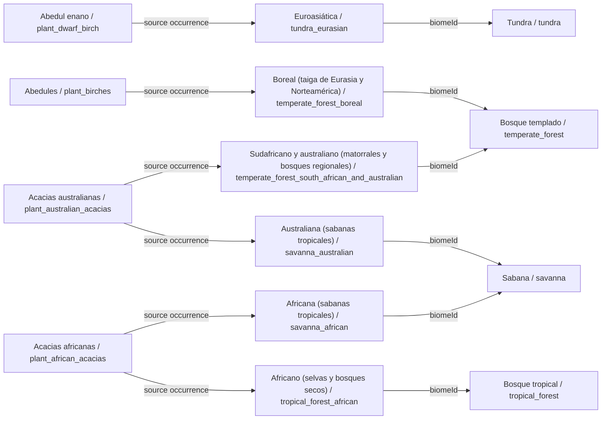
```mermaid
flowchart LR
    c0["Abedul enano / plant_dwarf_birch"]
    v9["Euroasiática / tundra_eurasian"]
    b2["Tundra / tundra"]
    c1["Abedules / plant_birches"]
    v7["Boreal (taiga de Eurasia y Norteamérica) / temperate_forest_boreal"]
    b1["Bosque templado / temperate_forest"]
    c2["Acacias africanas / plant_african_acacias"]
    v1["Africano (selvas y bosques secos) / tropical_forest_african"]
    b0["Bosque tropical / tropical_forest"]
    v11["Africana (sabanas tropicales) / savanna_african"]
    b3["Sabana / savanna"]
    c3["Acacias australianas / plant_australian_acacias"]
    v6["Sudafricano y australiano (matorrales y bosques regionales) / temperate_forest_south_african_and_australian"]
    v14["Australiana (sabanas tropicales) / savanna_australian"]
    c0 -->|source occurrence| v9
    c1 -->|source occurrence| v7
    c2 -->|source occurrence| v1
    c2 -->|source occurrence| v11
    c3 -->|source occurrence| v14
    c3 -->|source occurrence| v6
    v1 -->|biomeId| b0
    v11 -->|biomeId| b3
    v14 -->|biomeId| b3
    v6 -->|biomeId| b1
    v7 -->|biomeId| b1
    v9 -->|biomeId| b2
```

### Grupo 2

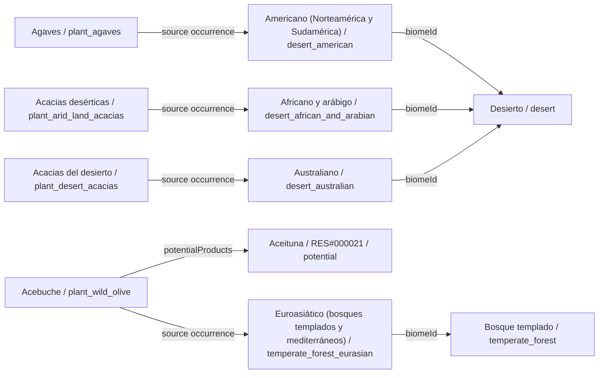
```mermaid
flowchart LR
    c0["Acacias del desierto / plant_desert_acacias"]
    v18["Australiano / desert_australian"]
    b4["Desierto / desert"]
    c1["Acacias desérticas / plant_arid_land_acacias"]
    v16["Africano y arábigo / desert_african_and_arabian"]
    c2["Acebuche / plant_wild_olive"]
    v4["Euroasiático (bosques templados y mediterráneos) / temperate_forest_eurasian"]
    b1["Bosque templado / temperate_forest"]
    o2_0["Aceituna / RES#000021 / potential"]
    c3["Agaves / plant_agaves"]
    v15["Americano (Norteamérica y Sudamérica) / desert_american"]
    c0 -->|source occurrence| v18
    c1 -->|source occurrence| v16
    c2 -->|potentialProducts| o2_0
    c2 -->|source occurrence| v4
    c3 -->|source occurrence| v15
    v15 -->|biomeId| b4
    v16 -->|biomeId| b4
    v18 -->|biomeId| b4
    v4 -->|biomeId| b1
```

### Grupo 3

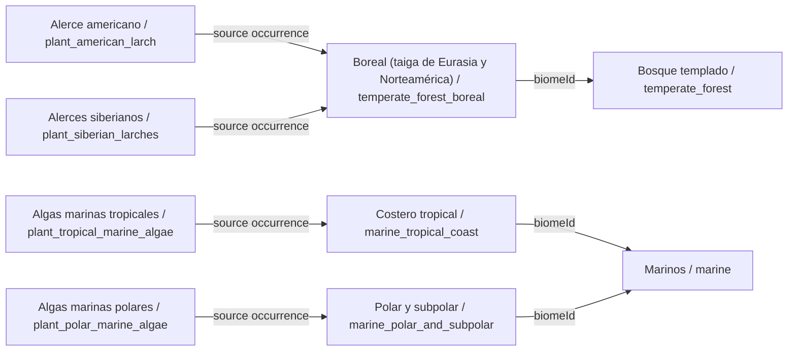
```mermaid
flowchart LR
    c0["Alerce americano / plant_american_larch"]
    v7["Boreal (taiga de Eurasia y Norteamérica) / temperate_forest_boreal"]
    b1["Bosque templado / temperate_forest"]
    c1["Alerces siberianos / plant_siberian_larches"]
    c2["Algas marinas polares / plant_polar_marine_algae"]
    v21["Polar y subpolar / marine_polar_and_subpolar"]
    b5["Marinos / marine"]
    c3["Algas marinas tropicales / plant_tropical_marine_algae"]
    v19["Costero tropical / marine_tropical_coast"]
    c0 -->|source occurrence| v7
    c1 -->|source occurrence| v7
    c2 -->|source occurrence| v21
    c3 -->|source occurrence| v19
    v19 -->|biomeId| b5
    v21 -->|biomeId| b5
    v7 -->|biomeId| b1
```

### Grupo 4

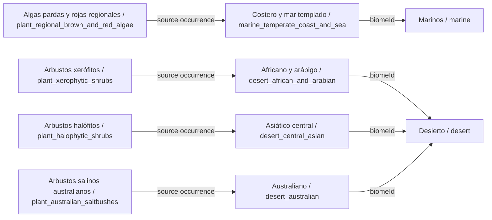
```mermaid
flowchart LR
    c0["Algas pardas y rojas regionales / plant_regional_brown_and_red_algae"]
    v20["Costero y mar templado / marine_temperate_coast_and_sea"]
    b5["Marinos / marine"]
    c1["Arbustos halófitos / plant_halophytic_shrubs"]
    v17["Asiático central / desert_central_asian"]
    b4["Desierto / desert"]
    c2["Arbustos salinos australianos / plant_australian_saltbushes"]
    v18["Australiano / desert_australian"]
    c3["Arbustos xerófitos / plant_xerophytic_shrubs"]
    v16["Africano y arábigo / desert_african_and_arabian"]
    c0 -->|source occurrence| v20
    c1 -->|source occurrence| v17
    c2 -->|source occurrence| v18
    c3 -->|source occurrence| v16
    v16 -->|biomeId| b4
    v17 -->|biomeId| b4
    v18 -->|biomeId| b4
    v20 -->|biomeId| b5
```

### Grupo 5

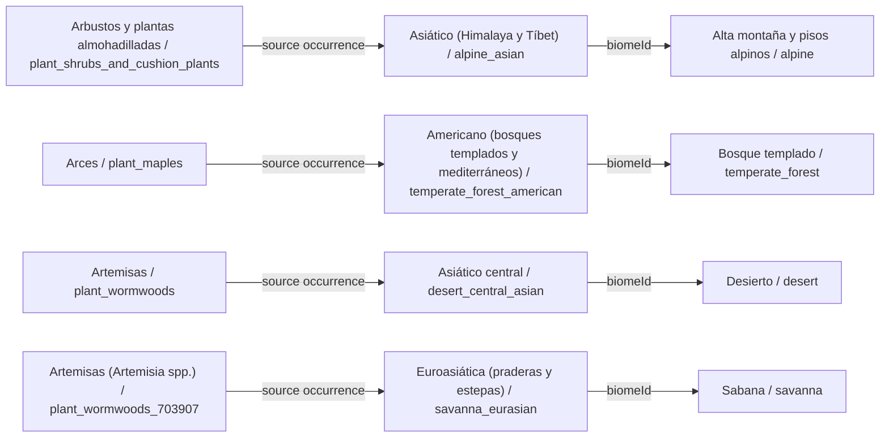
```mermaid
flowchart LR
    c0["Arbustos y plantas almohadilladas / plant_shrubs_and_cushion_plants"]
    v24["Asiático (Himalaya y Tíbet) / alpine_asian"]
    b6["Alta montaña y pisos alpinos / alpine"]
    c1["Arces / plant_maples"]
    v5["Americano (bosques templados y mediterráneos) / temperate_forest_american"]
    b1["Bosque templado / temperate_forest"]
    c2["Artemisas / plant_wormwoods"]
    v17["Asiático central / desert_central_asian"]
    b4["Desierto / desert"]
    c3["Artemisas (Artemisia spp.) / plant_wormwoods_703907"]
    v13["Euroasiática (praderas y estepas) / savanna_eurasian"]
    b3["Sabana / savanna"]
    c0 -->|source occurrence| v24
    c1 -->|source occurrence| v5
    c2 -->|source occurrence| v17
    c3 -->|source occurrence| v13
    v13 -->|biomeId| b3
    v17 -->|biomeId| b4
    v24 -->|biomeId| b6
    v5 -->|biomeId| b1
```

### Grupo 6

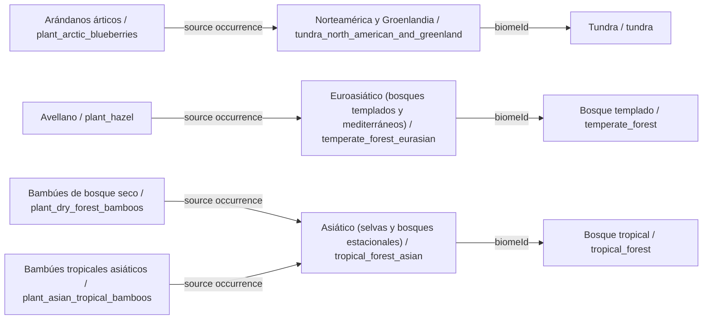
```mermaid
flowchart LR
    c0["Arándanos árticos / plant_arctic_blueberries"]
    v8["Norteamérica y Groenlandia / tundra_north_american_and_greenland"]
    b2["Tundra / tundra"]
    c1["Avellano / plant_hazel"]
    v4["Euroasiático (bosques templados y mediterráneos) / temperate_forest_eurasian"]
    b1["Bosque templado / temperate_forest"]
    c2["Bambúes de bosque seco / plant_dry_forest_bamboos"]
    v2["Asiático (selvas y bosques estacionales) / tropical_forest_asian"]
    b0["Bosque tropical / tropical_forest"]
    c3["Bambúes tropicales asiáticos / plant_asian_tropical_bamboos"]
    c0 -->|source occurrence| v8
    c1 -->|source occurrence| v4
    c2 -->|source occurrence| v2
    c3 -->|source occurrence| v2
    v2 -->|biomeId| b0
    v4 -->|biomeId| b1
    v8 -->|biomeId| b2
```

### Grupo 7

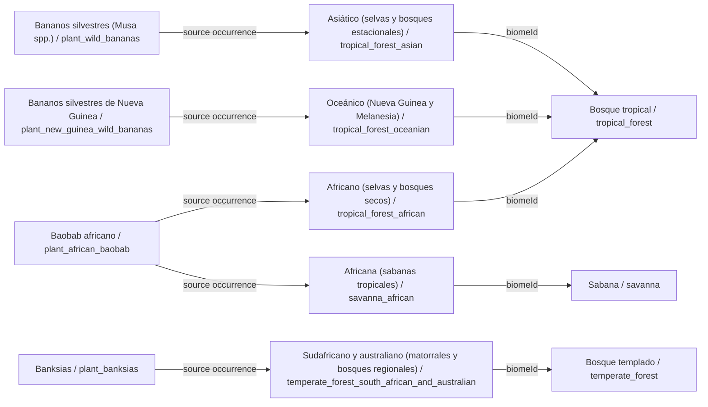
```mermaid
flowchart LR
    c0["Bananos silvestres (Musa spp.) / plant_wild_bananas"]
    v2["Asiático (selvas y bosques estacionales) / tropical_forest_asian"]
    b0["Bosque tropical / tropical_forest"]
    c1["Bananos silvestres de Nueva Guinea / plant_new_guinea_wild_bananas"]
    v3["Oceánico (Nueva Guinea y Melanesia) / tropical_forest_oceanian"]
    c2["Banksias / plant_banksias"]
    v6["Sudafricano y australiano (matorrales y bosques regionales) / temperate_forest_south_african_and_australian"]
    b1["Bosque templado / temperate_forest"]
    c3["Baobab africano / plant_african_baobab"]
    v1["Africano (selvas y bosques secos) / tropical_forest_african"]
    v11["Africana (sabanas tropicales) / savanna_african"]
    b3["Sabana / savanna"]
    c0 -->|source occurrence| v2
    c1 -->|source occurrence| v3
    c2 -->|source occurrence| v6
    c3 -->|source occurrence| v1
    c3 -->|source occurrence| v11
    v1 -->|biomeId| b0
    v11 -->|biomeId| b3
    v2 -->|biomeId| b0
    v3 -->|biomeId| b0
    v6 -->|biomeId| b1
```

### Grupo 8

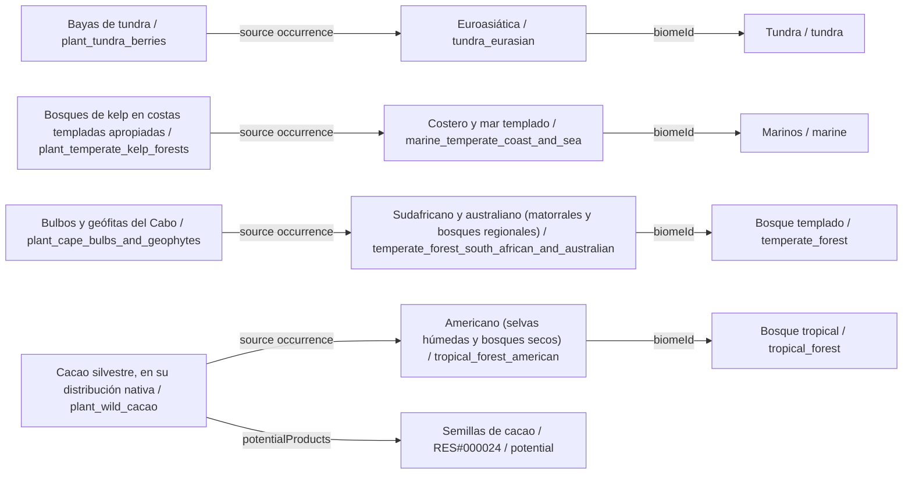
```mermaid
flowchart LR
    c0["Bayas de tundra / plant_tundra_berries"]
    v9["Euroasiática / tundra_eurasian"]
    b2["Tundra / tundra"]
    c1["Bosques de kelp en costas templadas apropiadas / plant_temperate_kelp_forests"]
    v20["Costero y mar templado / marine_temperate_coast_and_sea"]
    b5["Marinos / marine"]
    c2["Bulbos y geófitas del Cabo / plant_cape_bulbs_and_geophytes"]
    v6["Sudafricano y australiano (matorrales y bosques regionales) / temperate_forest_south_african_and_australian"]
    b1["Bosque templado / temperate_forest"]
    c3["Cacao silvestre, en su distribución nativa / plant_wild_cacao"]
    v0["Americano (selvas húmedas y bosques secos) / tropical_forest_american"]
    b0["Bosque tropical / tropical_forest"]
    o3_0["Semillas de cacao / RES#000024 / potential"]
    c0 -->|source occurrence| v9
    c1 -->|source occurrence| v20
    c2 -->|source occurrence| v6
    c3 -->|potentialProducts| o3_0
    c3 -->|source occurrence| v0
    v0 -->|biomeId| b0
    v20 -->|biomeId| b5
    v6 -->|biomeId| b1
    v9 -->|biomeId| b2
```

### Grupo 9

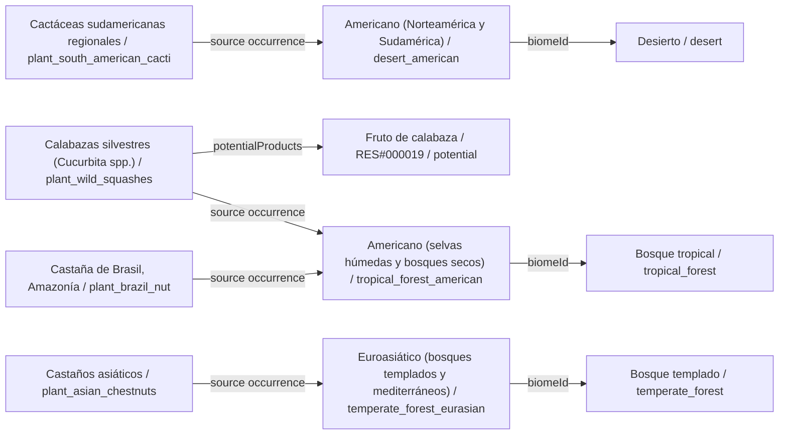
```mermaid
flowchart LR
    c0["Cactáceas sudamericanas regionales / plant_south_american_cacti"]
    v15["Americano (Norteamérica y Sudamérica) / desert_american"]
    b4["Desierto / desert"]
    c1["Calabazas silvestres (Cucurbita spp.) / plant_wild_squashes"]
    v0["Americano (selvas húmedas y bosques secos) / tropical_forest_american"]
    b0["Bosque tropical / tropical_forest"]
    o1_0["Fruto de calabaza / RES#000019 / potential"]
    c2["Castaña de Brasil, Amazonía / plant_brazil_nut"]
    c3["Castaños asiáticos / plant_asian_chestnuts"]
    v4["Euroasiático (bosques templados y mediterráneos) / temperate_forest_eurasian"]
    b1["Bosque templado / temperate_forest"]
    c0 -->|source occurrence| v15
    c1 -->|potentialProducts| o1_0
    c1 -->|source occurrence| v0
    c2 -->|source occurrence| v0
    c3 -->|source occurrence| v4
    v0 -->|biomeId| b0
    v15 -->|biomeId| b4
    v4 -->|biomeId| b1
```

### Grupo 10

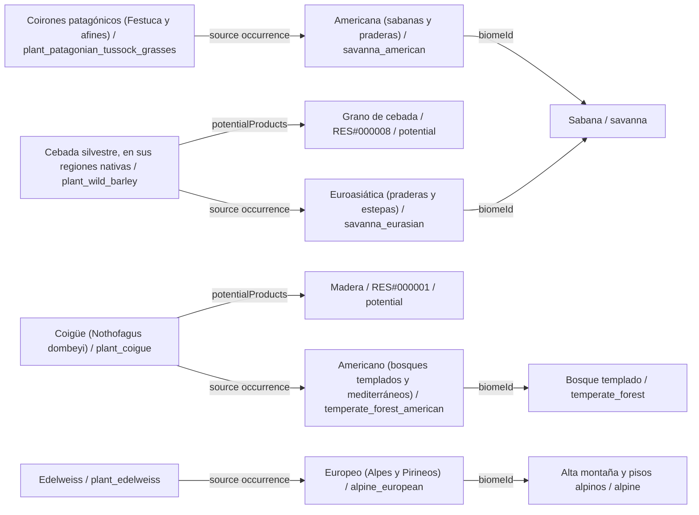
```mermaid
flowchart LR
    c0["Cebada silvestre, en sus regiones nativas / plant_wild_barley"]
    v13["Euroasiática (praderas y estepas) / savanna_eurasian"]
    b3["Sabana / savanna"]
    o0_0["Grano de cebada / RES#000008 / potential"]
    c1["Coigüe (Nothofagus dombeyi) / plant_coigue"]
    v5["Americano (bosques templados y mediterráneos) / temperate_forest_american"]
    b1["Bosque templado / temperate_forest"]
    o1_0["Madera / RES#000001 / potential"]
    c2["Coirones patagónicos (Festuca y afines) / plant_patagonian_tussock_grasses"]
    v12["Americana (sabanas y praderas) / savanna_american"]
    c3["Edelweiss / plant_edelweiss"]
    v25["Europeo (Alpes y Pirineos) / alpine_european"]
    b6["Alta montaña y pisos alpinos / alpine"]
    c0 -->|potentialProducts| o0_0
    c0 -->|source occurrence| v13
    c1 -->|potentialProducts| o1_0
    c1 -->|source occurrence| v5
    c2 -->|source occurrence| v12
    c3 -->|source occurrence| v25
    v12 -->|biomeId| b3
    v13 -->|biomeId| b3
    v25 -->|biomeId| b6
    v5 -->|biomeId| b1
```

### Grupo 11

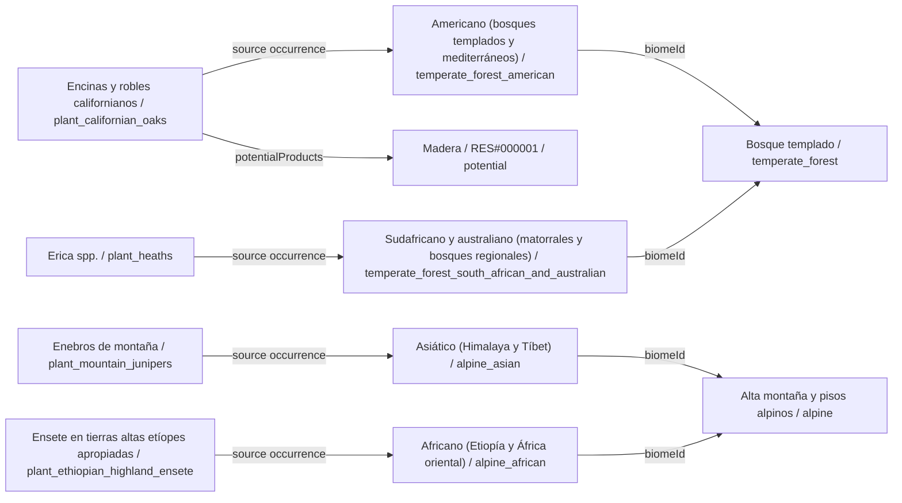
```mermaid
flowchart LR
    c0["Encinas y robles californianos / plant_californian_oaks"]
    v5["Americano (bosques templados y mediterráneos) / temperate_forest_american"]
    b1["Bosque templado / temperate_forest"]
    o0_0["Madera / RES#000001 / potential"]
    c1["Enebros de montaña / plant_mountain_junipers"]
    v24["Asiático (Himalaya y Tíbet) / alpine_asian"]
    b6["Alta montaña y pisos alpinos / alpine"]
    c2["Ensete en tierras altas etíopes apropiadas / plant_ethiopian_highland_ensete"]
    v26["Africano (Etiopía y África oriental) / alpine_african"]
    c3["Erica spp. / plant_heaths"]
    v6["Sudafricano y australiano (matorrales y bosques regionales) / temperate_forest_south_african_and_australian"]
    c0 -->|potentialProducts| o0_0
    c0 -->|source occurrence| v5
    c1 -->|source occurrence| v24
    c2 -->|source occurrence| v26
    c3 -->|source occurrence| v6
    v24 -->|biomeId| b6
    v26 -->|biomeId| b6
    v5 -->|biomeId| b1
    v6 -->|biomeId| b1
```

### Grupo 12

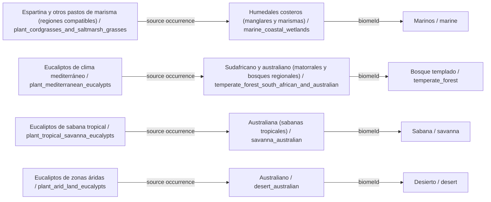
```mermaid
flowchart LR
    c0["Espartina y otros pastos de marisma (regiones compatibles) / plant_cordgrasses_and_saltmarsh_grasses"]
    v22["Humedales costeros (manglares y marismas) / marine_coastal_wetlands"]
    b5["Marinos / marine"]
    c1["Eucaliptos de clima mediterráneo / plant_mediterranean_eucalypts"]
    v6["Sudafricano y australiano (matorrales y bosques regionales) / temperate_forest_south_african_and_australian"]
    b1["Bosque templado / temperate_forest"]
    c2["Eucaliptos de sabana tropical / plant_tropical_savanna_eucalypts"]
    v14["Australiana (sabanas tropicales) / savanna_australian"]
    b3["Sabana / savanna"]
    c3["Eucaliptos de zonas áridas / plant_arid_land_eucalypts"]
    v18["Australiano / desert_australian"]
    b4["Desierto / desert"]
    c0 -->|source occurrence| v22
    c1 -->|source occurrence| v6
    c2 -->|source occurrence| v14
    c3 -->|source occurrence| v18
    v14 -->|biomeId| b3
    v18 -->|biomeId| b4
    v22 -->|biomeId| b5
    v6 -->|biomeId| b1
```

### Grupo 13

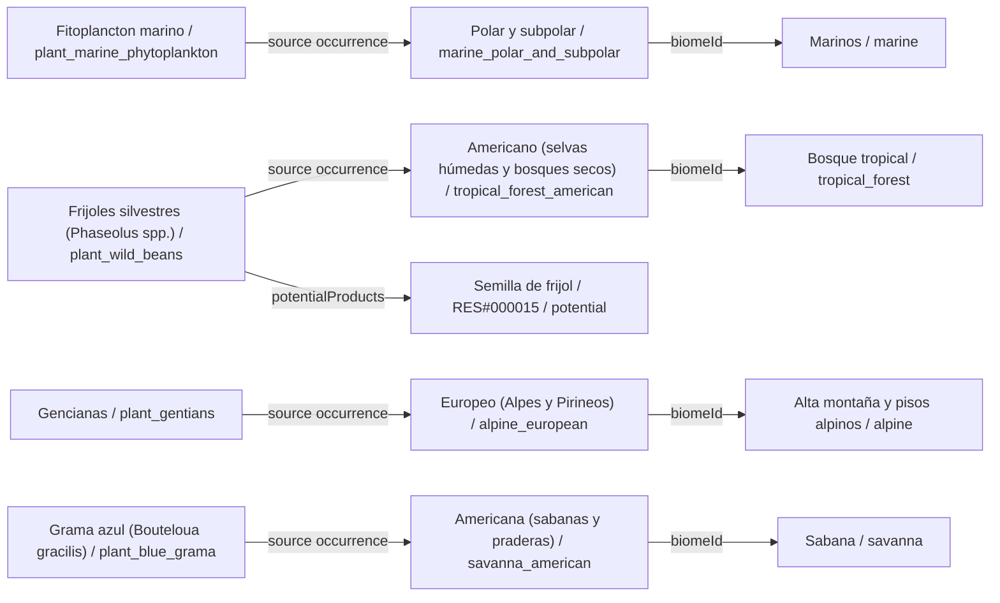
```mermaid
flowchart LR
    c0["Fitoplancton marino / plant_marine_phytoplankton"]
    v21["Polar y subpolar / marine_polar_and_subpolar"]
    b5["Marinos / marine"]
    c1["Frijoles silvestres (Phaseolus spp.) / plant_wild_beans"]
    v0["Americano (selvas húmedas y bosques secos) / tropical_forest_american"]
    b0["Bosque tropical / tropical_forest"]
    o1_0["Semilla de frijol / RES#000015 / potential"]
    c2["Gencianas / plant_gentians"]
    v25["Europeo (Alpes y Pirineos) / alpine_european"]
    b6["Alta montaña y pisos alpinos / alpine"]
    c3["Grama azul (Bouteloua gracilis) / plant_blue_grama"]
    v12["Americana (sabanas y praderas) / savanna_american"]
    b3["Sabana / savanna"]
    c0 -->|source occurrence| v21
    c1 -->|potentialProducts| o1_0
    c1 -->|source occurrence| v0
    c2 -->|source occurrence| v25
    c3 -->|source occurrence| v12
    v0 -->|biomeId| b0
    v12 -->|biomeId| b3
    v21 -->|biomeId| b5
    v25 -->|biomeId| b6
```

### Grupo 14

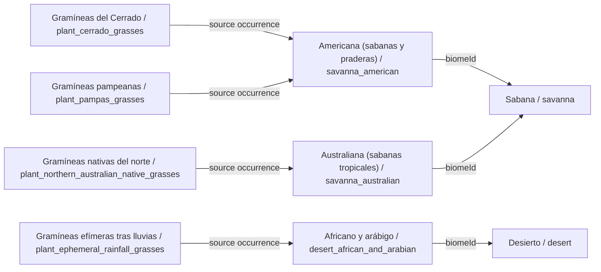
```mermaid
flowchart LR
    c0["Gramíneas del Cerrado / plant_cerrado_grasses"]
    v12["Americana (sabanas y praderas) / savanna_american"]
    b3["Sabana / savanna"]
    c1["Gramíneas efímeras tras lluvias / plant_ephemeral_rainfall_grasses"]
    v16["Africano y arábigo / desert_african_and_arabian"]
    b4["Desierto / desert"]
    c2["Gramíneas nativas del norte / plant_northern_australian_native_grasses"]
    v14["Australiana (sabanas tropicales) / savanna_australian"]
    c3["Gramíneas pampeanas / plant_pampas_grasses"]
    c0 -->|source occurrence| v12
    c1 -->|source occurrence| v16
    c2 -->|source occurrence| v14
    c3 -->|source occurrence| v12
    v12 -->|biomeId| b3
    v14 -->|biomeId| b3
    v16 -->|biomeId| b4
```

### Grupo 15

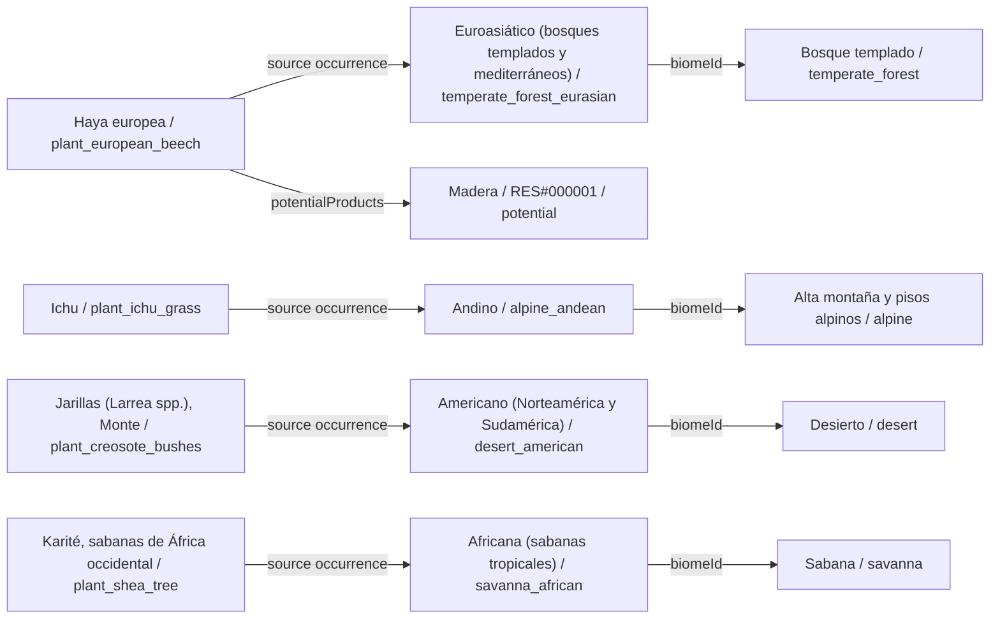
```mermaid
flowchart LR
    c0["Haya europea / plant_european_beech"]
    v4["Euroasiático (bosques templados y mediterráneos) / temperate_forest_eurasian"]
    b1["Bosque templado / temperate_forest"]
    o0_0["Madera / RES#000001 / potential"]
    c1["Ichu / plant_ichu_grass"]
    v23["Andino / alpine_andean"]
    b6["Alta montaña y pisos alpinos / alpine"]
    c2["Jarillas (Larrea spp.), Monte / plant_creosote_bushes"]
    v15["Americano (Norteamérica y Sudamérica) / desert_american"]
    b4["Desierto / desert"]
    c3["Karité, sabanas de África occidental / plant_shea_tree"]
    v11["Africana (sabanas tropicales) / savanna_african"]
    b3["Sabana / savanna"]
    c0 -->|potentialProducts| o0_0
    c0 -->|source occurrence| v4
    c1 -->|source occurrence| v23
    c2 -->|source occurrence| v15
    c3 -->|source occurrence| v11
    v11 -->|biomeId| b3
    v15 -->|biomeId| b4
    v23 -->|biomeId| b6
    v4 -->|biomeId| b1
```

### Grupo 16

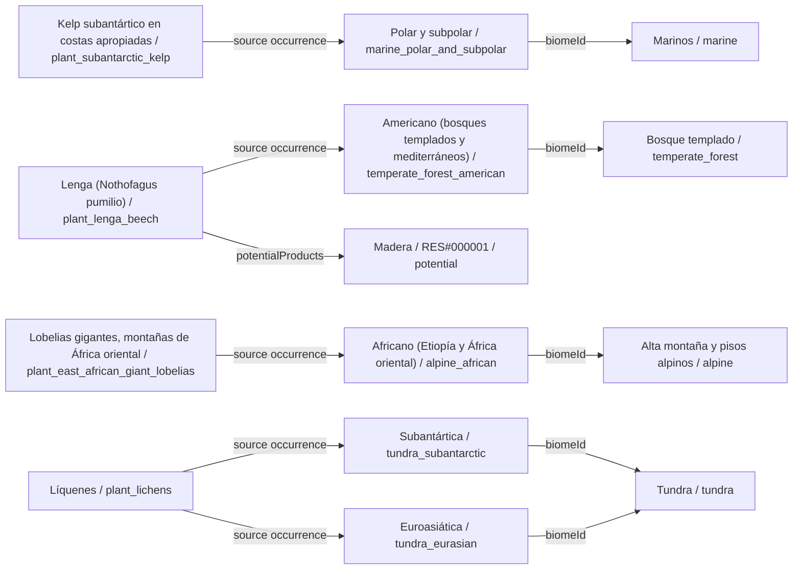
```mermaid
flowchart LR
    c0["Kelp subantártico en costas apropiadas / plant_subantarctic_kelp"]
    v21["Polar y subpolar / marine_polar_and_subpolar"]
    b5["Marinos / marine"]
    c1["Lenga (Nothofagus pumilio) / plant_lenga_beech"]
    v5["Americano (bosques templados y mediterráneos) / temperate_forest_american"]
    b1["Bosque templado / temperate_forest"]
    o1_0["Madera / RES#000001 / potential"]
    c2["Lobelias gigantes, montañas de África oriental / plant_east_african_giant_lobelias"]
    v26["Africano (Etiopía y África oriental) / alpine_african"]
    b6["Alta montaña y pisos alpinos / alpine"]
    c3["Líquenes / plant_lichens"]
    v9["Euroasiática / tundra_eurasian"]
    b2["Tundra / tundra"]
    v10["Subantártica / tundra_subantarctic"]
    c0 -->|source occurrence| v21
    c1 -->|potentialProducts| o1_0
    c1 -->|source occurrence| v5
    c2 -->|source occurrence| v26
    c3 -->|source occurrence| v10
    c3 -->|source occurrence| v9
    v10 -->|biomeId| b2
    v21 -->|biomeId| b5
    v26 -->|biomeId| b6
    v5 -->|biomeId| b1
    v9 -->|biomeId| b2
```

### Grupo 17

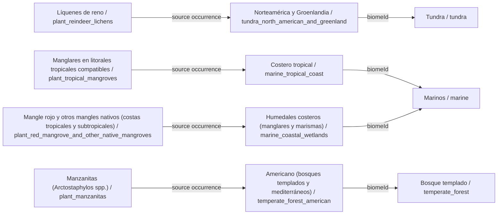
```mermaid
flowchart LR
    c0["Líquenes de reno / plant_reindeer_lichens"]
    v8["Norteamérica y Groenlandia / tundra_north_american_and_greenland"]
    b2["Tundra / tundra"]
    c1["Manglares en litorales tropicales compatibles / plant_tropical_mangroves"]
    v19["Costero tropical / marine_tropical_coast"]
    b5["Marinos / marine"]
    c2["Mangle rojo y otros mangles nativos (costas tropicales y subtropicales) / plant_red_mangrove_and_other_native_mangroves"]
    v22["Humedales costeros (manglares y marismas) / marine_coastal_wetlands"]
    c3["Manzanitas (Arctostaphylos spp.) / plant_manzanitas"]
    v5["Americano (bosques templados y mediterráneos) / temperate_forest_american"]
    b1["Bosque templado / temperate_forest"]
    c0 -->|source occurrence| v8
    c1 -->|source occurrence| v19
    c2 -->|source occurrence| v22
    c3 -->|source occurrence| v5
    v19 -->|biomeId| b5
    v22 -->|biomeId| b5
    v5 -->|biomeId| b1
    v8 -->|biomeId| b2
```

### Grupo 18

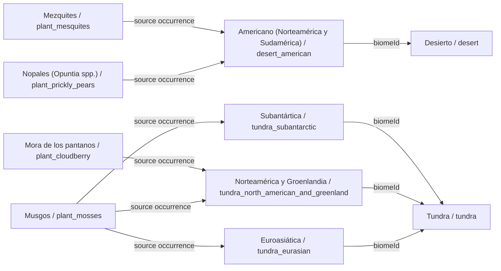
```mermaid
flowchart LR
    c0["Mezquites / plant_mesquites"]
    v15["Americano (Norteamérica y Sudamérica) / desert_american"]
    b4["Desierto / desert"]
    c1["Mora de los pantanos / plant_cloudberry"]
    v8["Norteamérica y Groenlandia / tundra_north_american_and_greenland"]
    b2["Tundra / tundra"]
    c2["Musgos / plant_mosses"]
    v9["Euroasiática / tundra_eurasian"]
    v10["Subantártica / tundra_subantarctic"]
    c3["Nopales (Opuntia spp.) / plant_prickly_pears"]
    c0 -->|source occurrence| v15
    c1 -->|source occurrence| v8
    c2 -->|source occurrence| v10
    c2 -->|source occurrence| v8
    c2 -->|source occurrence| v9
    c3 -->|source occurrence| v15
    v10 -->|biomeId| b2
    v15 -->|biomeId| b4
    v8 -->|biomeId| b2
    v9 -->|biomeId| b2
```

### Grupo 19

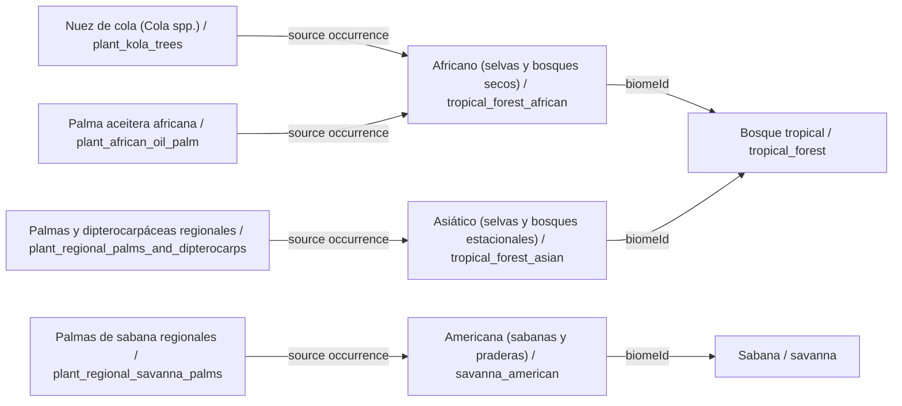
```mermaid
flowchart LR
    c0["Nuez de cola (Cola spp.) / plant_kola_trees"]
    v1["Africano (selvas y bosques secos) / tropical_forest_african"]
    b0["Bosque tropical / tropical_forest"]
    c1["Palma aceitera africana / plant_african_oil_palm"]
    c2["Palmas de sabana regionales / plant_regional_savanna_palms"]
    v12["Americana (sabanas y praderas) / savanna_american"]
    b3["Sabana / savanna"]
    c3["Palmas y dipterocarpáceas regionales / plant_regional_palms_and_dipterocarps"]
    v2["Asiático (selvas y bosques estacionales) / tropical_forest_asian"]
    c0 -->|source occurrence| v1
    c1 -->|source occurrence| v1
    c2 -->|source occurrence| v12
    c3 -->|source occurrence| v2
    v1 -->|biomeId| b0
    v12 -->|biomeId| b3
    v2 -->|biomeId| b0
```

### Grupo 20

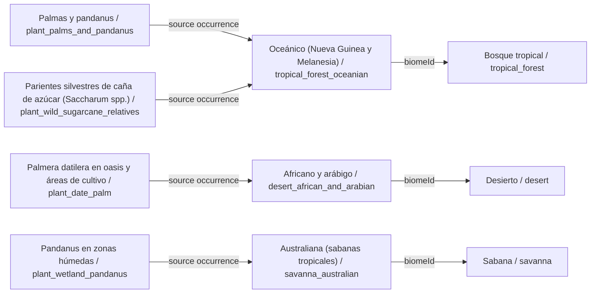
```mermaid
flowchart LR
    c0["Palmas y pandanus / plant_palms_and_pandanus"]
    v3["Oceánico (Nueva Guinea y Melanesia) / tropical_forest_oceanian"]
    b0["Bosque tropical / tropical_forest"]
    c1["Palmera datilera en oasis y áreas de cultivo / plant_date_palm"]
    v16["Africano y arábigo / desert_african_and_arabian"]
    b4["Desierto / desert"]
    c2["Pandanus en zonas húmedas / plant_wetland_pandanus"]
    v14["Australiana (sabanas tropicales) / savanna_australian"]
    b3["Sabana / savanna"]
    c3["Parientes silvestres de caña de azúcar (Saccharum spp.) / plant_wild_sugarcane_relatives"]
    c0 -->|source occurrence| v3
    c1 -->|source occurrence| v16
    c2 -->|source occurrence| v14
    c3 -->|source occurrence| v3
    v14 -->|biomeId| b3
    v16 -->|biomeId| b4
    v3 -->|biomeId| b0
```

### Grupo 21

```mermaid
flowchart LR
    c0["Parientes silvestres de la papa / plant_wild_potato_relatives"]
    v23["Andino / alpine_andean"]
    b6["Alta montaña y pisos alpinos / alpine"]
    c1["Parientes silvestres de la quinua / plant_wild_quinoa_relatives"]
    c2["Parientes silvestres del mijo perla, Sahel / plant_sahelian_wild_pearl_millet_relatives"]
    v11["Africana (sabanas tropicales) / savanna_african"]
    b3["Sabana / savanna"]
    c3["Pastos afroalpinos / plant_afroalpine_grasses"]
    v26["Africano (Etiopía y África oriental) / alpine_african"]
    c0 -->|source occurrence| v23
    c1 -->|source occurrence| v23
    c2 -->|source occurrence| v11
    c3 -->|source occurrence| v26
    v11 -->|biomeId| b3
    v23 -->|biomeId| b6
    v26 -->|biomeId| b6
```

### Grupo 22

```mermaid
flowchart LR
    c0["Pastos alpinos / plant_alpine_grasses"]
    v25["Europeo (Alpes y Pirineos) / alpine_european"]
    b6["Alta montaña y pisos alpinos / alpine"]
    c1["Pastos alpinos asiáticos / plant_asian_alpine_grasses"]
    v24["Asiático (Himalaya y Tíbet) / alpine_asian"]
    c2["Pastos altos (Andropogon gerardii) / plant_big_bluestem"]
    v12["Americana (sabanas y praderas) / savanna_american"]
    b3["Sabana / savanna"]
    c3["Pastos desérticos regionales / plant_regional_desert_grasses"]
    v17["Asiático central / desert_central_asian"]
    b4["Desierto / desert"]
    c0 -->|source occurrence| v25
    c1 -->|source occurrence| v24
    c2 -->|source occurrence| v12
    c3 -->|source occurrence| v17
    v12 -->|biomeId| b3
    v17 -->|biomeId| b4
    v24 -->|biomeId| b6
    v25 -->|biomeId| b6
```

### Grupo 23

```mermaid
flowchart LR
    c0["Pastos esteparios euroasiáticos / plant_eurasian_steppe_grasses"]
    v13["Euroasiática (praderas y estepas) / savanna_eurasian"]
    b3["Sabana / savanna"]
    c1["Pastos marinos (Thalassia y otros géneros regionales) / plant_regional_seagrasses"]
    v19["Costero tropical / marine_tropical_coast"]
    b5["Marinos / marine"]
    c2["Pastos subantárticos / plant_subantarctic_grasses"]
    v10["Subantártica / tundra_subantarctic"]
    b2["Tundra / tundra"]
    c3["Pequi (Caryocar brasiliense), Cerrado / plant_pequi"]
    v12["Americana (sabanas y praderas) / savanna_american"]
    c0 -->|source occurrence| v13
    c1 -->|source occurrence| v19
    c2 -->|source occurrence| v10
    c3 -->|source occurrence| v12
    v10 -->|biomeId| b2
    v12 -->|biomeId| b3
    v13 -->|biomeId| b3
    v19 -->|biomeId| b5
```

### Grupo 24

```mermaid
flowchart LR
    c0["Pino silvestre / plant_scots_pine"]
    v7["Boreal (taiga de Eurasia y Norteamérica) / temperate_forest_boreal"]
    b1["Bosque templado / temperate_forest"]
    o0_0["Madera / RES#000001 / potential"]
    c1["Pinos de montaña / plant_mountain_pines"]
    v25["Europeo (Alpes y Pirineos) / alpine_european"]
    b6["Alta montaña y pisos alpinos / alpine"]
    o1_0["Madera / RES#000001 / potential"]
    c2["Plantas almohadilladas / plant_cushion_plants"]
    v10["Subantártica / tundra_subantarctic"]
    b2["Tundra / tundra"]
    c3["Plantas almohadilladas andinas / plant_andean_cushion_plants"]
    v23["Andino / alpine_andean"]
    c0 -->|potentialProducts| o0_0
    c0 -->|source occurrence| v7
    c1 -->|potentialProducts| o1_0
    c1 -->|source occurrence| v25
    c2 -->|source occurrence| v10
    c3 -->|source occurrence| v23
    v10 -->|biomeId| b2
    v23 -->|biomeId| b6
    v25 -->|biomeId| b6
    v7 -->|biomeId| b1
```

### Grupo 25

```mermaid
flowchart LR
    c0["Plantas de niebla costera, sectores de Atacama / plant_atacama_coastal_fog_plants"]
    v15["Americano (Norteamérica y Sudamérica) / desert_american"]
    b4["Desierto / desert"]
    c1["Plantas halófitas de estuario / plant_estuarine_halophytes"]
    v22["Humedales costeros (manglares y marismas) / marine_coastal_wetlands"]
    b5["Marinos / marine"]
    c2["Proteas / plant_proteas"]
    v6["Sudafricano y australiano (matorrales y bosques regionales) / temperate_forest_south_african_and_australian"]
    b1["Bosque templado / temperate_forest"]
    c3["Pícea blanca / plant_white_spruce"]
    v7["Boreal (taiga de Eurasia y Norteamérica) / temperate_forest_boreal"]
    o3_0["Madera / RES#000001 / potential"]
    c0 -->|source occurrence| v15
    c1 -->|source occurrence| v22
    c2 -->|source occurrence| v6
    c3 -->|potentialProducts| o3_0
    c3 -->|source occurrence| v7
    v15 -->|biomeId| b4
    v22 -->|biomeId| b5
    v6 -->|biomeId| b1
    v7 -->|biomeId| b1
```

### Grupo 26

```mermaid
flowchart LR
    c0["Pícea negra / plant_black_spruce"]
    v7["Boreal (taiga de Eurasia y Norteamérica) / temperate_forest_boreal"]
    b1["Bosque templado / temperate_forest"]
    o0_0["Madera / RES#000001 / potential"]
    c1["Píceas euroasiáticas / plant_eurasian_spruces"]
    o1_0["Madera / RES#000001 / potential"]
    c2["Queñua (Polylepis spp.) / plant_queuna_trees"]
    v23["Andino / alpine_andean"]
    b6["Alta montaña y pisos alpinos / alpine"]
    c3["Quillay / plant_soapbark_tree"]
    v5["Americano (bosques templados y mediterráneos) / temperate_forest_american"]
    c0 -->|potentialProducts| o0_0
    c0 -->|source occurrence| v7
    c1 -->|potentialProducts| o1_0
    c1 -->|source occurrence| v7
    c2 -->|source occurrence| v23
    c3 -->|source occurrence| v5
    v23 -->|biomeId| b6
    v5 -->|biomeId| b1
    v7 -->|biomeId| b1
```

### Grupo 27

```mermaid
flowchart LR
    c0["Rafia africana (Raphia spp.) / plant_african_raffia_palms"]
    v1["Africano (selvas y bosques secos) / tropical_forest_african"]
    b0["Bosque tropical / tropical_forest"]
    c1["Restios / plant_restios"]
    v6["Sudafricano y australiano (matorrales y bosques regionales) / temperate_forest_south_african_and_australian"]
    b1["Bosque templado / temperate_forest"]
    c2["Robles europeos / plant_european_oaks"]
    v4["Euroasiático (bosques templados y mediterráneos) / temperate_forest_eurasian"]
    o2_0["Madera / RES#000001 / potential"]
    c3["Robles norteamericanos / plant_north_american_oaks"]
    v5["Americano (bosques templados y mediterráneos) / temperate_forest_american"]
    o3_0["Madera / RES#000001 / potential"]
    c0 -->|source occurrence| v1
    c1 -->|source occurrence| v6
    c2 -->|potentialProducts| o2_0
    c2 -->|source occurrence| v4
    c3 -->|potentialProducts| o3_0
    c3 -->|source occurrence| v5
    v1 -->|biomeId| b0
    v4 -->|biomeId| b1
    v5 -->|biomeId| b1
    v6 -->|biomeId| b1
```

### Grupo 28

```mermaid
flowchart LR
    c0["Robles y arces asiáticos / plant_asian_oaks_and_maples"]
    v4["Euroasiático (bosques templados y mediterráneos) / temperate_forest_eurasian"]
    b1["Bosque templado / temperate_forest"]
    c1["Rododendros de altura / plant_high_altitude_rhododendrons"]
    v24["Asiático (Himalaya y Tíbet) / alpine_asian"]
    b6["Alta montaña y pisos alpinos / alpine"]
    c2["Saguaro, Sonora / plant_sonoran_saguaro"]
    v15["Americano (Norteamérica y Sudamérica) / desert_american"]
    b4["Desierto / desert"]
    c3["Sauces enanos / plant_dwarf_willows"]
    v8["Norteamérica y Groenlandia / tundra_north_american_and_greenland"]
    b2["Tundra / tundra"]
    c0 -->|source occurrence| v4
    c1 -->|source occurrence| v24
    c2 -->|source occurrence| v15
    c3 -->|source occurrence| v8
    v15 -->|biomeId| b4
    v24 -->|biomeId| b6
    v4 -->|biomeId| b1
    v8 -->|biomeId| b2
```

### Grupo 29

```mermaid
flowchart LR
    c0["Sauces árticos / plant_arctic_willows"]
    v9["Euroasiática / tundra_eurasian"]
    b2["Tundra / tundra"]
    c1["Saxaúl (Haloxylon spp.) / plant_saxaul"]
    v17["Asiático central / desert_central_asian"]
    b4["Desierto / desert"]
    c2["Senecios gigantes (Dendrosenecio spp.) / plant_giant_groundsels"]
    v26["Africano (Etiopía y África oriental) / alpine_african"]
    b6["Alta montaña y pisos alpinos / alpine"]
    c3["Sorgos silvestres africanos / plant_african_wild_sorghums"]
    v11["Africana (sabanas tropicales) / savanna_african"]
    b3["Sabana / savanna"]
    c0 -->|source occurrence| v9
    c1 -->|source occurrence| v17
    c2 -->|source occurrence| v26
    c3 -->|source occurrence| v11
    v11 -->|biomeId| b3
    v17 -->|biomeId| b4
    v26 -->|biomeId| b6
    v9 -->|biomeId| b2
```

### Grupo 30

```mermaid
flowchart LR
    c0["Spinifex (Triodia spp.) / plant_spinifex_grasses"]
    v18["Australiano / desert_australian"]
    b4["Desierto / desert"]
    c1["Taro silvestre en su área nativa / plant_wild_taro"]
    v2["Asiático (selvas y bosques estacionales) / tropical_forest_asian"]
    b0["Bosque tropical / tropical_forest"]
    c2["Taro y otras aráceas regionales / plant_taro_and_regional_aroids"]
    v3["Oceánico (Nueva Guinea y Melanesia) / tropical_forest_oceanian"]
    c3["Teca en su distribución nativa / plant_native_teak"]
    o3_0["Madera / RES#000001 / potential"]
    c0 -->|source occurrence| v18
    c1 -->|source occurrence| v2
    c2 -->|source occurrence| v3
    c3 -->|potentialProducts| o3_0
    c3 -->|source occurrence| v2
    v18 -->|biomeId| b4
    v2 -->|biomeId| b0
    v3 -->|biomeId| b0
```

### Grupo 31

```mermaid
flowchart LR
    c0["Teosinte, en su distribución mesoamericana / plant_mesoamerican_teosinte"]
    v0["Americano (selvas húmedas y bosques secos) / tropical_forest_american"]
    b0["Bosque tropical / tropical_forest"]
    c1["Trigo silvestre, solo en sus regiones nativas del sudoeste asiático / plant_southwest_asian_wild_wheat"]
    v13["Euroasiática (praderas y estepas) / savanna_eurasian"]
    b3["Sabana / savanna"]
    o1_0["Grano de trigo / RES#000007 / potential"]
    c2["Vainilla (Vanilla planifolia), Mesoamérica / plant_mesoamerican_vanilla"]
    c3["Vid silvestre en hábitats nativos / plant_native_wild_grapevine"]
    v4["Euroasiático (bosques templados y mediterráneos) / temperate_forest_eurasian"]
    b1["Bosque templado / temperate_forest"]
    o3_0["Uva / RES#000020 / potential"]
    c0 -->|source occurrence| v0
    c1 -->|potentialProducts| o1_0
    c1 -->|source occurrence| v13
    c2 -->|source occurrence| v0
    c3 -->|potentialProducts| o3_0
    c3 -->|source occurrence| v4
    v0 -->|biomeId| b0
    v13 -->|biomeId| b3
    v4 -->|biomeId| b1
```

### Grupo 32

```mermaid
flowchart LR
    c0["Zostera y otros pastos marinos / plant_eelgrass_and_other_seagrasses"]
    v20["Costero y mar templado / marine_temperate_coast_and_sea"]
    b5["Marinos / marine"]
    c1["Árbol del caucho (Hevea brasiliensis), Amazonía / plant_amazonian_rubber_tree"]
    v0["Americano (selvas húmedas y bosques secos) / tropical_forest_american"]
    b0["Bosque tropical / tropical_forest"]
    c2["Árboles de maderas tropicales regionales / plant_regional_tropical_timber_trees"]
    v1["Africano (selvas y bosques secos) / tropical_forest_african"]
    o2_0["Madera / RES#000001 / potential"]
    c3["Árboles de miombo (Brachystegia spp.), donde corresponda / plant_miombo_trees"]
    c0 -->|source occurrence| v20
    c1 -->|source occurrence| v0
    c2 -->|potentialProducts| o2_0
    c2 -->|source occurrence| v1
    c3 -->|source occurrence| v1
    v0 -->|biomeId| b0
    v1 -->|biomeId| b0
    v20 -->|biomeId| b5
```

### Grupo 33

```mermaid
flowchart LR
    c0["Árboles de sal (Shorea robusta), regiones adecuadas / plant_sal_trees"]
    v2["Asiático (selvas y bosques estacionales) / tropical_forest_asian"]
    b0["Bosque tropical / tropical_forest"]
    c0 -->|source occurrence| v2
    v2 -->|biomeId| b0
```

## Todos los candidatos agrícolas

Son grupos agrícolas pendientes de especie exacta y ancestro; no se fusionan automáticamente con candidatos regionales.

### Cultivos 1

```mermaid
flowchart LR
    tech["species_cultivation"]
    c0["Trigo / wheat"]
    c0 -->|cultivationResearch.technologyId| tech
    g0["cereal"]
    c0 -->|cropUseTag| g0
    r0_0["Grano de trigo / RES#000007"]
    c0 -->|products / proposed| r0_0
    r0_1["Paja de cereal / RES#000028"]
    c0 -->|products / proposed| r0_1
    c1["Cebada / barley"]
    c1 -->|cultivationResearch.technologyId| tech
    c1 -->|cropUseTag| g0
    r1_0["Grano de cebada / RES#000008"]
    c1 -->|products / proposed| r1_0
    r1_1["Paja de cereal / RES#000028"]
    c1 -->|products / proposed| r1_1
    c2["Arroz / rice"]
    c2 -->|cultivationResearch.technologyId| tech
    c2 -->|cropUseTag| g0
    r2_0["Grano de arroz / RES#000009"]
    c2 -->|products / proposed| r2_0
    r2_1["Paja de cereal / RES#000028"]
    c2 -->|products / proposed| r2_1
    c3["Maíz / maize"]
    c3 -->|cultivationResearch.technologyId| tech
    c3 -->|cropUseTag| g0
    r3_0["Grano de maíz / RES#000010"]
    c3 -->|products / proposed| r3_0
```

### Cultivos 2

```mermaid
flowchart LR
    tech["species_cultivation"]
    c0["Sorgo / sorghum"]
    c0 -->|cultivationResearch.technologyId| tech
    g0["cereal"]
    c0 -->|cropUseTag| g0
    r0_0["Grano de sorgo / RES#000011"]
    c0 -->|products / proposed| r0_0
    c1["Mijo / millet"]
    c1 -->|cultivationResearch.technologyId| tech
    c1 -->|cropUseTag| g0
    r1_0["Grano de mijo / RES#000012"]
    c1 -->|products / proposed| r1_0
    c2["Papa / potato"]
    c2 -->|cultivationResearch.technologyId| tech
    g1["root_or_tuber"]
    c2 -->|cropUseTag| g1
    r2_0["Tubérculo de papa / RES#000013"]
    c2 -->|products / proposed| r2_0
    c3["Yuca / cassava"]
    c3 -->|cultivationResearch.technologyId| tech
    c3 -->|cropUseTag| g1
    r3_0["Raíz de yuca / RES#000014"]
    c3 -->|products / proposed| r3_0
```

### Cultivos 3

```mermaid
flowchart LR
    tech["species_cultivation"]
    c0["Frijoles / beans"]
    c0 -->|cultivationResearch.technologyId| tech
    g0["pulse"]
    c0 -->|cropUseTag| g0
    r0_0["Semilla de frijol / RES#000015"]
    c0 -->|products / proposed| r0_0
    c1["Lentejas / lentils"]
    c1 -->|cultivationResearch.technologyId| tech
    c1 -->|cropUseTag| g0
    r1_0["Semilla de lenteja / RES#000016"]
    c1 -->|products / proposed| r1_0
    c2["Garbanzos / chickpeas"]
    c2 -->|cultivationResearch.technologyId| tech
    c2 -->|cropUseTag| g0
    r2_0["Semilla de garbanzo / RES#000017"]
    c2 -->|products / proposed| r2_0
    c3["Guisantes / peas"]
    c3 -->|cultivationResearch.technologyId| tech
    c3 -->|cropUseTag| g0
    r3_0["Semilla de arveja / RES#000018"]
    c3 -->|products / proposed| r3_0
```

### Cultivos 4

```mermaid
flowchart LR
    tech["species_cultivation"]
    c0["Calabaza / squash"]
    c0 -->|cultivationResearch.technologyId| tech
    g0["vegetable"]
    c0 -->|cropUseTag| g0
    r0_0["Fruto de calabaza / RES#000019"]
    c0 -->|products / proposed| r0_0
    c1["Vid / grapevine"]
    c1 -->|cultivationResearch.technologyId| tech
    g1["fruit_crop"]
    c1 -->|cropUseTag| g1
    r1_0["Uva / RES#000020"]
    c1 -->|products / proposed| r1_0
    c2["Olivo / olive"]
    c2 -->|cultivationResearch.technologyId| tech
    g2["oil_crop"]
    c2 -->|cropUseTag| g2
    r2_0["Aceituna / RES#000021"]
    c2 -->|products / proposed| r2_0
    c3["Higuera / fig"]
    c3 -->|cultivationResearch.technologyId| tech
    c3 -->|cropUseTag| g1
    r3_0["Higo / RES#000022"]
    c3 -->|products / proposed| r3_0
```

### Cultivos 5

```mermaid
flowchart LR
    tech["species_cultivation"]
    c0["Palmera datilera / date_palm"]
    c0 -->|cultivationResearch.technologyId| tech
    g0["fruit_crop"]
    c0 -->|cropUseTag| g0
    r0_0["Dátil / RES#000023"]
    c0 -->|products / proposed| r0_0
    c1["Cacao / cacao"]
    c1 -->|cultivationResearch.technologyId| tech
    g1["special_crop"]
    c1 -->|cropUseTag| g1
    r1_0["Semillas de cacao / RES#000024"]
    c1 -->|products / proposed| r1_0
    c2["Café / coffee"]
    c2 -->|cultivationResearch.technologyId| tech
    c2 -->|cropUseTag| g1
    r2_0["Frutos de café / RES#000025"]
    c2 -->|products / proposed| r2_0
    c3["Caña de azúcar / sugarcane"]
    c3 -->|cultivationResearch.technologyId| tech
    c3 -->|cropUseTag| g1
    r3_0["Tallo de caña de azúcar / RES#000026"]
    c3 -->|products / proposed| r3_0
```

### Cultivos 6

```mermaid
flowchart LR
    tech["species_cultivation"]
    c0["Algodón / cotton"]
    c0 -->|cultivationResearch.technologyId| tech
    g0["fiber_crop"]
    c0 -->|cropUseTag| g0
    r0_0["Fibra de algodón / RES#000027"]
    c0 -->|products / proposed| r0_0
```

| id | Nombre | cropUseTag | sourceOriginHint |
| --- | --- | --- | --- |
| wheat | Trigo | cereal | Southwest Asia |
| barley | Cebada | cereal | Southwest Asia |
| rice | Arroz | cereal | None |
| maize | Maíz | cereal | Mesoamerica |
| sorghum | Sorgo | cereal | None |
| millet | Mijo | cereal | None |
| potato | Papa | root_or_tuber | Andes |
| cassava | Yuca | root_or_tuber | South America |
| beans | Frijoles | pulse | None |
| lentils | Lentejas | pulse | None |
| chickpeas | Garbanzos | pulse | None |
| peas | Guisantes | pulse | None |
| squash | Calabaza | vegetable | None |
| grapevine | Vid | fruit_crop | None |
| olive | Olivo | oil_crop | None |
| fig | Higuera | fruit_crop | None |
| date_palm | Palmera datilera | fruit_crop | None |
| cacao | Cacao | special_crop | Tropical America |
| coffee | Café | special_crop | None |
| sugarcane | Caña de azúcar | special_crop | None |
| cotton | Algodón | fiber_crop | None |

## Todas las apariciones de la fuente

Esta tabla conserva cada vínculo regional y método de extracción aunque el diagrama agrupe flechas repetidas. La presencia inicial sigue deshabilitada.

| id | definitionId | biomeId | variantId | extractionMethodId | sourceText |
| --- | --- | --- | --- | --- | --- |
| occurrence_0016 | plant_wild_cacao | tropical_forest | tropical_forest_american | None | Cacao silvestre, en su distribución nativa |
| occurrence_0017 | plant_mesoamerican_teosinte | tropical_forest | tropical_forest_american | None | Teosinte, en su distribución mesoamericana |
| occurrence_0018 | plant_mesoamerican_vanilla | tropical_forest | tropical_forest_american | None | Vainilla (Vanilla planifolia), Mesoamérica |
| occurrence_0019 | plant_wild_beans | tropical_forest | tropical_forest_american | None | Frijoles silvestres (Phaseolus spp.) |
| occurrence_0020 | plant_brazil_nut | tropical_forest | tropical_forest_american | None | Castaña de Brasil, Amazonía |
| occurrence_0021 | plant_wild_squashes | tropical_forest | tropical_forest_american | None | Calabazas silvestres (Cucurbita spp.) |
| occurrence_0022 | plant_amazonian_rubber_tree | tropical_forest | tropical_forest_american | None | Árbol del caucho (Hevea brasiliensis), Amazonía |
| occurrence_0038 | plant_african_oil_palm | tropical_forest | tropical_forest_african | None | Palma aceitera africana |
| occurrence_0039 | plant_african_baobab | tropical_forest | tropical_forest_african | None | Baobab africano |
| occurrence_0040 | plant_kola_trees | tropical_forest | tropical_forest_african | None | Nuez de cola (Cola spp.) |
| occurrence_0041 | plant_african_acacias | tropical_forest | tropical_forest_african | None | Acacias africanas |
| occurrence_0042 | plant_african_raffia_palms | tropical_forest | tropical_forest_african | None | Rafia africana (Raphia spp.) |
| occurrence_0043 | plant_miombo_trees | tropical_forest | tropical_forest_african | None | Árboles de miombo (Brachystegia spp.), donde corresponda |
| occurrence_0044 | plant_regional_tropical_timber_trees | tropical_forest | tropical_forest_african | None | Árboles de maderas tropicales regionales |
| occurrence_0060 | plant_wild_bananas | tropical_forest | tropical_forest_asian | None | Bananos silvestres (Musa spp.) |
| occurrence_0061 | plant_native_teak | tropical_forest | tropical_forest_asian | None | Teca en su distribución nativa |
| occurrence_0062 | plant_wild_taro | tropical_forest | tropical_forest_asian | None | Taro silvestre en su área nativa |
| occurrence_0063 | plant_dry_forest_bamboos | tropical_forest | tropical_forest_asian | None | Bambúes de bosque seco |
| occurrence_0064 | plant_asian_tropical_bamboos | tropical_forest | tropical_forest_asian | None | Bambúes tropicales asiáticos |
| occurrence_0065 | plant_sal_trees | tropical_forest | tropical_forest_asian | None | Árboles de sal (Shorea robusta), regiones adecuadas |
| occurrence_0066 | plant_regional_palms_and_dipterocarps | tropical_forest | tropical_forest_asian | None | Palmas y dipterocarpáceas regionales |
| occurrence_0079 | plant_wild_sugarcane_relatives | tropical_forest | tropical_forest_oceanian | None | Parientes silvestres de caña de azúcar (Saccharum spp.) |
| occurrence_0080 | plant_new_guinea_wild_bananas | tropical_forest | tropical_forest_oceanian | None | Bananos silvestres de Nueva Guinea |
| occurrence_0081 | plant_taro_and_regional_aroids | tropical_forest | tropical_forest_oceanian | None | Taro y otras aráceas regionales |
| occurrence_0082 | plant_palms_and_pandanus | tropical_forest | tropical_forest_oceanian | None | Palmas y pandanus |
| occurrence_0098 | plant_european_oaks | temperate_forest | temperate_forest_eurasian | None | Robles europeos |
| occurrence_0099 | plant_asian_oaks_and_maples | temperate_forest | temperate_forest_eurasian | None | Robles y arces asiáticos |
| occurrence_0100 | plant_wild_olive | temperate_forest | temperate_forest_eurasian | None | Acebuche |
| occurrence_0101 | plant_european_beech | temperate_forest | temperate_forest_eurasian | None | Haya europea |
| occurrence_0102 | plant_asian_chestnuts | temperate_forest | temperate_forest_eurasian | None | Castaños asiáticos |
| occurrence_0103 | plant_native_wild_grapevine | temperate_forest | temperate_forest_eurasian | None | Vid silvestre en hábitats nativos |
| occurrence_0104 | plant_hazel | temperate_forest | temperate_forest_eurasian | None | Avellano |
| occurrence_0120 | plant_north_american_oaks | temperate_forest | temperate_forest_american | None | Robles norteamericanos |
| occurrence_0121 | plant_coigue | temperate_forest | temperate_forest_american | None | Coigüe (Nothofagus dombeyi) |
| occurrence_0122 | plant_manzanitas | temperate_forest | temperate_forest_american | None | Manzanitas (Arctostaphylos spp.) |
| occurrence_0123 | plant_soapbark_tree | temperate_forest | temperate_forest_american | None | Quillay |
| occurrence_0124 | plant_maples | temperate_forest | temperate_forest_american | None | Arces |
| occurrence_0125 | plant_lenga_beech | temperate_forest | temperate_forest_american | None | Lenga (Nothofagus pumilio) |
| occurrence_0126 | plant_californian_oaks | temperate_forest | temperate_forest_american | None | Encinas y robles californianos |
| occurrence_0142 | plant_proteas | temperate_forest | temperate_forest_south_african_and_australian | None | Proteas |
| occurrence_0143 | plant_banksias | temperate_forest | temperate_forest_south_african_and_australian | None | Banksias |
| occurrence_0144 | plant_heaths | temperate_forest | temperate_forest_south_african_and_australian | None | Erica spp. |
| occurrence_0145 | plant_mediterranean_eucalypts | temperate_forest | temperate_forest_south_african_and_australian | None | Eucaliptos de clima mediterráneo |
| occurrence_0146 | plant_restios | temperate_forest | temperate_forest_south_african_and_australian | None | Restios |
| occurrence_0147 | plant_australian_acacias | temperate_forest | temperate_forest_south_african_and_australian | None | Acacias australianas |
| occurrence_0148 | plant_cape_bulbs_and_geophytes | temperate_forest | temperate_forest_south_african_and_australian | None | Bulbos y geófitas del Cabo |
| occurrence_0164 | plant_scots_pine | temperate_forest | temperate_forest_boreal | None | Pino silvestre |
| occurrence_0165 | plant_black_spruce | temperate_forest | temperate_forest_boreal | None | Pícea negra |
| occurrence_0166 | plant_eurasian_spruces | temperate_forest | temperate_forest_boreal | None | Píceas euroasiáticas |
| occurrence_0167 | plant_white_spruce | temperate_forest | temperate_forest_boreal | None | Pícea blanca |
| occurrence_0168 | plant_siberian_larches | temperate_forest | temperate_forest_boreal | None | Alerces siberianos |
| occurrence_0169 | plant_american_larch | temperate_forest | temperate_forest_boreal | None | Alerce americano |
| occurrence_0170 | plant_birches | temperate_forest | temperate_forest_boreal | None | Abedules |
| occurrence_0184 | plant_dwarf_willows | tundra | tundra_north_american_and_greenland | None | Sauces enanos |
| occurrence_0185 | plant_reindeer_lichens | tundra | tundra_north_american_and_greenland | None | Líquenes de reno |
| occurrence_0186 | plant_cloudberry | tundra | tundra_north_american_and_greenland | None | Mora de los pantanos |
| occurrence_0187 | plant_mosses | tundra | tundra_north_american_and_greenland | None | Musgos |
| occurrence_0188 | plant_arctic_blueberries | tundra | tundra_north_american_and_greenland | None | Arándanos árticos |
| occurrence_0202 | plant_dwarf_birch | tundra | tundra_eurasian | None | Abedul enano |
| occurrence_0203 | plant_arctic_willows | tundra | tundra_eurasian | None | Sauces árticos |
| occurrence_0204 | plant_lichens | tundra | tundra_eurasian | None | Líquenes |
| occurrence_0205 | plant_mosses | tundra | tundra_eurasian | None | Musgos |
| occurrence_0206 | plant_tundra_berries | tundra | tundra_eurasian | None | Bayas de tundra |
| occurrence_0217 | plant_subantarctic_grasses | tundra | tundra_subantarctic | None | Pastos subantárticos |
| occurrence_0218 | plant_mosses | tundra | tundra_subantarctic | None | Musgos |
| occurrence_0219 | plant_lichens | tundra | tundra_subantarctic | None | Líquenes |
| occurrence_0220 | plant_cushion_plants | tundra | tundra_subantarctic | None | Plantas almohadilladas |
| occurrence_0235 | plant_african_wild_sorghums | savanna | savanna_african | None | Sorgos silvestres africanos |
| occurrence_0236 | plant_sahelian_wild_pearl_millet_relatives | savanna | savanna_african | None | Parientes silvestres del mijo perla, Sahel |
| occurrence_0237 | plant_african_baobab | savanna | savanna_african | None | Baobab africano |
| occurrence_0238 | plant_shea_tree | savanna | savanna_african | None | Karité, sabanas de África occidental |
| occurrence_0239 | plant_african_acacias | savanna | savanna_african | None | Acacias africanas |
| occurrence_0255 | plant_cerrado_grasses | savanna | savanna_american | None | Gramíneas del Cerrado |
| occurrence_0256 | plant_big_bluestem | savanna | savanna_american | None | Pastos altos (Andropogon gerardii) |
| occurrence_0257 | plant_pampas_grasses | savanna | savanna_american | None | Gramíneas pampeanas |
| occurrence_0258 | plant_regional_savanna_palms | savanna | savanna_american | None | Palmas de sabana regionales |
| occurrence_0259 | plant_blue_grama | savanna | savanna_american | None | Grama azul (Bouteloua gracilis) |
| occurrence_0260 | plant_patagonian_tussock_grasses | savanna | savanna_american | None | Coirones patagónicos (Festuca y afines) |
| occurrence_0261 | plant_pequi | savanna | savanna_american | None | Pequi (Caryocar brasiliense), Cerrado |
| occurrence_0274 | plant_wormwoods_703907 | savanna | savanna_eurasian | None | Artemisas (Artemisia spp.) |
| occurrence_0275 | plant_eurasian_steppe_grasses | savanna | savanna_eurasian | None | Pastos esteparios euroasiáticos |
| occurrence_0276 | plant_southwest_asian_wild_wheat | savanna | savanna_eurasian | None | Trigo silvestre, solo en sus regiones nativas del sudoeste asiático |
| occurrence_0277 | plant_wild_barley | savanna | savanna_eurasian | None | Cebada silvestre, en sus regiones nativas |
| occurrence_0290 | plant_tropical_savanna_eucalypts | savanna | savanna_australian | None | Eucaliptos de sabana tropical |
| occurrence_0291 | plant_australian_acacias | savanna | savanna_australian | None | Acacias australianas |
| occurrence_0292 | plant_northern_australian_native_grasses | savanna | savanna_australian | None | Gramíneas nativas del norte |
| occurrence_0293 | plant_wetland_pandanus | savanna | savanna_australian | None | Pandanus en zonas húmedas |
| occurrence_0309 | plant_sonoran_saguaro | desert | desert_american | None | Saguaro, Sonora |
| occurrence_0310 | plant_south_american_cacti | desert | desert_american | None | Cactáceas sudamericanas regionales |
| occurrence_0311 | plant_prickly_pears | desert | desert_american | None | Nopales (Opuntia spp.) |
| occurrence_0312 | plant_creosote_bushes | desert | desert_american | None | Jarillas (Larrea spp.), Monte |
| occurrence_0313 | plant_agaves | desert | desert_american | None | Agaves |
| occurrence_0314 | plant_atacama_coastal_fog_plants | desert | desert_american | None | Plantas de niebla costera, sectores de Atacama |
| occurrence_0315 | plant_mesquites | desert | desert_american | None | Mezquites |
| occurrence_0328 | plant_arid_land_acacias | desert | desert_african_and_arabian | None | Acacias desérticas |
| occurrence_0329 | plant_xerophytic_shrubs | desert | desert_african_and_arabian | None | Arbustos xerófitos |
| occurrence_0330 | plant_date_palm | desert | desert_african_and_arabian | None | Palmera datilera en oasis y áreas de cultivo |
| occurrence_0331 | plant_ephemeral_rainfall_grasses | desert | desert_african_and_arabian | None | Gramíneas efímeras tras lluvias |
| occurrence_0344 | plant_saxaul | desert | desert_central_asian | None | Saxaúl (Haloxylon spp.) |
| occurrence_0345 | plant_wormwoods | desert | desert_central_asian | None | Artemisas |
| occurrence_0346 | plant_halophytic_shrubs | desert | desert_central_asian | None | Arbustos halófitos |
| occurrence_0347 | plant_regional_desert_grasses | desert | desert_central_asian | None | Pastos desérticos regionales |
| occurrence_0360 | plant_spinifex_grasses | desert | desert_australian | None | Spinifex (Triodia spp.) |
| occurrence_0361 | plant_desert_acacias | desert | desert_australian | None | Acacias del desierto |
| occurrence_0362 | plant_arid_land_eucalypts | desert | desert_australian | None | Eucaliptos de zonas áridas |
| occurrence_0363 | plant_australian_saltbushes | desert | desert_australian | None | Arbustos salinos australianos |
| occurrence_0374 | plant_tropical_mangroves | marine | marine_tropical_coast | None | Manglares en litorales tropicales compatibles |
| occurrence_0375 | plant_regional_seagrasses | marine | marine_tropical_coast | None | Pastos marinos (Thalassia y otros géneros regionales) |
| occurrence_0376 | plant_tropical_marine_algae | marine | marine_tropical_coast | None | Algas marinas tropicales |
| occurrence_0387 | plant_temperate_kelp_forests | marine | marine_temperate_coast_and_sea | None | Bosques de kelp en costas templadas apropiadas |
| occurrence_0388 | plant_eelgrass_and_other_seagrasses | marine | marine_temperate_coast_and_sea | None | Zostera y otros pastos marinos |
| occurrence_0389 | plant_regional_brown_and_red_algae | marine | marine_temperate_coast_and_sea | None | Algas pardas y rojas regionales |
| occurrence_0401 | plant_marine_phytoplankton | marine | marine_polar_and_subpolar | None | Fitoplancton marino |
| occurrence_0402 | plant_polar_marine_algae | marine | marine_polar_and_subpolar | None | Algas marinas polares |
| occurrence_0403 | plant_subantarctic_kelp | marine | marine_polar_and_subpolar | None | Kelp subantártico en costas apropiadas |
| occurrence_0415 | plant_red_mangrove_and_other_native_mangroves | marine | marine_coastal_wetlands | None | Mangle rojo y otros mangles nativos (costas tropicales y subtropicales) |
| occurrence_0416 | plant_cordgrasses_and_saltmarsh_grasses | marine | marine_coastal_wetlands | None | Espartina y otros pastos de marisma (regiones compatibles) |
| occurrence_0417 | plant_estuarine_halophytes | marine | marine_coastal_wetlands | None | Plantas halófitas de estuario |
| occurrence_0431 | plant_ichu_grass | alpine | alpine_andean | None | Ichu |
| occurrence_0432 | plant_queuna_trees | alpine | alpine_andean | None | Queñua (Polylepis spp.) |
| occurrence_0433 | plant_wild_potato_relatives | alpine | alpine_andean | None | Parientes silvestres de la papa |
| occurrence_0434 | plant_wild_quinoa_relatives | alpine | alpine_andean | None | Parientes silvestres de la quinua |
| occurrence_0435 | plant_andean_cushion_plants | alpine | alpine_andean | None | Plantas almohadilladas andinas |
| occurrence_0449 | plant_mountain_junipers | alpine | alpine_asian | None | Enebros de montaña |
| occurrence_0450 | plant_high_altitude_rhododendrons | alpine | alpine_asian | None | Rododendros de altura |
| occurrence_0451 | plant_asian_alpine_grasses | alpine | alpine_asian | None | Pastos alpinos asiáticos |
| occurrence_0452 | plant_shrubs_and_cushion_plants | alpine | alpine_asian | None | Arbustos y plantas almohadilladas |
| occurrence_0466 | plant_edelweiss | alpine | alpine_european | None | Edelweiss |
| occurrence_0467 | plant_mountain_pines | alpine | alpine_european | None | Pinos de montaña |
| occurrence_0468 | plant_alpine_grasses | alpine | alpine_european | None | Pastos alpinos |
| occurrence_0469 | plant_gentians | alpine | alpine_european | None | Gencianas |
| occurrence_0482 | plant_east_african_giant_lobelias | alpine | alpine_african | None | Lobelias gigantes, montañas de África oriental |
| occurrence_0483 | plant_giant_groundsels | alpine | alpine_african | None | Senecios gigantes (Dendrosenecio spp.) |
| occurrence_0484 | plant_afroalpine_grasses | alpine | alpine_african | None | Pastos afroalpinos |
| occurrence_0485 | plant_ethiopian_highland_ensete | alpine | alpine_african | None | Ensete en tierras altas etíopes apropiadas |

[Biological identities and relationships / Identidades y relaciones biológicas](BIOLOGY.es.md)
